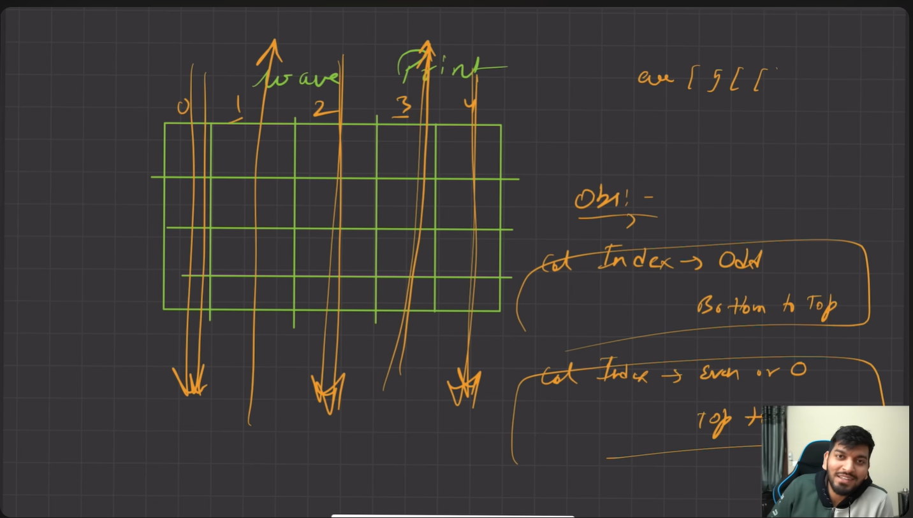
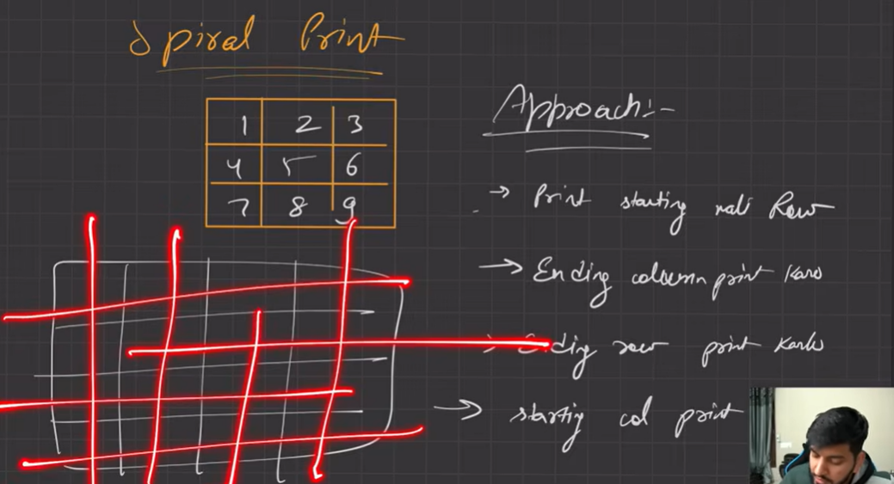
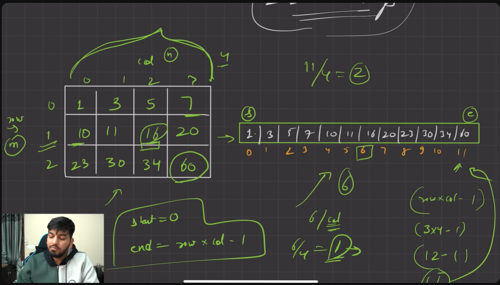
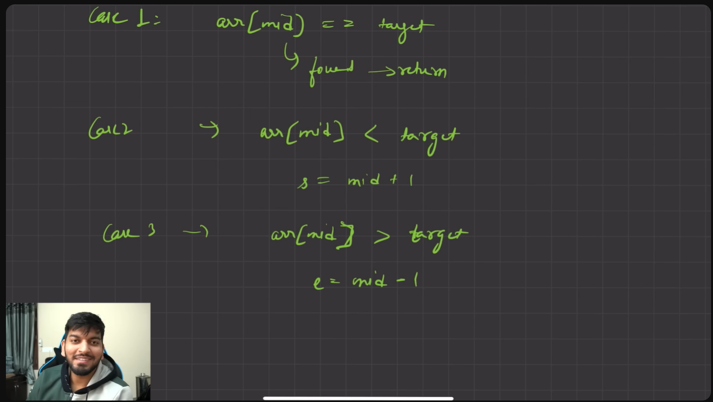

# 1 🔢 Matrix Operations: Target Search, Row-wise and Column-wise Sum

**Difficulty:** 🟡 Medium  
**Tags:** Matrix, 2D Array, Iteration  

---

### 🧩 Problem Statement  
You are given a 2×2 matrix. Your tasks are:  
1. Input elements row-wise.  
2. Display the matrix.  
3. Search for a target element.  
4. Compute **row-wise sums**.  
5. Compute **column-wise sums**.  

---

### ✅ Example  
**Input:**
```
1 2
3 4
Target = 3
```

**Output:**
```
Matrix elements are:
1 2
3 4

Enter element you want to search: 3
Element found ✅

Row-wise sums:
Row 1 sum = 3
Row 2 sum = 7

Column-wise sums:
Column 1 sum = 4
Column 2 sum = 6
```

---

### 💻 Solution (C++)
```cpp
#include <iostream>
using namespace std;

// Function to check if target exists in matrix
int target_check(int arr[][2], int target, int n, int m) {
    for(int i = 0; i < n; i++) {
        for(int j = 0; j < m; j++) {
            if(arr[i][j] == target) {
                return 1; // found
            }
        }
    }
    return 0; // not found
}

// Function to calculate row-wise sum
void rowWiseSum(int arr[][2], int n, int m) {
    cout << "Row-wise sums:" << endl;
    for(int i = 0; i < n; i++) {
        int sum = 0;
        for(int j = 0; j < m; j++) {
            sum += arr[i][j];
        }
        cout << "Row " << i+1 << " sum = " << sum << endl;
    }
}

// Function to calculate column-wise sum
void colWiseSum(int arr[][2], int n, int m) {
    cout << "Column-wise sums:" << endl;
    for(int j = 0; j < m; j++) {
        int sum = 0;
        for(int i = 0; i < n; i++) {
            sum += arr[i][j];
        }
        cout << "Column " << j+1 << " sum = " << sum << endl;
    }
}

int main() {
    int arr[2][2];

    // Input elements row-wise
    cout << "Enter elements (row-wise):" << endl;
    for(int i = 0; i < 2; i++) {
        for(int j = 0; j < 2; j++) {
            cin >> arr[i][j];
        }
    }

    // Display matrix
    cout << "\nMatrix elements are:" << endl;
    for(int i = 0; i < 2; i++) {
        for(int j = 0; j < 2; j++) {
            cout << arr[i][j] << " ";
        }
        cout << endl;
    }

    // Search target
    int target;
    cout << "\nEnter element you want to search: ";
    cin >> target;

    if(target_check(arr, target, 2, 2)) {
        cout << "Element found ✅" << endl;
    } else {
        cout << "Not found ❌" << endl;
    }

    cout << endl;
    rowWiseSum(arr, 2, 2);
    colWiseSum(arr, 2, 2);

    return 0;
}
```

---


### 📊 Complexity  
- **Target search:** O(n × m)  
- **Row-wise sum:** O(n × m)  
- **Column-wise sum:** O(n × m)  
- **Space Complexity:** O(1) (fixed 2×2 matrix)  

---

### 🔗 Practice Links  
- [GeeksforGeeks: Matrix problems](https://www.geeksforgeeks.org/matrix/)  
- [LeetCode: Matrix problems](https://leetcode.com/tag/matrix/)  
- [Coding Ninjas: Matrix problems](https://www.codingninjas.com/studio/problems?topic=Matrix)  

---


# 2. 🔢 Matrix Row-wise Sum and Maximum Row

**Difficulty:** 🟡 Medium  
**Tags:** Matrix, 2D Array, Iteration  

---

### 🧩 Problem Statement  
You are given a 2×2 matrix. Your tasks are:  
1. Input elements row-wise.  
2. Display the matrix.  
3. Compute **row-wise sums**.  
4. Find the **row with the maximum sum** and return its index.

---

### ✅ Example  
**Input:**
```
1 2
3 4
```

**Output:**
```
Matrix elements are:
1 2
3 4

Row sums:
3
7
maximum sum is : 7
max is at index 1
```

---

### 💻 Solution (C++)
```cpp
#include <iostream>
#include <climits>
using namespace std;

// Function to calculate row-wise sum and find row with maximum sum
int rowWiseSum(int arr[][2], int n, int m) {
    int maxi = INT_MIN;   // store maximum sum
    int rowIndex = 0;     // store row index of maximum sum

    for(int i = 0; i < n; i++) {
        int sum = 0;
        for(int j = 0; j < m; j++) {
            sum += arr[i][j];
        }
        cout << "Row " << i+1 << " sum = " << sum << endl;

        if(sum > maxi) {
            maxi = sum;
            rowIndex = i;
        }
    }

    cout << "Maximum sum is: " << maxi << endl;
    return rowIndex;
}

int main() {
    int arr[2][2];

    // Input elements row-wise
    cout << "Enter elements (row-wise):" << endl;
    for(int i = 0; i < 2; i++) {
        for(int j = 0; j < 2; j++) {
            cin >> arr[i][j];
        }
    }

    // Display matrix
    cout << "\nMatrix elements are:" << endl;
    for(int i = 0; i < 2; i++) {
        for(int j = 0; j < 2; j++) {
            cout << arr[i][j] << " ";
        }
        cout << endl;
    }

    cout << endl;
    int ans = rowWiseSum(arr, 2, 2);
    cout << "Max sum is at row index " << ans << endl;

    return 0;
}
```

---


### 📊 Complexity  
- **Row-wise sum:** O(n × m)  
- **Finding maximum row:** O(n) (done while computing sums)  
- **Space Complexity:** O(1)  

---

### 🔗 Practice Links  
- [GeeksforGeeks: Row with maximum sum](https://www.geeksforgeeks.org/find-row-with-maximum-sum/)  
- [Coding Ninjas: Matrix problems](https://www.codingninjas.com/studio/problems?topic=Matrix)  

---


# 3.🔢 Matrix Operations: Sum, Multiplication, Division, Transpose

**Difficulty:** 🟡 Medium  
**Tags:** Matrix, 2D Array, Iteration  

---

### 🧩 Problem Statement  
You are given two 2×2 matrices. Your tasks are:  
1. Input both matrices row‑wise.  
2. Display the matrices.  
3. Compute **matrix sum** (element‑wise addition).  
4. Compute **matrix multiplication (element‑wise)**.  
5. Compute **matrix division (element‑wise)**.  
6. Compute the **transpose** of the first matrix.

---

### ✅ Example  
**Input:**
```
Matrix 1:
1 2
3 4

Matrix 2:
5 6
7 8
```

### 💻 Solution (C++)
```cpp
#include <iostream>
using namespace std;

// Function to compute matrix sum (element-wise)
void matrixsum(int arr1[][2], int arr2[][2], int n, int m) {
    int result[n][m];
    for(int i=0; i<n; i++) {
        for(int j=0; j<m; j++) {
            result[i][j] = arr1[i][j] + arr2[i][j];
        }
    }
    cout << "sum is:" << endl;
    for(int i=0; i<n; i++) {
        for(int j=0; j<m; j++) {
            cout << result[i][j] << " ";
        }
        cout << endl;
    }
}

// Function to compute matrix multiplication (element-wise)
void matrixmul(int arr1[][2], int arr2[][2], int n, int m) {
    int result[n][m];
    for(int i=0; i<n; i++) {
        for(int j=0; j<m; j++) {
            result[i][j] = arr1[i][j] * arr2[i][j];
        }
    }
    cout << "mul is:" << endl;
    for(int i=0; i<n; i++) {
        for(int j=0; j<m; j++) {
            cout << result[i][j] << " ";
        }
        cout << endl;
    }
}

// Function to compute matrix division (element-wise)
void matrixdiv(int arr1[][2], int arr2[][2], int n, int m) {
    int result[n][m];
    for(int i=0; i<n; i++) {
        for(int j=0; j<m; j++) {
            result[i][j] = arr1[i][j] / arr2[i][j]; // integer division
        }
    }
    cout << "div is:" << endl;
    for(int i=0; i<n; i++) {
        for(int j=0; j<m; j++) {
            cout << result[i][j] << " ";
        }
        cout << endl;
    }
}

// Function to compute transpose of a matrix
void transpose(int arr1[][2], int n, int m) {
    cout << "transpose is:" << endl;
    for(int j=0; j<m; j++) {
        for(int i=0; i<n; i++) {
            cout << arr1[i][j] << " ";
        }
        cout << endl;
    }
}

int main() {
    int arr1[2][2], arr2[2][2];

    cout << "Enter elements for matrix 1 (row-wise):" << endl;
    for(int i=0; i<2; i++) {
        for(int j=0; j<2; j++) {
            cin >> arr1[i][j];
        }
    }

    cout << "Enter elements for matrix 2 (row-wise):" << endl;
    for(int i=0; i<2; i++) {
        for(int j=0; j<2; j++) {
            cin >> arr2[i][j];
        }
    }

    cout << "\nMatrix 1:" << endl;
    for(int i=0; i<2; i++) {
        for(int j=0; j<2; j++) {
            cout << arr1[i][j] << " ";
        }
        cout << endl;
    }

    cout << "\nMatrix 2:" << endl;
    for(int i=0; i<2; i++) {
        for(int j=0; j<2; j++) {
            cout << arr2[i][j] << " ";
        }
        cout << endl;
    }

    cout << endl;
    matrixsum(arr1, arr2, 2, 2);
    matrixmul(arr1, arr2, 2, 2);
    matrixdiv(arr1, arr2, 2, 2);
    transpose(arr1, 2, 2);

    return 0;
}
```


---

### 📊 Complexity  
- **Matrix sum:** O(n × m)  
- **Matrix multiplication (element-wise):** O(n × m)  
- **Matrix division (element-wise):** O(n × m)  
- **Transpose:** O(n × m)  
- **Space Complexity:** O(n × m) for result matrix  

---

### 🔗 Practice Links  
- [GeeksforGeeks: Matrix problems](https://www.geeksforgeeks.org/matrix/)  
- [LeetCode: Matrix problems](https://leetcode.com/tag/matrix/)  
- [Coding Ninjas: Matrix problems](https://www.codingninjas.com/studio/problems?topic=Matrix)  

---




# 🌊 Wave Print of a Matrix

**Difficulty:** 🟡 Medium  
**Tags:** Matrix, 2D Array, Traversal  

---

### 🧩 Problem Statement  
Given a 2D matrix of size `nRows × mCols`, print its elements in **wave form**:  
- Traverse column by column.  
- If the column index is **even**, print from **top to bottom**.  
- If the column index is **odd**, print from **bottom to top**.  

Return the wave traversal as a vector.

---

### ✅ Example  
**Input:**
```
Matrix:
1  2  3
4  5  6
7  8  9
```

**Output (Wave Print):**
```
1 4 7 8 5 2 3 6 9
```

---

### 💡 Approach  
1. Initialize an empty vector `ans`.  
2. Traverse each column `col` from `0` to `mCols-1`.  
3. If `col` is even → traverse rows top to bottom.  
4. If `col` is odd → traverse rows bottom to top.  
5. Push elements into `ans`.  
6. Return `ans`.

---

### 💻 Solution (C++)
```cpp
#include <bits/stdc++.h> 
using namespace std;

vector<int> wavePrint(vector<vector<int>> arr, int nRows, int mCols) {
    vector<int> ans;

    for(int col = 0; col < mCols; col++) {
        if(col % 2 == 0) {
            // Even column → Top to Bottom
            for(int row = 0; row < nRows; row++) {
                ans.push_back(arr[row][col]);
            }
        } else {
            // Odd column → Bottom to Top
            for(int row = nRows - 1; row >= 0; row--) {
                ans.push_back(arr[row][col]);
            }
        }
    }

    return ans;
}
```

---

### 📝 Dry Run Example  
**Matrix:**
```
1 2 3
4 5 6
7 8 9
```

- Column 0 (even): `1,4,7`  
- Column 1 (odd): `8,5,2`  
- Column 2 (even): `3,6,9`  

**Wave Print:** `1 4 7 8 5 2 3 6 9`

---

### 📊 Complexity  
- **Time Complexity:** O(nRows × mCols) → each element visited once  
- **Space Complexity:** O(nRows × mCols) → result vector  

---

### 🔗 Practice Links  
- [GeeksforGeeks: Wave Print of a Matrix](https://www.geeksforgeeks.org/print-matrix-in-wave-form/)  
- [Coding Ninjas: Wave Print](https://www.codingninjas.com/studio/problems/print-like-a-wave_893268)  

---


# 🌀 Spiral Order Traversal of a Matrix

**Difficulty:** 🟡 Medium  
**Tags:** Matrix, 2D Array, Traversal  

---

### 🧩 Problem Statement  
Given a 2D matrix, return all elements in **spiral order**:  
- Traverse the matrix in layers.  
- Start from the **top row**, then the **right column**, then the **bottom row**, then the **left column**.  
- Continue inward until all elements are visited.

---

### ✅ Example  
**Input:**
```
Matrix:
1  2  3
4  5  6
7  8  9
```

**Output (Spiral Order):**
```
1 2 3 6 9 8 7 4 5
```

---

### 💡 Approach  
1. Maintain four boundaries:  
   - `startingRow`, `endingRow`, `startingCol`, `endingCol`.  
2. Traverse in four directions:  
   - Left → Right (top row)  
   - Top → Bottom (right column)  
   - Right → Left (bottom row)  
   - Bottom → Top (left column)  
3. After each traversal, shrink the boundary inward.  
4. Continue until all elements are visited.

---

### 💻 Solution (C++)
```cpp
#include <bits/stdc++.h>
using namespace std;

vector<int> spiralOrder(vector<vector<int>>& matrix) {

    vector<int> ans;

    int rows = matrix.size();
    int cols = matrix[0].size();

    int top = 0;
    int bottom = rows - 1;
    int left = 0;
    int right = cols - 1;

    while(top <= bottom && left <= right) {

        // Top Row
        for(int i = left; i <= right; i++) {
            ans.push_back(matrix[top][i]);
        }
        top++;

        // Right Column
        for(int i = top; i <= bottom; i++) {
            ans.push_back(matrix[i][right]);
        }
        right--;

        // Bottom Row
        if(top <= bottom) {
            for(int i = right; i >= left; i--) {
                ans.push_back(matrix[bottom][i]);
            }
            bottom--;
        }

        // Left Column
        if(left <= right) {
            for(int i = bottom; i >= top; i--) {
                ans.push_back(matrix[i][left]);
            }
            left++;
        }
    }

    return ans;
}

int main() {

    vector<vector<int>> matrix = {
        {1,2,3},
        {4,5,6},
        {7,8,9}
    };

    vector<int> ans = spiralOrder(matrix);

    for(int x : ans) {
        cout << x << " ";
    }

    return 0;
}
```

---

### 📝 Dry Run Example  
**Matrix:**
```
1 2 3
4 5 6
7 8 9
```

- Top row → `1,2,3`  
- Right column → `6,9`  
- Bottom row → `8,7`  
- Left column → `4`  
- Remaining middle → `5`  

**Spiral Order:** `1 2 3 6 9 8 7 4 5`

---

### 📊 Complexity  
- **Time Complexity:** O(n × m) → each element visited once  
- **Space Complexity:** O(n × m) → result vector  

---

### 🔗 Practice Links  
- [LeetCode: Spiral Matrix](https://leetcode.com/problems/spiral-matrix/)  
- [GeeksforGeeks: Print a matrix in spiral form](https://www.geeksforgeeks.org/print-a-given-matrix-in-spiral-form/)  
- [Coding Ninjas: Spiral Order Matrix](https://www.codingninjas.com/studio/problems/spiral-order-matrix_893268)  

---


# 🔄 Rotate Image (90° Clockwise)

**Difficulty:** 🟡 Medium  
**Tags:** Matrix, 2D Array, Transpose, Reverse  

---

### 🧩 Problem Statement  
You are given an `n × n` matrix. Rotate the matrix **90 degrees clockwise** in-place.  
- Do not use extra space for another matrix.  
- Modify the original matrix directly.

---

### ✅ Example  
**Input:**
```
Matrix:
1 2 3
4 5 6
7 8 9
```

**Output (Rotated 90° Clockwise):**
```
7 4 1
8 5 2
9 6 3
```

---

### 💡 Approach  
1. **Transpose the matrix**:  
   - Swap `matrix[i][j]` with `matrix[j][i]` for all `i < j`.  
   - This flips the matrix over its diagonal.  

2. **Reverse each row**:  
   - Reverse the elements in every row.  
   - This completes the 90° clockwise rotation.  

---

### 💻 Solution (C++)
```cpp
class Solution {
public:
    void rotate(vector<vector<int>>& matrix) {
        int n = matrix.size();

        // Step 1: Transpose the matrix
        for(int i = 0; i < n; i++) {
            for(int j = i+1; j < n; j++) {
                swap(matrix[i][j], matrix[j][i]);
            }
        }

        // Step 2: Reverse each row
        for(int i = 0; i < n; i++) {
            reverse(matrix[i].begin(), matrix[i].end());
        }
    }
};
```

---

### 📝 Dry Run Example  
**Matrix:**
```
1 2 3
4 5 6
7 8 9
```

- **Transpose:**
```
1 4 7
2 5 8
3 6 9
```

- **Reverse each row:**
```
7 4 1
8 5 2
9 6 3
```

**Final Rotated Matrix:**  
```
7 4 1
8 5 2
9 6 3
```

---

### 📊 Complexity  
- **Time Complexity:** O(n²) → each element visited once during transpose + reverse  
- **Space Complexity:** O(1) → in-place rotation  

---

### 🔗 Practice Links  
- [LeetCode: Rotate Image](https://leetcode.com/problems/rotate-image/)  
- [GeeksforGeeks: Rotate a matrix by 90 degrees](https://www.geeksforgeeks.org/inplace-rotate-square-matrix-by-90-degrees/)  
- [Coding Ninjas: Rotate Matrix](https://www.codingninjas.com/studio/problems/rotate-matrix_1234567)  

---

# 🔄 Rotate Matrix by 180° (In-place)

**Difficulty:** 🟡 Medium  
**Tags:** Matrix, 2D Array, Transpose, Reverse  

---

### 🧩 Problem Statement  
You are given an `n × n` matrix. Rotate the matrix **180 degrees in-place**.  
- Do not use extra space for another matrix.  
- Modify the original matrix directly.

---

### ✅ Example  
**Input:**
```
Matrix:
1 2 3
4 5 6
7 8 9
```

**Output (Rotated 180°):**
```
9 8 7
6 5 4
3 2 1
```

---

### 💡 Approach  
There are multiple ways to rotate a matrix by 180°:

1. **Two successive 90° rotations**  
   - Perform transpose + reverse twice.  

2. **Reverse rows and columns directly**  
   - Reverse each row.  
   - Then reverse each column.  

Both approaches achieve the same result.

---

### 💻 Solution (C++)
```cpp
class Solution {
  public:
    void rotateMatrix(vector<vector<int>>& mat) {
        int n = mat.size();

        // First 90° rotation (transpose + reverse)
        for(int i = 0; i < n; i++) {
            for(int j = i+1; j < n; j++) {
                swap(mat[i][j], mat[j][i]);
            }
        }
        for(int i = 0; i < n; i++) {
            reverse(mat[i].begin(), mat[i].end());
        }

        // Second 90° rotation (transpose + reverse again)
        for(int i = 0; i < n; i++) {
            for(int j = i+1; j < n; j++) {
                swap(mat[i][j], mat[j][i]);
            }
        }
        for(int i = 0; i < n; i++) {
            reverse(mat[i].begin(), mat[i].end());
        }


              // or 
        // Just reverse rows AND columns (or do 90° twice)
        // for (int i = 0; i < n; i++)
        //     reverse(matrix[i].begin(), matrix[i].end());
        
        // for (int j = 0; j < n; j++) {
        //     int top = 0, bot = n - 1;
        //     while (top < bot) {
        //         swap(matrix[top++][j], matrix[bot--][j]);
        //     }
        // }
    }
};
```

---

### 📝 Dry Run Example  
**Matrix:**
```
1 2 3
4 5 6
7 8 9
```

- After first 90° clockwise rotation →  
```
7 4 1
8 5 2
9 6 3
```

- After second 90° clockwise rotation →  
```
9 8 7
6 5 4
3 2 1
```

**Final Rotated Matrix (180°):**
```
9 8 7
6 5 4
3 2 1
```

---

### 📊 Complexity  
- **Time Complexity:** O(n²) → each element visited twice during transpose + reverse  
- **Space Complexity:** O(1) → in-place rotation  

---

### 🔗 Practice Links  
- [GeeksforGeeks: Rotate matrix by 180 degrees](https://www.geeksforgeeks.org/rotate-matrix-180-degree/)  
- [Coding Ninjas: Rotate Matrix Problems](https://www.codingninjas.com/studio/problems/rotate-matrix_1234567)  

---



## agar mid ka row column nikalna hai toh mid ko jisko linear me banaye hai uska index divide total col  , and column ke liye index modulo col


# 🔎 Search in a 2D Matrix (Binary Search)

**Difficulty:** 🟡 Medium  
**Tags:** Matrix, Binary Search, 2D Array  

---

### 🧩 Problem Statement  
You are given an `m × n` matrix where:  
- Each row is sorted in ascending order.  
- The first integer of each row is greater than the last integer of the previous row.  

Given a target integer, return `true` if it exists in the matrix, otherwise return `false`.

---

### ✅ Example  
**Input:**
```
Matrix:
1  3  5  7
10 11 16 20
23 30 34 60

Target = 3
```

**Output:**
```
true
```

**Input:**
```
Matrix:
1  3  5  7
10 11 16 20
23 30 34 60

Target = 13
```

**Output:**
```
false
```

---

### 💡 Approach  
1. Treat the 2D matrix as a **flattened 1D array** of size `row × col`.  
2. Apply **binary search** on this virtual array.  
3. Convert the 1D index back to 2D using:  
   - `rowIndex = mid / col`  
   - `colIndex = mid % col`  
4. Compare the element with the target.  
   - If equal → return true.  
   - If smaller → move right (`start = mid+1`).  
   - If larger → move left (`end = mid-1`).  
5. Continue until `start > end`.

---

### 💻 Solution (C++)
```cpp
// we can use binary search approach so first convert into linear 
class Solution {
public:
    bool searchMatrix(vector<vector<int>>& matrix, int target) {
        
        int row =matrix.size();
        int col = matrix[0].size();  // ek pahla row pakad liya uska size then total no of col

        int start =0;
        int end = row*col -1; 
        int mid =  start + (end-start)/2;

        while(start<=end){
           int element = matrix[mid/col][mid%col];

           if(element == target){
            return 1;
           }

           else if(element < target){
            start = mid+1;
           }
           else{
            end = mid-1;
           }

           mid = start + (end-start)/2;
        }
        return 0;
    }
};
```

---

### 📝 Dry Run Example  
**Matrix:**
```
1 3 5
7 9 11
13 15 17
```
**Target = 9**

- Flattened array = `[1,3,5,7,9,11,13,15,17]`  
- Binary search steps:  
  - mid = 4 → element = 9 → found ✅  

**Output:** `true`

---

### 📊 Complexity  
- **Time Complexity:** O(log(n × m)) → binary search on flattened array  
- **Space Complexity:** O(1) → no extra space used  

---

### 🔗 Practice Links  
- [LeetCode: Search a 2D Matrix](https://leetcode.com/problems/search-a-2d-matrix/)  
- [GeeksforGeeks: Search in a 2D matrix](https://www.geeksforgeeks.org/search-in-a-row-wise-and-column-wise-sorted-matrix/)  
- [Coding Ninjas: Search Matrix](https://www.codingninjas.com/studio/problems/search-in-a-2d-matrix_981280)  

---


# 🔎 Search in a 2D Matrix (Row & Column Sorted)

**Difficulty:** 🟡 Medium  
**Tags:** Matrix, Binary Search, 2D Array  

---

### 🧩 Problem Statement  
You are given an `m × n` matrix where:  
- Each row is sorted in ascending order.  
- Each column is sorted in ascending order.  

Return `true` if a target integer exists in the matrix, otherwise return `false`.

---

### 💡 Approach (Staircase Search)  
1. Start from the **top‑right corner** of the matrix.  
2. Compare the current element with the target:  
   - If equal → return `true`.  
   - If current element < target → move **down** (increase row index).  
   - If current element > target → move **left** (decrease column index).  
3. Continue until indices go out of bounds.  
4. If not found, return `false`.  

This works because the matrix is sorted both row‑wise and column‑wise, allowing elimination of one row or column at each step.

---

### ✅ Example  
**Input:**
```
Matrix:
1  4  7  11
2  5  8  12
3  6  9  16
10 13 14 17

Target = 5
```

**Output:**
```
true
```

**Input:**
```
Matrix:
1  4  7  11
2  5  8  12
3  6  9  16
10 13 14 17

Target = 20
```

**Output:**
```
false
```

---

### 💻 Solution (C++)  
*(Your exact code, unchanged)*

```cpp
class Solution {
public:
    bool searchMatrix(vector<vector<int>>& matrix, int target) {
        int row = matrix.size();
        int column = matrix[0].size();

        int rowIndex = 0;   
        int columnIndex = column-1 ;

        while(rowIndex < row && columnIndex >=0 ){
            int element = matrix[rowIndex][columnIndex];

            if(element == target){
                return 1;
            }

            else if(element < target){
                rowIndex++;
            }
            else{
                columnIndex--;
            }
        }
        return 0;
    }
};
```

---

### 📝 Dry Run Example  
**Matrix:**
```
1 4 7
2 5 8
3 6 9
```
**Target = 6**

- Start at top‑right → element = 7  
- 7 > 6 → move left → element = 4  
- 4 < 6 → move down → element = 5  
- 5 < 6 → move down → element = 6 → found ✅  

**Output:** `true`

---

### 📊 Complexity  
- **Time Complexity:** O(n + m) → at most one pass across rows and columns  
- **Space Complexity:** O(1) → no extra space used  

---

### 🔗 Practice Links  
- [LeetCode: Search a 2D Matrix II](https://leetcode.com/problems/search-a-2d-matrix-ii/)  
- [GeeksforGeeks: Search in a row-wise and column-wise sorted matrix](https://www.geeksforgeeks.org/search-in-a-row-wise-and-column-wise-sorted-matrix/)  
- [Coding Ninjas: Search Matrix](https://www.codingninjas.com/studio/problems/search-in-a-2d-matrix_981280)  

---
