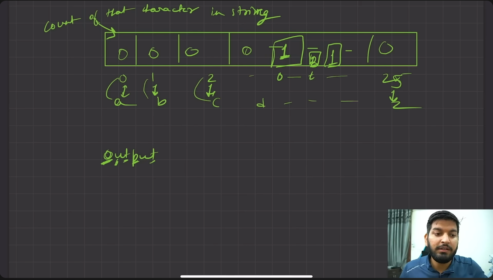
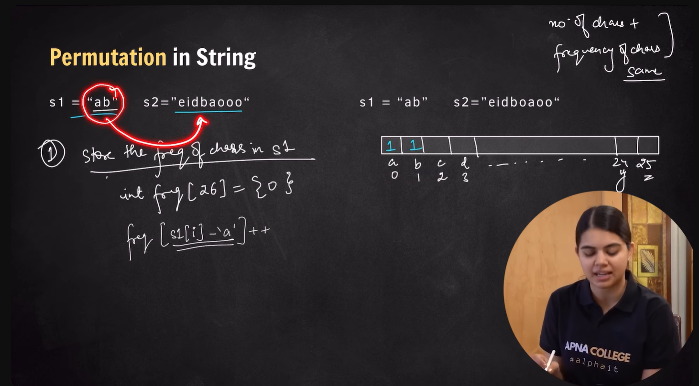
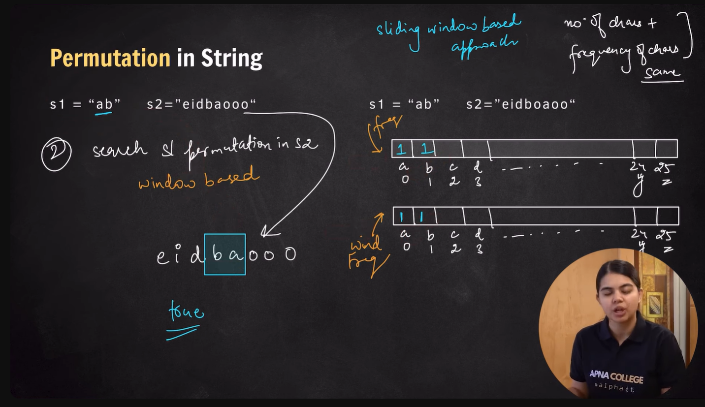
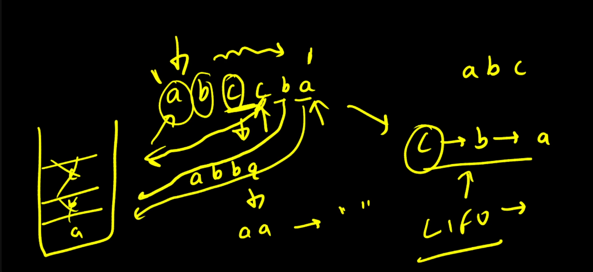
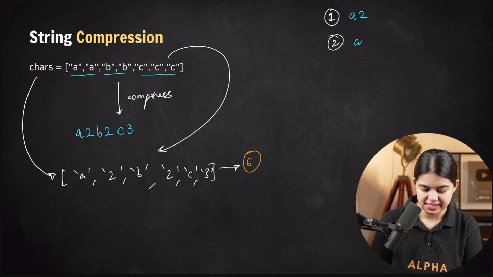
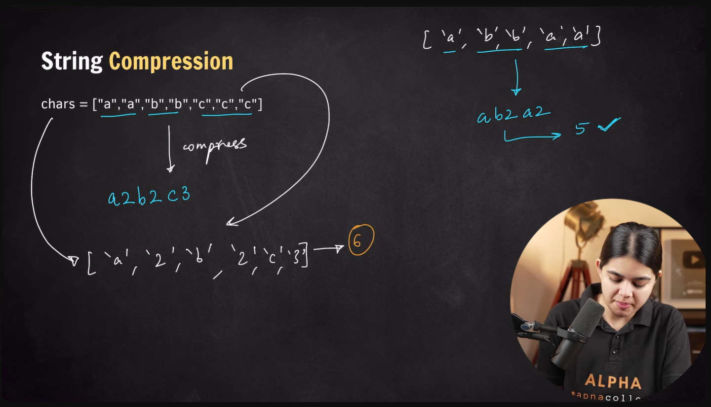
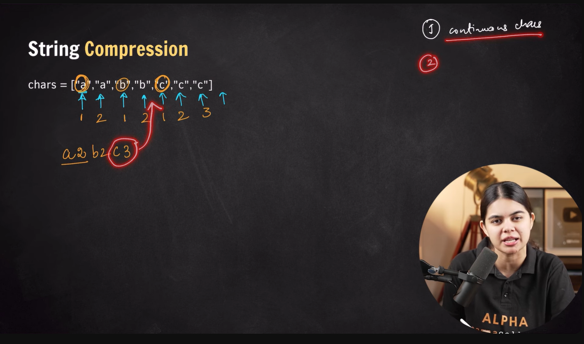
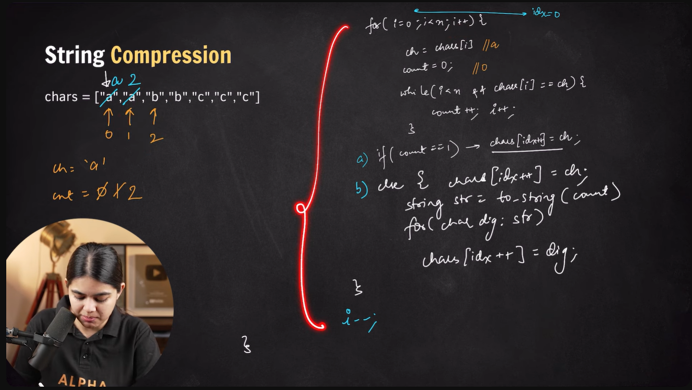

# 📑 String Problem Set in C++

Welcome to the String Problem Set!  
This collection includes common string problems solved in C++, with explanations, examples, solutions, and complexity analysis.  
It’s designed to be examiner‑friendly and practice‑ready.

---

## 🔗 Practice index

| # | Title | What | Complexity | Quick links |
|---|---|---|---|---|
| 1️⃣ | 🔤 Find Length of a String | Manual count | O(n) | [GFG / CN](#1-find-length-of-a-string) |
| 2️⃣ | 🔄 Reverse a String | Two‑pointers / Concatenation | O(n) | [LeetCode / GFG / CN](#2-reverse-a-string) |
| 3️⃣ | 🔎 Valid Palindrome | Clean + reverse check | O(n) | [LeetCode / GFG / CN](#3-valid-palindrome) |
| 4️⃣ | 🔄 Reverse String by Words (Dot) | Word order reverse | O(n) | [LeetCode / GFG / CN](#4-reverse-string-by-words-dot-separator) |
| 5️⃣ | 🔄 Reverse Words in a String | Reverse each word | O(n) | [LeetCode / GFG / CN](#5-reverse-words-in-a-string-keep-word-order) |
| 6️⃣ | 🔎 Maximum Occurring Character | Frequency count | O(n) | [GFG / CN](#6-maximum-occurring-character-in-a-string) |
| 7️⃣ | 🔄 Replace Spaces | Replace `' '` with `@40` | O(n) | [GFG / CN](#7-replace-spaces-in-a-string) |
| 8️⃣ | 🔄 Remove All Occurrences of Substring | Erase + find loop | O(n×m) | [LeetCode / GFG](#8-remove-all-occurrences-of-a-substring) |
| 9️⃣ | 🔄 Permutation in String | Sliding window check | O(n×m) | [LeetCode / GFG](#9-permutation-in-string-check-inclusion) |
| 🔟 | 🔄 Remove Adjacent Duplicates | Stack simulation | O(n) | [LeetCode / GFG / CN](#10-remove-all-adjacent-duplicates-in-string) |
| 1️⃣1️⃣ | 🔄 String Compression | Run‑length encoding | O(n) | [LeetCode / GFG](#11-string-compression) |

---

## 📋 Table of contents

1. 🔤 Find length of a string  
2. 🔄 Reverse a string  
3. 🔎 Valid palindrome  
4. 🔄 Reverse string by words (dot separator)  
5. 🔄 Reverse words in a string (keep word order)  
6. 🔎 Maximum occurring character in a string  
7. 🔄 Replace spaces in a string  
8. 🔄 Remove all occurrences of a substring  
9. 🔄 Permutation in string (check inclusion)  
10. 🔄 Remove all adjacent duplicates in string  
11. 🔄 String compression  

---


# 🔗 Practice links (all string problems)

- **GeeksforGeeks:** [https://www.geeksforgeeks.org/string-data-structure/](https://www.geeksforgeeks.org/string-data-structure/)  
- **LeetCode:** [https://leetcode.com/tag/string/](https://leetcode.com/tag/string/)  
- **Coding Ninjas:** [https://www.codingninjas.com/studio/problems?topic=Strings](https://www.codingninjas.com/studio/problems?topic=Strings)  

---


# 1 🔤 Find Length of a String (Manual Count)

**Difficulty:** 🟢 Easy  
**Tags:** String, Iteration  

---

### 🧩 Problem Statement  
You are given a string `s`.  
Your task is to find the **length of the string** without directly using built‑in length functions.

---

### ✅ Example  
```
Input: s = "hello"
Output: 5
```

```
Input: s = "VIT Chennai"
Output: 11
```

### 💻 Solution (C++)
```cpp
// User function Template for C++

class Solution {
  public:
    int lengthString(string &s) {
        int count = 0;
        
        // Traverse each character
        for(int i = 0; i < s.size(); i++) {
            count++;
        }
        
        return count;
    }
};
```

### 📊 Complexity Analysis  
- **Time Complexity:** O(n) → single traversal of the string  
- **Space Complexity:** O(1) → constant extra space  

---

### 🔗 Practice Links  
- [GeeksforGeeks: Length of a string without using strlen](https://www.geeksforgeeks.org/program-to-find-length-of-a-string-without-using-strlen-function/)  
- [Coding Ninjas: String problems](https://www.codingninjas.com/studio/problems?topic=Strings)  

---

# 2 🔄 Reverse a String

**Difficulty:** 🟢 Easy  
**Tags:** String, Two Pointers, Iteration  

---

### 🧩 Problem Statement  
You are given a string (or a vector of characters).  
Your task is to **reverse the string**.  
- In the first approach, reverse the string **in-place** using two pointers.  
- In the second approach, build a new reversed string using concatenation.

---

### ✅ Example  
```
Input: s = ['h','e','l','l','o']
Output: ['o','l','l','e','h']
```


### 💡 Approach 1: Two Pointers (In-place)  
- Initialize two pointers:  
  - `start = 0` (beginning of string)  
  - `end = s.size() - 1` (end of string)  
- Swap characters at `start` and `end`.  
- Move `start++` forward and `end--` backward.  
- Continue until `start >= end`.  

---

### 💻 Solution (C++)
```cpp
class Solution {
public:
    void reverseString(vector<char>& s) {
        int start = 0;
        int end = s.size() - 1;

        while(start < end) {
            swap(s[start++], s[end--]);
        }
    }
};
```
```cpp

#include <iostream>
using namespace std;

int main()
{
    int n = 121;
    int num= n;
    int reversed =0;
     
     
     while(num!=0){
         reversed=reversed*10+(num%10);
         num/=10;
     }
     
     cout<<reversed<<endl;
     
     if(n == reversed){
         cout<<"palindrome\n";
     }
     else{
         cout<<"not\n";
     }
}
```

---

### 📝 Dry Run Example  
**Input:** s = ['h','e','l','l','o']  

| start | end | swap | Array state |
|-------|-----|------|-------------|
| 0     | 4   | h ↔ o | ['o','e','l','l','h'] |
| 1     | 3   | e ↔ l | ['o','l','l','e','h'] |
| 2     | 2   | stop | ['o','l','l','e','h'] |

Final result: `['o','l','l','e','h']`

---

### 💡 Approach 2: Build New String (Concatenation)  
- Initialize an empty string `reversed`.  
- Traverse the string from the last character to the first.  
- Append each character to `reversed`.  
- Print or return the new string.

---

### 💻 Solution (C++)
```cpp
string reversed = "";

for (int i = s.length() - 1; i >= 0; i--) {
    reversed += s[i];
}
cout << reversed;
```

---

### 📊 Complexity Analysis  
- **Two-pointer approach:**  
  - Time Complexity: O(n)  
  - Space Complexity: O(1) (in-place)  

- **Concatenation approach:**  
  - Time Complexity: O(n)  
  - Space Complexity: O(n) (new string created)  

---

### 🔗 Practice Links  
- [LeetCode: Reverse String](https://leetcode.com/problems/reverse-string/)  
- [GeeksforGeeks: Reverse a string](https://www.geeksforgeeks.org/reverse-a-string-in-cpp/)  
- [Coding Ninjas: Reverse String](https://www.codingninjas.com/studio/problems/reverse-string_1234567)  

---


# 3 🔎 Valid Palindrome (String Cleaning + Reverse Check)

**Difficulty:** 🟡 Medium  
**Tags:** String, Palindrome, Two Pointers  

---

### 🧩 Problem Statement  
You are given a string `s`.  
Your task is to determine if it is a **valid palindrome**, considering only alphanumeric characters and ignoring cases.  

---

### ✅ Example  
```
Input: s = "A man, a plan, a canal: Panama"
Output: true
```

```
Input: s = "race a car"
Output: false
```

---

### 💡 Approach  
1. **Clean the string**:  
   - Traverse each character.  
   - Keep only alphanumeric characters.  
   - Convert uppercase letters to lowercase.  
2. **Reverse the cleaned string**.  
3. Compare the reversed string with the cleaned string.  
   - If they match → palindrome.  
   - Else → not a palindrome.  

---
```

### 💻 Solution (C++)
```cpp
class Solution {
public:
    bool isPalindrome(string s) {
        string cleaned = "";

        // Clean the string: keep alphanumeric, convert to lowercase
        for(char ch: s){
            if(isalnum(ch)){
                if(ch >= 'a' && ch <= 'z'){
                    cleaned += ch;
                }
                else if(ch >= 'A' && ch <= 'Z'){
                    char temp = ch - 'A' + 'a';
                    cleaned += temp;
                }
                else {
                    cleaned += ch; // digits remain unchanged
                }
            }
        }

        // Reverse the cleaned string
        string reversed = "";
        for(int i = cleaned.length() - 1; i >= 0; i--){
            reversed += cleaned[i];
        }

        return reversed == cleaned;
    }
};
```

---

### 📊 Complexity Analysis  
- **Time Complexity:** O(n) → single traversal for cleaning + reversal  
- **Space Complexity:** O(n) → extra space for cleaned and reversed strings  

---

### 🔗 Practice Links  
- [LeetCode: Valid Palindrome](https://leetcode.com/problems/valid-palindrome/)  
- [GeeksforGeeks: Check if a string is palindrome](https://www.geeksforgeeks.org/check-if-a-string-is-palindrome/)  
- [Coding Ninjas: Palindrome String](https://www.codingninjas.com/studio/problems/palindrome-string_799352)  

---

# 4🔄 Reverse String by Words (Dot Separator)

**Difficulty:** 🟡 Medium  
**Tags:** String, Splitting, Reverse  

---

### 🧩 Problem Statement  
Given a string `s`, reverse the string **without reversing its individual words**.  
Words are separated by dots (`.`).  

**Note:**  
- The string may contain leading/trailing dots or multiple dots between words.  
- The returned string should only have a **single dot** separating words, and no extra dots should be included.  

---

### ✅ Example  
```
Input: s = "...i.like..this.program..."
Output: "program.this.like.i"
```

```
Input: s = "hello.world"
Output: "world.hello"
```

```
Input: s = "a..b.c"
Output: "c.b.a"
```

---

### 💡 Approach  
1. Traverse the string and split it into words using `.` as a delimiter.  
2. Ignore empty tokens (caused by multiple dots or leading/trailing dots).  
3. Reverse the list of words.  
4. Join them back with a single dot (`.`).  

---

### 💻 Solution (C++)
```cpp
class Solution {
  public:
    string reverseWords(string &s) {
        vector<string> words;
        string temp = "";
        
        // Split by dot and filter empty tokens
        for(char ch : s) {
            if(ch == '.') {
                if(!temp.empty()) {
                    words.push_back(temp);
                    temp.clear();
                }
            } else {
                temp += ch;
            }
        }
        
        if(!temp.empty()) words.push_back(temp);
        
        // Reverse the words
        reverse(words.begin(), words.end());
        
        // Join with single dot
        string result;
        for(int i = 0; i < words.size(); i++) {
            result += words[i];
            if(i != words.size() - 1) result += '.';
        }
        return result;
    }
};
```

---

### 📝 Dry Run Example  
**Input:** s = "...i.like..this.program..."  

- Split → `["i", "like", "this", "program"]`  
- Reverse → `["program", "this", "like", "i"]`  
- Join → `"program.this.like.i"`

---

### 📊 Complexity Analysis  
- **Time Complexity:** O(n) → single traversal for splitting + reversing + joining  
- **Space Complexity:** O(n) → storage for words  

---

### 🔗 Practice Links  
- [GeeksforGeeks: Reverse words in a given string](https://www.geeksforgeeks.org/reverse-words-in-a-given-string/)  
- [LeetCode: Reverse Words in a String](https://leetcode.com/problems/reverse-words-in-a-string/)  
- [Coding Ninjas: Reverse String by Words](https://www.codingninjas.com/studio/problems/reverse-string-by-words_799352)  

---


# 5. 🔄 Reverse Words in a String (Keep Word Order)

**Difficulty:** 🟡 Medium  
**Tags:** String, Word Manipulation, Reverse  

---

### 🧩 Problem Statement  
Given a string `s` consisting of words separated by spaces, reverse each individual word **without changing the order of words**.

---

### ✅ Example  
```
Input: s = "Hello World"
Output: "olleH dlroW"
```

```
Input: s = "VIT Chennai"
Output: "TIV iahneCh"
```

---

### 💡 Approach  
1. Traverse the string character by character.  
2. Split the string into words using spaces as delimiters.  
3. Reverse each word individually.  
4. Reconstruct the string by joining reversed words with spaces.  

---

### 💻 Solution (C++)
```cpp
class Solution {
public:
    string reverseWords(string s) {
        vector<string> words;
        string temp = "";

        // Split by spaces
        for(char ch : s) {
            if(ch == ' ') {
                if(!temp.empty()) {
                    words.push_back(temp);
                    temp.clear();
                }
            } else {
                temp += ch;
            }
        }
        if(!temp.empty()) words.push_back(temp);

        // Reverse each word
        for(string &w : words) {
            reverse(w.begin(), w.end());
        }

        // Join words with single space
        string result;
        for(int i = 0; i < words.size(); i++) {
            result += words[i];
            if(i != words.size() - 1) result += ' ';
        }
        return result;
    }
};
```

---

### 📝 Dry Run Example  
**Input:** `"Hello World"`  

- Split → `["Hello", "World"]`  
- Reverse each → `["olleH", "dlroW"]`  
- Join → `"olleH dlroW"`

**Output:** `"olleH dlroW"`

---

### 📊 Complexity Analysis  
- **Time Complexity:** O(n) → single traversal + reversing each word  
- **Space Complexity:** O(n) → storage for words  

---

### 🔗 Practice Links  
- [LeetCode: Reverse Words in a String III](https://leetcode.com/problems/reverse-words-in-a-string-iii/)  
- [GeeksforGeeks: Reverse words in a given string](https://www.geeksforgeeks.org/reverse-words-in-a-given-string/)  
- [Coding Ninjas: Reverse Words](https://www.codingninjas.com/studio/problems/reverse-words_799352)  

---



# 6. 🔎 Maximum Occurring Character in a String

**Difficulty:** 🟢 Easy  
**Tags:** String, Frequency Count, Hashing  

---

### 🧩 Problem Statement  
Given a string `s`, find the **character that occurs the maximum number of times**.  
- Both uppercase and lowercase letters should be treated as the same (case‑insensitive).  
- If multiple characters have the same maximum frequency, return the one that appears first in alphabetical order.

---

### ✅ Example  
```
Input: s = "testsample"
Output: 'e'
```

```
Input: s = "output"
Output: 't'
```

---

### 💡 Approach  
1. Create a frequency array of size 26 (for each alphabet letter).  
2. Traverse the string:  
   - Convert each character to lowercase (or normalize uppercase).  
   - Increment its frequency count.  
3. Find the character with the maximum frequency.  
4. Return the corresponding character.  

---

### 💻 Solution (C++)
```cpp
class Solution {
  public:
    char getMaxOccuringChar(string& s) {
        int arr[26] = {0};  // frequency array

        // Count frequency of each character
        for(int i = 0; i < s.size(); i++) {
            char ch = s[i];
            int number = 0;

            if(ch >= 'a' && ch <= 'z') {
                number = ch - 'a';
            }
            else if(ch >= 'A' && ch <= 'Z') {
                number = ch - 'A';
            }

            arr[number]++;
        }

        // Find maximum frequency
        int maxi = -1, ans = 0;
        for(int i = 0; i < 26; i++) {
            if(maxi < arr[i]) {
                ans = i;     // index of max occurring char
                maxi = arr[i];
            }
        }

        return 'a' + ans;  // return as lowercase
    }
};
```

---

### 📝 Dry Run Example  
**Input:** `"output"`  

- Frequency array:  
  - o → 1  
  - u → 2  
  - t → 2  
  - p → 1  

- Maximum frequency = 2  
- First alphabetically among max = `'t'`  

**Output:** `'t'`

---

### 📊 Complexity Analysis  
- **Time Complexity:** O(n) → single traversal of the string  
- **Space Complexity:** O(1) → fixed array of size 26  

---

### 🔗 Practice Links  
- [GeeksforGeeks: Maximum occurring character in a string](https://www.geeksforgeeks.org/maximum-occurring-character-in-a-string/)  
- [Coding Ninjas: Max Occurring Character](https://www.codingninjas.com/studio/problems/maximum-occurring-character_1234567)  

---


# 7. 🔄 Replace Spaces in a String

**Difficulty:** 🟢 Easy  
**Tags:** String, Replacement, Iteration  

---

### 🧩 Problem Statement  
Given a string `str`, replace every space `' '` with the sequence `"@40"`.  
Return the modified string.

---

### ✅ Example  
```
Input: str = "My name is Shambhu"
Output: "My@40name@40is@40Shambhu"
```

```
Input: str = "  hello world  "
Output: "@40@40hello@40world@40@40"
```

---

### 💡 Approach  
- Initialize an empty result string.  
- Traverse each character of the input string.  
- If the character is a space `' '`, append `"@40"` to the result.  
- Otherwise, append the character itself.  
- Return the final result string.  

---

### 💻 Solution (C++)
```cpp
#include <bits/stdc++.h> 
using namespace std;

string replaceSpaces(string &str) {
    string result;

    for(char ch : str) {
        if(ch == ' ') {
            result += "@40";
        } else {
            result += ch;
        }
    }

    return result;
}
```

---

### 📊 Complexity Analysis  
- **Time Complexity:** O(n) → single traversal of the string  
- **Space Complexity:** O(n) → extra space for result string  

---

### 🔗 Practice Links  
- [GeeksforGeeks: Replace spaces in a string](https://www.geeksforgeeks.org/replace-spaces-in-a-string-with-40/)  
- [Coding Ninjas: Replace Spaces](https://www.codingninjas.com/studio/problems/replace-spaces_1172173)  

---


# 8. 🔄 Remove All Occurrences of a Substring

**Difficulty:** 🟡 Medium  
**Tags:** String, Erase, Find  

---

### 🧩 Problem Statement  
Given two strings `s` and `part`, remove **all occurrences** of `part` from `s`.  
The removal should continue until `part` no longer exists in `s`.

---

### ✅ Example  
```
Input: s = "daabcbaabcbc", part = "abc"
Output: "dab"
```

```
Input: s = "axxxxyyyyb", part = "xy"
Output: "ab"
```

---

### 💡 Approach  
1. Use `string.find(part)` to locate the substring `part` inside `s`.  
2. If found, erase it using `string.erase(position, length)`.  
3. Repeat until no more occurrences of `part` are found.  
4. Return the final string.  

---

### 💻 Solution (C++)
```cpp
class Solution {
public:
    string removeOccurrences(string s, string part) {
        while(s.length() != 0 && s.find(part) < s.length()) {
            s.erase(s.find(part), part.length());
        }
        return s;
    }
};
```

---

### 📝 Dry Run Example  
**Input:** `s = "daabcbaabcbc", part = "abc"`  

- Step 1: find `"abc"` at index 2 → erase → `"dabaabcbc"`  
- Step 2: find `"abc"` at index 4 → erase → `"dabc"`  
- Step 3: find `"abc"` at index 1 → erase → `"dab"`  
- `"abc"` no longer found → stop  

**Output:** `"dab"`

---

### 📊 Complexity Analysis  
- **Time Complexity:** O(n × m)  
  - `n` = length of string `s`  
  - `m` = length of substring `part`  
  - Because each `find` + `erase` may scan the string multiple times.  
- **Space Complexity:** O(1) → in-place modification of string  

---

### 🔗 Practice Links  
- [LeetCode: Remove All Occurrences of a Substring](https://leetcode.com/problems/remove-all-occurrences-of-a-substring/)  
- [GeeksforGeeks: Remove all occurrences of a substring](https://www.geeksforgeeks.org/remove-all-occurrences-of-a-substring/)  

---




# 9. 🔄 Permutation in String (Check Inclusion)

**Difficulty:** 🟡 Medium  
**Tags:** String, Sliding Window, Frequency Count  

---

### 🧩 Problem Statement  
Given two strings `s1` and `s2`, return `true` if `s2` contains a **permutation of `s1`**.  
In other words, check if one of `s1`’s permutations is a substring of `s2`.

---

### ✅ Example  
```
Input: s1 = "ab", s2 = "eidbaooo"
Output: true
Explanation: "ba" is a permutation of "ab" and is a substring of s2.
```

```
Input: s1 = "ab", s2 = "eidboaoo"
Output: false
```

---

### 💡 Approach  
1. Build a frequency array for characters in `s1`.  
2. Traverse `s2` with a window of size `s1.length()`.  
3. For each window, build a frequency array of characters.  
4. Compare the window frequency with `s1`’s frequency.  
5. If they match → return `true`.  
6. If no window matches → return `false`.  

---

### 💻 Solution (C++)
```cpp
class Solution {
public:
    // Utility function to check if two frequency arrays are identical
    bool isfreqsame(int freq1[] , int freq2[]){
        for(int i = 0; i < 26; i++){
            if(freq1[i] != freq2[i]){
                return false;
            }
        }
        return true;
    }

    bool checkInclusion(string s1, string s2) {
        int freq[26] = {0}; // frequency array for s1

        // Count frequency of each character in s1
        for(int i = 0; i < s1.length(); i++){
            int indx = s1[i] - 'a';
            freq[indx]++;
        } 

        int windowsize = s1.length();

        // Traverse s2 with windows of size equal to s1
        for(int i = 0; i < s2.length(); i++){
            int windIdx = 0, idx = i;
            int windowFreq[26] = {0}; // frequency array for current window

            // Build frequency for current window substring
            while(windIdx < windowsize && idx < s2.length()){
                int indx = s2[idx] - 'a';
                windowFreq[indx]++;
                windIdx++;
                idx++;
            }

            // Compare window frequency with s1 frequency
            if(isfreqsame(freq, windowFreq)){
                return true;
            }
        }
        
        return false;
    }
};
```

---

### 📝 Dry Run Example  
**Input:** s1 = `"ab"`, s2 = `"eidbaooo"`  

- s1 frequency → `{a:1, b:1}`  
- Window `"ei"` → mismatch  
- Window `"id"` → mismatch  
- Window `"db"` → mismatch  
- Window `"ba"` → `{a:1, b:1}` → match → return `true`

---

### 📊 Complexity Analysis  
- **Time Complexity:** O(n × m)  
  - `n = s2.length()`, `m = s1.length()`  
  - Because each window rebuilds frequency from scratch.  
- **Space Complexity:** O(1) → fixed arrays of size 26  

---

### 🔗 Practice Links  
- [LeetCode: Permutation in String](https://leetcode.com/problems/permutation-in-string/)  
- [GeeksforGeeks: Check if a string contains permutation](https://www.geeksforgeeks.org/check-if-a-string-contains-a-permutation-of-another/)  

---



# 10. 🔄 Remove All Adjacent Duplicates in String

**Difficulty:** 🟡 Medium  
**Tags:** String, Stack Simulation  

---

### 🧩 Problem Statement  
Given a string `s`, repeatedly remove adjacent duplicates until no more can be removed.  
Return the final string after all such operations.

---

### ✅ Example  
```
Input: s = "abbaca"
Output: "ca"
Explanation:
- Remove "bb" → "aaca"
- Remove "aa" → "ca"
```

```
Input: s = "azxxzy"
Output: "ay"
Explanation:
- Remove "xx" → "azzy"
- Remove "zz" → "ay"
```

---

### 💡 Approach  
- Use a string `st` as a stack.  
- Traverse each character in `s`:  
  - If `st` is not empty and the top of stack (`st.back()`) equals current character → pop it (remove duplicate).  
  - Otherwise, push the character into `st`.  
- At the end, `st` contains the final string with duplicates removed.  

---

### 💻 Solution (C++)
```cpp
class Solution {
public:
    string removeDuplicates(string s) {
        string st = ""; // acts like a stack

        for(char ch : s) {
            // If last character in stack equals current, remove it
            if(!st.empty() && st.back() == ch) {
                st.pop_back();
            }
            else {
                st.push_back(ch); // otherwise push current character
            }
        } 

        return st; // final string without adjacent duplicates
    }
};
```

---

### 📝 Dry Run Example  
**Input:** `"abbaca"`  

- st = ""  
- Read 'a' → push → st = "a"  
- Read 'b' → push → st = "ab"  
- Read 'b' → duplicate → pop → st = "a"  
- Read 'a' → duplicate → pop → st = ""  
- Read 'c' → push → st = "c"  
- Read 'a' → push → st = "ca"  

**Output:** `"ca"`

---

### 📊 Complexity Analysis  
- **Time Complexity:** O(n) → single traversal of the string  
- **Space Complexity:** O(n) → stack storage in worst case  

---

### 🔗 Practice Links  
- [LeetCode: Remove All Adjacent Duplicates in String](https://leetcode.com/problems/remove-all-adjacent-duplicates-in-string/)  
- [GeeksforGeeks: Remove all adjacent duplicates](https://www.geeksforgeeks.org/remove-all-adjacent-duplicates-from-a-string/)  
- [Coding Ninjas: Remove Duplicates](https://www.codingninjas.com/studio/problems/remove-all-adjacent-duplicates-in-string_799352)  

---






# 11. 🔄 String Compression (LeetCode 443)

**Difficulty:** 🟡 Medium  
**Tags:** String, Two Pointers, Compression  

---

### 🧩 Problem Statement  
Given an array of characters `chars`, compress it **in-place**.  
The compression rules are:  
- For a group of consecutive repeating characters, replace them with the character followed by the count of repetitions.  
- If the character appears only once, just keep the character.  
- The function should return the new length of the compressed array.  

---

### ✅ Example  
```
Input: chars = ["a","a","b","b","c","c","c"]
Output: 6
Explanation: The compressed array is ["a","2","b","2","c","3"].
```

```
Input: chars = ["a"]
Output: 1
Explanation: The compressed array is ["a"].
```

```
Input: chars = ["a","b","b","b","b","b","b","b","b","b","b","b","b"]
Output: 4
Explanation: The compressed array is ["a","b","1","2"].
```

---

### 💡 Approach  
1. Use an index `idx` to track the position where compressed characters are written.  
2. Traverse the array with a loop:  
   - Count consecutive occurrences of the current character.  
   - Write the character at `chars[idx]`.  
   - If count > 1, convert count to string and write each digit into `chars`.  
3. Resize the array to the new length (`idx`).  
4. Return `idx` as the compressed length.  

---

### 💻 Solution (C++)
```cpp
class Solution {
public:
    int compress(vector<char>& chars) {
        int n = chars.size();
        int idx = 0; // position to write compressed characters

        for(int i = 0; i < n; i++) {
            char ch = chars[i];
            int count = 0;

            // Count consecutive occurrences of current character
            while(i < n && chars[i] == ch) {
                count++;
                i++;
            }

            // Write the character
            chars[idx++] = ch;

            // If count > 1, write the count as string
            if(count > 1) {
                string str = to_string(count);
                for(char digit : str) {
                    chars[idx++] = digit;
                }
            }

            i--; // adjust index because outer loop increments i
        }

        // Resize array to new length
        chars.resize(idx);
        return idx;
    }
};
```

---

### 📝 Dry Run Example  
**Input:** `["a","a","b","b","c","c","c"]`  

- i=0 → ch='a', count=2 → write "a2" → result = ["a","2"]  
- i=2 → ch='b', count=2 → write "b2" → result = ["a","2","b","2"]  
- i=4 → ch='c', count=3 → write "c3" → result = ["a","2","b","2","c","3"]  

**Output length:** 6  
**Compressed array:** `["a","2","b","2","c","3"]`

---

### 📊 Complexity Analysis  
- **Time Complexity:** O(n) → single traversal of the array  
- **Space Complexity:** O(1) → in-place compression  

---

### 🔗 Practice Links  
- [LeetCode: String Compression](https://leetcode.com/problems/string-compression/)  
- [GeeksforGeeks: String compression](https://www.geeksforgeeks.org/run-length-encoding/)  

---
