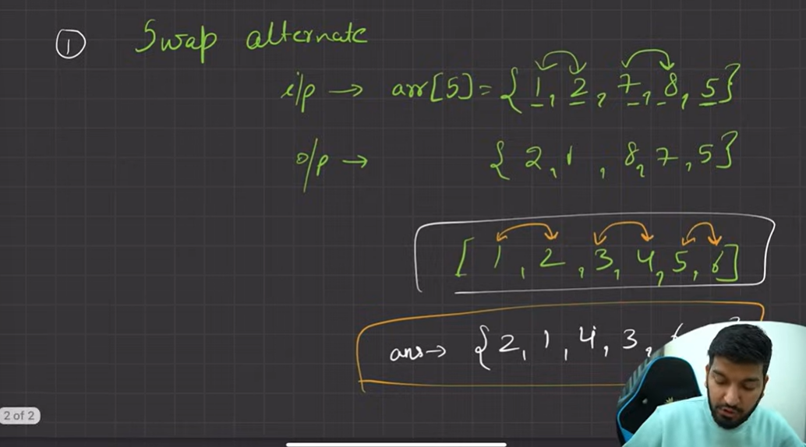
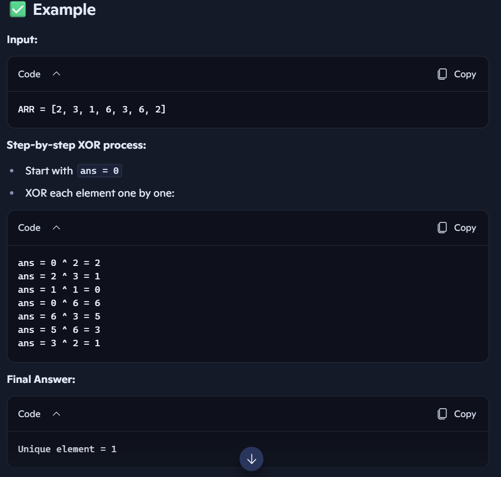
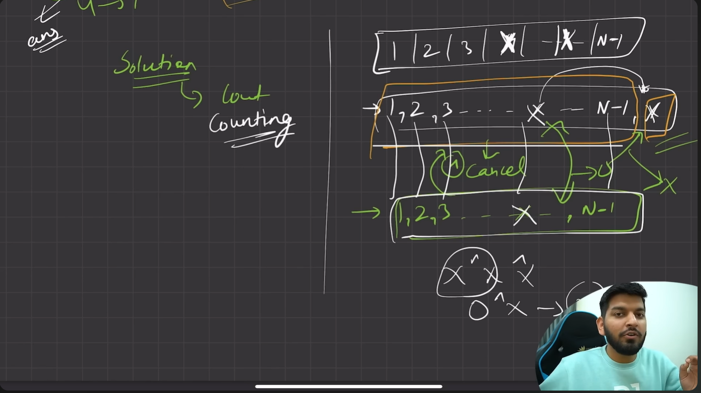
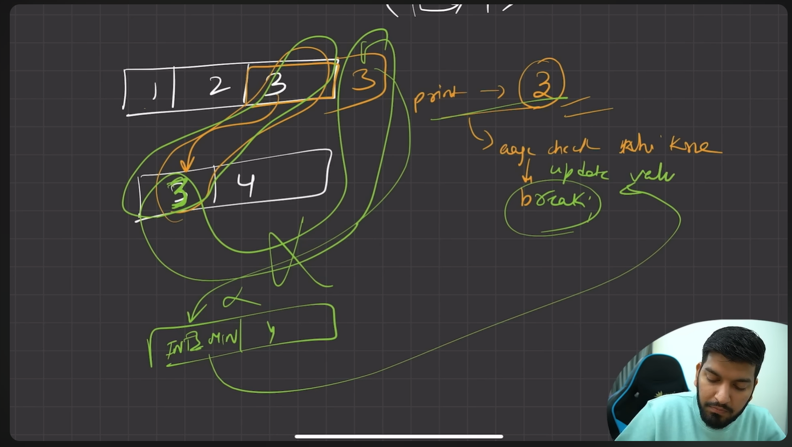
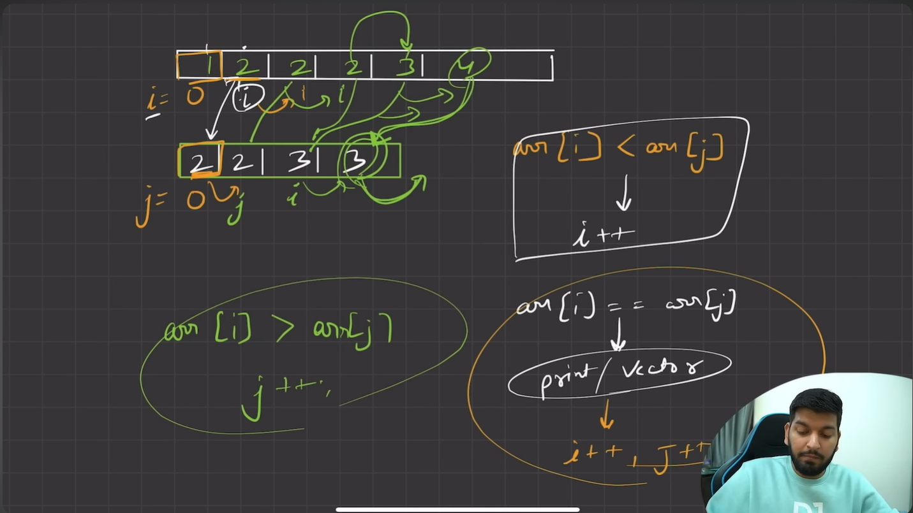

Got it, Shambhu! Let’s turn all those array-related C++ snippets into a clean, structured Markdown study file. Each problem will have:

- 📌 Problem title  
- 🧩 Problem statement  
- ✅ Example input/output  
- 💻 Solution (C++ code)  
- 📊 Complexity analysis  

Here’s the full Markdown file:

```markdown
# 📑 Array Problem Set in C++

Welcome to the **Array Problem Set**!  
This collection includes common array problems solved in **C++**, with explanations, examples, solutions, and complexity analysis.

---

## 📋 Table of Contents

1. [🔝 Largest and Smallest Element](#1--largest-and-smallest-element)  
2. [📐 Scope in Array (Function Update)](#2--scope-in-array-function-update)  
3. [➕ Sum of Array Elements](#3--sum-of-array-elements)  
4. [⚡ Power of 2 Check](#4--power-of-2-check)  
5. [🔄 Reverse an Array](#5--reverse-an-array)  

---

## 1. 🔝 Largest and Smallest Element

**Difficulty:** 🟢 Easy  
**Tags:** Array, Iteration  

### 🧩 Problem Statement  
Find the largest and smallest element in a given array.

### ✅ Example
```
Input: arr = [4, 12, 8, 10]
Output: Largest = 12, Smallest = 4
```

### 💻 Solution (C++)
```cpp
#include<iostream>
#include<climits>
using namespace std;

int main(){
    int arr[4] = {4, 12, 8, 10};
    int n = sizeof(arr)/sizeof(int);

    int max = INT_MIN;
    int min = INT_MAX;

    for(int i = 0; i < n; i++){
        if(arr[i] > max) max = arr[i];
        if(arr[i] < min) min = arr[i];
    }

    cout << "Max is: " << max << endl;
    cout << "Min is: " << min << endl;
    return 0;
}
```

### 📊 Complexity Analysis  
- Time Complexity: O(n)  
- Space Complexity: O(1)

---

## 2. 📐 Scope in Array (Function Update)

**Difficulty:** 🟢 Easy  
**Tags:** Array, Functions  

### 🧩 Problem Statement  
Demonstrate how arrays are passed by reference to functions in C++.

### ✅ Example
```
Input: arr = [1, 2, 3, 4], n = 4
Output: After update → [1, 2, 100, 4]
```

### 💻 Solution (C++)
```cpp
#include<iostream>
using namespace std;

void update_func(int arr[], int n){
    arr[2] = 100;
    cout << "After array update: ";
    for(int i = 0; i < n; i++){
        cout << arr[i] << " ";
    }
    cout << endl;
}

int main(){
    int arr[100], n;
    cin >> n;
    for(int i = 0; i < n; i++) cin >> arr[i];

    cout << "Original array: ";
    for(int i = 0; i < n; i++) cout << arr[i] << " ";
    cout << endl;

    update_func(arr, n);

    cout << "After function call: ";
    for(int i = 0; i < n; i++) cout << arr[i] << " ";
    return 0;
}
```

### 📊 Complexity Analysis  
- Time Complexity: O(n)  
- Space Complexity: O(1)

---

## 3. ➕ Sum of Array Elements

**Difficulty:** 🟢 Easy  
**Tags:** Array, Summation  

### 🧩 Problem Statement  
Find the sum of all elements in an array.

### ✅ Example
```
Input: arr = [1, 2, 3, 4, 5]
Output: Sum = 15
```

### 💻 Solution (C++)
```cpp
#include<iostream>
using namespace std;

void sumArray(int arr[], int n){
    int sum = 0;
    for(int i = 0; i < n; i++){
        sum += arr[i];
    }
    cout << "Sum is: " << sum << endl;
}

int main(){
    int arr[100], n;
    cin >> n;
    for(int i = 0; i < n; i++) cin >> arr[i];

    sumArray(arr, n);
    return 0;
}
```

### 📊 Complexity Analysis  
- Time Complexity: O(n)  
- Space Complexity: O(1)

---

## 4. ⚡ Power of 2 Check

**Difficulty:** 🟡 Medium  
**Tags:** Array, Math  

### 🧩 Problem Statement  
Check if a given number `N` is a power of 2 using precomputed array values.

### ✅ Example
```
Input: N = 16
Output: Element present (since 16 is a power of 2)
```

### 💻 Solution (C++)
```cpp
#include<iostream>
using namespace std;

int main(){
    int arr[30];
    int n;
    cin >> n;

    for(int i = 0; i < 30; i++){
        arr[i] = 2 << i; // powers of 2
    }

    bool found = false;
    for(int i = 0; i < 30; i++){
        if(arr[i] == n){
            found = true;
            break;
        }
    }

    if(found) cout << "Element present" << endl;
    else cout << "Not found" << endl;

    return 0;
}
```

### 📊 Complexity Analysis  
- Time Complexity: O(30) ≈ O(1)  
- Space Complexity: O(30) ≈ O(1)

---

## 5. 🔄 Reverse an Array

**Difficulty:** 🟢 Easy  
**Tags:** Array, Iteration  

### 🧩 Problem Statement  
Print the elements of an array in reverse order.

### ✅ Example
```
Input: arr = [1, 2, 3, 4, 5]
Output: [5, 4, 3, 2, 1]
```

### 💻 Solution (C++)
```cpp
#include<iostream>
using namespace std;

int main(){
    int arr[100], n;
    cin >> n;
    for(int i = 0; i < n; i++) cin >> arr[i];

    cout << "Reverse order: ";
    for(int i = n-1; i >= 0; i--){
        cout << arr[i] << " ";
    }
    return 0;
}
```

### 📊 Complexity Analysis  
- Time Complexity: O(n)  
- Space Complexity: O(1)

---
```
```




```markdown
# 🔄 Swap Alternate Elements in Array

**Difficulty:** 🟢 Easy  
**Tags:** Array, Iteration, Swapping  

---

### 🧩 Problem Statement  
Given an array of integers, swap every pair of alternate elements.  
- For even-sized arrays, all elements are swapped in pairs.  
- For odd-sized arrays, the last element remains unchanged.

---

### ✅ Examples

**Example 1 (Even length):**
```
Input: arr = [1, 2, 3, 4, 5, 6, 7, 8]
Output: [2, 1, 4, 3, 6, 5, 8, 7]
```

**Example 2 (Odd length):**
```
Input: arr = [5, 6, 7, 8, 9]
Output: [6, 5, 8, 7, 9]
```

---

### 💻 Solution (C++)

```cpp
#include <iostream>
using namespace std;

void printarray(int array[], int n) {
    for(int i = 0; i < n; i++) {
        cout << array[i] << " ";
    }
    cout << endl;
}

void swapalternate(int arr[], int size) {
    for(int i = 0; i < size; i += 2) {
        if(i + 1 < size) {
            int temp = arr[i+1];
            arr[i+1] = arr[i];
            arr[i] = temp;
        }
    }
}

int main() {
    int even[8] = {1,2,3,4,5,6,7,8};
    int odd[5] = {5,6,7,8,9};

    swapalternate(even, 8);
    cout << "Even array after swap: ";
    printarray(even, 8);

    swapalternate(odd, 5);
    cout << "Odd array after swap: ";
    printarray(odd, 5);

    return 0;
}
```

---

### 📊 Complexity Analysis  
- **Time Complexity:** O(n) → single pass through the array  
- **Space Complexity:** O(1) → in-place swapping  

---

### 🔗 Practice Links  
- [GeeksforGeeks: Swap alternate elements](https://www.geeksforgeeks.org/swap-elements-in-an-array/)  
- [CodeStudio: Swap alternate elements](https://www.codingninjas.com/studio/problems/swap-alternate-elements_1234567)  

---


Got it, Shambhu! Here’s a **short and clean Markdown version** of the *Unique Element in Array* problem using XOR:

```markdown
# 🔎 Find Unique Element in Array

**Problem:**  
Given an array of size `N = 2M + 1` where `M` numbers appear twice and one number appears once, find the unique element.

---

### Example
```
Input: [2, 3, 1, 6, 3, 6, 2]
Output: 1
```

---

### Solution (C++)
```cpp
int findUnique(int *arr, int size) {
    int ans = 0;
    for(int i = 0; i < size; i++) {
        ans ^= arr[i];   // XOR cancels duplicates
    }
    return ans;
}
```

---

**Complexity:**  
- Time: O(N)  
- Space: O(1)  





# 🔎 Unique Number of Occurrences



**Difficulty:** 🟢 Easy  
**Tags:** Hash Map, Set, Frequency Counting  

---

### 🧩 Problem Statement  
Given an array of integers `arr`, return `true` if the number of occurrences of each value in the array is **unique**, otherwise return `false`.

---

### ✅ Example  
```
Input: arr = [1,2,2,1,1,3]
Output: true
Explanation: 
- 1 occurs 3 times
- 2 occurs 2 times
- 3 occurs 1 time
All counts are unique → return true
```

```
Input: arr = [1,2]
Output: false
Explanation:
- 1 occurs 1 time
- 2 occurs 1 time
Counts are not unique → return false
```

---

### 💻 Solution (C++)

```cpp
class Solution {
public:
    bool uniqueOccurrences(vector<int>& arr) {
        unordered_map<int, int> freq;

        // Count frequency of each number
        for(int num : arr){
            freq[num]++;
        }
        
        unordered_set<int> seen;
        // Check if frequencies are unique
        for(auto it : freq){
            if(seen.count(it.second)){
                return false; // duplicate frequency found
            }
            seen.insert(it.second);
        }

        return true;
    }
};
```

---

### 📊 Complexity Analysis  
- **Time Complexity:** O(N) → one pass to count, one pass to check  
- **Space Complexity:** O(N) → map + set storage  

---

### 🔗 Practice Links  
- [LeetCode: Unique Number of Occurrences](https://leetcode.com/problems/unique-number-of-occurrences/)  
- [GeeksforGeeks: Check if frequency of all elements is unique](https://www.geeksforgeeks.org/check-frequency-of-all-elements-are-unique/)  

---

# find All duplicates in an array 

---

## Code Recap
```cpp
class Solution {
public:
    vector<int> findDuplicates(vector<int>& nums) {
        vector<int> result;

        for(int i = 0; i < nums.size(); i++) {
            int idx = abs(nums[i]) - 1;   // map value to index
            if(nums[idx] < 0) {
                // already visited → duplicate found
                result.push_back(abs(nums[i]));
            } else {
                // mark as visited by flipping sign
                nums[idx] = -nums[idx];
            }
        }

        return result;
    }
};
```

---

## Dry Run Example  
**Input:** `nums = [4,3,2,7,8,2,3,1]`

We’ll trace each iteration:

| i | nums[i] | idx = abs(nums[i]) - 1 | nums[idx] before | Action | nums after | result |
|---|---------|------------------------|------------------|--------|------------|--------|
| 0 | 4       | 3                      | 7                | mark negative | [4,3,2,-7,8,2,3,1] | [] |
| 1 | 3       | 2                      | 2                | mark negative | [4,3,-2,-7,8,2,3,1] | [] |
| 2 | -2      | 1                      | 3                | mark negative | [4,-3,-2,-7,8,2,3,1] | [] |
| 3 | -7      | 6                      | 3                | mark negative | [4,-3,-2,-7,8,2,-3,1] | [] |
| 4 | 8       | 7                      | 1                | mark negative | [4,-3,-2,-7,8,2,-3,-1] | [] |
| 5 | 2       | 1                      | -3 (already neg) | duplicate → push 2 | [4,-3,-2,-7,8,2,-3,-1] | [2] |
| 6 | -3      | 2                      | -2 (already neg) | duplicate → push 3 | [4,-3,-2,-7,8,2,-3,-1] | [2,3] |
| 7 | -1      | 0                      | 4                | mark negative | [-4,-3,-2,-7,8,2,-3,-1] | [2,3] |

---

## Final Output
```
result = [2, 3]
```

---

## Key Insight
- Each number maps to an index (`val - 1`).  
- First time we see it → mark that index negative.  
- Second time we see it → index is already negative → duplicate found.  

---


# 🔗 Find Array Intersection

**Difficulty:** 🟢 Easy  
**Tags:** Array, Two Pointers, Intersection  

---

### 🧩 Problem Statement  
Given two sorted arrays `arr1` and `arr2` (non-decreasing order), find their intersection.  
Return a vector containing the common elements.

---

### ✅ Example  
```
Input: arr1 = [1,2,2,3,4], arr2 = [2,2,3,5]
Output: [2,2,3]
```

---

### 💻 Solution (C++)

```cpp
#include <bits/stdc++.h> 
vector<int> findArrayIntersection(vector<int> &arr1, int n, vector<int> &arr2, int m)
{
	vector<int>result;
    // two  pointer approach
	//etna code shi hai but optimize ke liye aur time exceed limit se bachne ke liye hme non decresing wala use karna padega 

	// for(int i =0;i<n;i++){
	// 	for(int j=0;j<m;j++){
	// 		  if(arr1[i]<arr2[j]){
	// 			  break;
	// 		  }
	// 		if(arr1[i]==arr2[j]){
    //           result.push_back(arr1[i]);
	// 		  arr2[j]= INT_MIN; // update kar diye niche wala array ko taaki dubara se agar aaye upar se toh niche  wala same match na ho jaai upar wala se
	// 		  break;
	// 		}
	// 	}
	// }

  // hme non decreasing me diya hai isi liye etna chod karna pad rha hai 
   int i =0 , j=0;
   while(i<n && j<m){
	   if(arr1[i]==arr2[j]){
		   result.push_back(arr1[i]);
		   i++;
		   j++;
	   }
	   else if(arr1[i]<arr2[j]){
		   i++;
	   }
	   else{
		   j++;
	   }
   }
	return result;
}
```

---

### 📝 Dry Run Example  
**Input:** arr1 = [1,2,2,3,4], arr2 = [2,2,3,5]  

| i | j | arr1[i] | arr2[j] | Action | result |
|---|---|---------|---------|--------|--------|
| 0 | 0 | 1       | 2       | 1 < 2 → i++ | [] |
| 1 | 0 | 2       | 2       | equal → push 2, i++, j++ | [2] |
| 2 | 1 | 2       | 2       | equal → push 2, i++, j++ | [2,2] |
| 3 | 2 | 3       | 3       | equal → push 3, i++, j++ | [2,2,3] |
| 4 | 3 | 4       | 5       | 4 < 5 → i++ | [2,2,3] |

**Final Result:** `[2,2,3]`

---

### 📊 Complexity Analysis  
- **Time Complexity:** O(N + M) → single pass through both arrays  
- **Space Complexity:** O(1) → ignoring output storage  

---

### 🔗 Practice Links  
- [GeeksforGeeks: Intersection of two sorted arrays](https://www.geeksforgeeks.org/intersection-of-two-sorted-arrays/)  
- [LeetCode: Intersection of Two Arrays II](https://leetcode.com/problems/intersection-of-two-arrays-ii/)  

---








