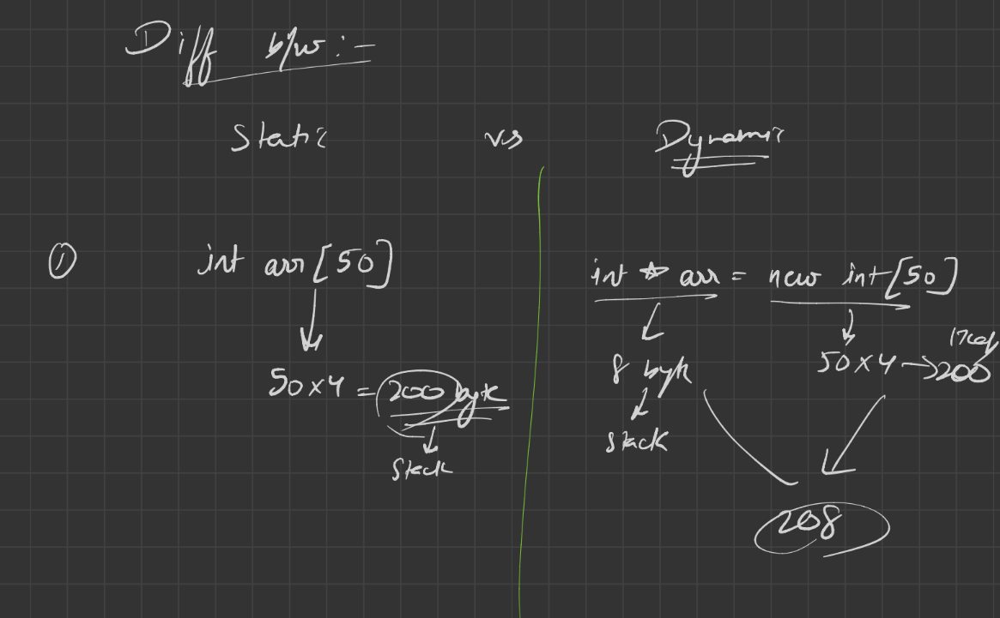
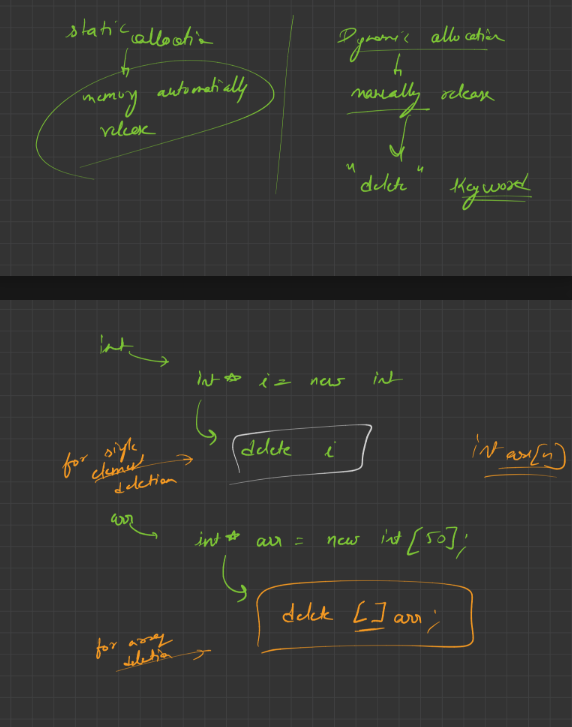

```cpp
#include<iostream>
using namespace std;

// ❌ Unsafe: returns reference to a local variable (num dies after function ends)
int& func(int a) {
    int num = a;       // local variable
    int& ans = num;    // reference bound to local
    return ans;        // returning reference to local → undefined behavior
}

// ❌ Unsafe: returns pointer to a local variable (n dies after function ends)
int* fun(int n) {
    int* ptr = &n;     // pointer to local variable
    return ptr;        // returning dangling pointer → undefined behavior
}

// ✅ Pass by reference: modifies the original variable
void update2(int& n) {
    n++;
}

// ✅ Pass by value: works on a copy, original unchanged
void update1(int n) {
    n++;
}

int main() {
    int n = 5;

    cout << "Before " << n << endl;   // Output: Before 5
    update2(n);                       // modifies n directly
    cout << "After " << n << endl;    // Output: After 6

    update1(n);                       // works on a copy
    cout << "After update1 " << n << endl; // Output: After update1 6 (unchanged)

    // Calling fun(n) → returns dangling pointer (unsafe)
    int* p = fun(n);
    cout << "Value at dangling pointer (undefined): " << *p << endl; 
    // ⚠️ This line may crash or print garbage

    // Calling func(n) → returns dangling reference (unsafe)
    int& ref = func(n);
    cout << "Value at dangling reference (undefined): " << ref << endl;
    // ⚠️ This line may crash or print garbage

    return 0;
}
```

---

## 🔎 Expected Output (with explanations)

```
Before 5
After 6
After update1 6
Value at dangling pointer (undefined): <garbage or crash>
Value at dangling reference (undefined): <garbage or crash>
```

---

## 🎯 Key Learning Points
- **Pass by value (`update1`)** → original variable unchanged and extra memory take  
- **Pass by reference (`update2`)** → original variable modified channge in same memory  
- **Returning reference/pointer to local variable (`func`, `fun`)** → unsafe, leads to undefined behavior (garbage values or runtime errors).  

---

Great topic, Shambhu 🤓 — examiners love when you can clearly distinguish **static memory** and **dynamic memory** in C++ with examples. Let’s break it down in a structured way:

---

## 🧠 Static Memory
- **Definition**: Memory allocated at **compile time**.  
- **Lifetime**: Exists for the entire program run.  
- **Location**: Stored in the **stack** (for local variables) or **data segment** (for global/static variables).  
- **Management**: Automatically managed by the compiler — no need to free manually.  
- **Examples**:
  ```cpp
  int x = 10;          // local variable → stack
  static int y = 20;   // static variable → data segment
  ```
- **Key Point**: Safe, but limited in size and scope.

---

## ⚡ Dynamic Memory
- **Definition**: Memory allocated at **runtime** using operators like `new` or functions like `malloc`.  
- **Lifetime**: Exists until explicitly freed (`delete` or `free`).  
- **Location**: Stored in the **heap**.  
- **Management**: Programmer must manage allocation and deallocation.  
- **Examples**:
  ```cpp
  int* ptr = new int(30);   // allocate on heap
  cout << *ptr << endl;     // prints 30
  delete ptr;               // free memory
  ```
- **Key Point**: Flexible, but risky — forgetting `delete` causes memory leaks.

---

## 📊 Comparison Table

| Aspect              | **Static Memory** | **Dynamic Memory** |
|---------------------|-------------------|--------------------|
| Allocation time     | Compile time      | Runtime            |
| Location            | Stack/Data segment| Heap               |
| Lifetime            | Fixed (program run)| Until freed manually|
| Management          | Automatic         | Manual (`new/delete`)|
| Example             | `int a = 5;`      | `int* p = new int(5);` |

---

## 🎯 Examiner-Friendly Example Program

```cpp
#include <iostream>
using namespace std;

int main() {
    // Static memory
    int a = 10;              // stack
    static int b = 20;       // data segment
    cout << "Static a: " << a << ", Static b: " << b << endl;

    // Dynamic memory
    int n;
    char c;
    int* p = new int(n);    // heap // size = p always 8 +  n*4 , (4 because int 4 size for 1 value)  
    char* ch = c;           //size ch ka 8 + ch(1) => total 9 byte 
    cout << "Dynamic p: " << *p << endl;

    delete p;                // free heap memory
    return 0;
}
```

### Output
```
Static a: 10, Static b: 20
Dynamic p: 30
```

---

## 📝 Key Takeaway
- **Static memory** → predictable, safe, compiler-managed.  
- **Dynamic memory** → flexible, programmer-managed, powerful but error-prone.  

---


---

## 📊 Summary of Sizes in C++

| Type declaration | Example | `sizeof(pointer)` (64‑bit) | `sizeof(*pointer)` (data size) | Notes |
|------------------|---------|----------------------------|--------------------------------|-------|
| **int\***        | `int* p = new int(30);` | 8 | 4 | Pointer is 8 bytes (address), int is 4 bytes |
| **char\***       | `char* ch = new char[10];` | 8 | 1 | Pointer is 8 bytes, char is 1 byte |
| **float\***      | `float* fl = new float(5.67f);` | 8 | 4 | Pointer is 8 bytes, float is 4 bytes |
| **string\***     | `string* str = new string("Hi");` | 8 | ~32 (implementation dependent) | Pointer is 8 bytes, string object size varies (~24–32 bytes on most compilers) |

---

## 🔎 Key Rules
- **Pointer size** depends on architecture:
  - 8 bytes on **64‑bit** systems.
  - 4 bytes on **32‑bit** systems.
- **Dereferenced size (`sizeof(*ptr)`)** depends on the type the pointer points to:
  - `int` → 4 bytes  
  - `char` → 1 byte  
  - `float` → 4 bytes  
  - `string` → implementation dependent (often ~32 bytes, because `std::string` stores metadata + pointer to dynamic char buffer).
- The pointer itself lives on the **stack**, but the data it points to can live on:
  - **Stack** (if pointing to a local variable),
  - **Heap** (if allocated with `new`),
  - **Static/data segment** (if pointing to a global/static variable or string literal).

---

## 🎯 Quick Example Code
```cpp
#include <iostream>
#include <string>
using namespace std;

int main() {
    int* p = new int(30);
    char* ch = new char[10];
    float* fl = new float(5.67f);
    string* str = new string("Hello");

    cout << "sizeof(p): " << sizeof(p) << ", sizeof(*p): " << sizeof(*p) << endl;
    cout << "sizeof(ch): " << sizeof(ch) << ", sizeof(*ch): " << sizeof(*ch) << endl;
    cout << "sizeof(fl): " << sizeof(fl) << ", sizeof(*fl): " << sizeof(*fl) << endl;
    cout << "sizeof(str): " << sizeof(str) << ", sizeof(*str): " << sizeof(*str) << endl;

    delete p;
    delete[] ch;
    delete fl;
    delete str;
    return 0;
}
```

### Sample Output (on 64‑bit system)
```
sizeof(p): 8, sizeof(*p): 4
sizeof(ch): 8, sizeof(*ch): 1
sizeof(fl): 8, sizeof(*fl): 4
sizeof(str): 8, sizeof(*str): 32
```

---

## 📝 Takeaway
- **Pointer size is fixed by architecture** (8 bytes on 64‑bit).  
- **Dereferenced size depends on the type** the pointer points to.  
- `std::string` is special: its size is larger because it stores metadata and a pointer to dynamic memory.

---




---

## 🔎 Detailed Explanation

### **Static Memory Allocation**
- **When allocated**: At compile time.  
- **Location**: Usually in the **stack** or **data segment**.  
- **Size**: Fixed and known before program execution.  
- **Lifetime**: Exists until the function ends (for local variables) or until the program ends (for global/static variables).  
- **Management**: Automatically handled by the compiler.  
- **Example**:
  ```cpp
  int arr[5];   // static array, size fixed at compile time
  ```
- **Advantages**: Fast access, no overhead of allocation/deallocation.  
- **Disadvantages**: Inflexible, cannot change size at runtime.  

---

### **Dynamic Memory Allocation**
- **When allocated**: At runtime.  
- **Location**: In the **heap**.  
- **Size**: Flexible, decided during program execution.  
- **Lifetime**: Exists until explicitly freed (`delete` in C++ or `free` in C).  
- **Management**: Controlled by the programmer.  
- **Example**:
  ```cpp
  int n;
  cin >> n;
  int* arr = new int[n];   // dynamic array, size decided at runtime
  delete[] arr;            // must free memory
  ```
- **Advantages**: Flexible, can handle variable sizes and large data.  
- **Disadvantages**: Slower allocation, risk of memory leaks if not freed.  

---

## 📊 Comparison Table

| Feature | **Static Memory Allocation** | **Dynamic Memory Allocation** |
|---------|------------------------------|--------------------------------|
| **Allocation time** | **[Compile time](guide://action?prefill=Tell%20me%20more%20about%3A%20Compile%20time)** | **[Runtime](guide://action?prefill=Tell%20me%20more%20about%3A%20Runtime)** |
| **Location** | **[Stack/Data segment](guide://action?prefill=Tell%20me%20more%20about%3A%20Stack%2FData%20segment)** | **[Heap](guide://action?prefill=Tell%20me%20more%20about%3A%20Heap)** |
| **Size** | **[Fixed](guide://action?prefill=Tell%20me%20more%20about%3A%20Fixed)** | **[Flexible](guide://action?prefill=Tell%20me%20more%20about%3A%20Flexible)** |
| **Lifetime** | **[Automatic](guide://action?prefill=Tell%20me%20more%20about%3A%20Automatic)** | **[Until freed manually](guide://action?prefill=Tell%20me%20more%20about%3A%20Until%20freed%20manually)** |
| **Management** | **[Compiler](guide://action?prefill=Tell%20me%20more%20about%3A%20Compiler)** | **[Programmer](guide://action?prefill=Tell%20me%20more%20about%3A%20Programmer)** |
| **Example** | **[int arr[5];](guide://tell-more)** | **[int* arr = new int[n];](guide://tell-more)** |

---

## 🎯 Key Takeaway
- Use **static allocation** when the size is known and fixed.  
- Use **dynamic allocation** when the size depends on runtime input or needs flexibility.  

---


---

## 🔎 Code Walkthrough

```cpp
#include <iostream>
using namespace std;

int main() {
    int row;
    cin >> row;   // number of rows

    int col;
    cin >> col;   // number of columns

    // ✅ Step 1: Create a 2D array dynamically
    int** arr = new int*[row];        // array of row pointers
    for(int i=0; i<row; i++) {
        arr[i] = new int[col];        // each row has 'col' integers
    }

    // ✅ Step 2: Take input
    for(int i=0; i<row; i++) {
        for(int j=0; j<col; j++) {
            cin >> arr[i][j];
        }
    }

    // ✅ Step 3: Print output
    cout << endl;
    for(int i=0; i<row; i++) {
        for(int j=0; j<col; j++) {
            cout << arr[i][j] << " ";
        }
        cout << endl;
    }

    // ✅ Step 4: Free memory (important in dynamic allocation)
    for(int i=0; i<row; i++) {
        delete [] arr[i];   // free each row
    }
    delete [] arr;          // free row pointer array

    return 0;
}
```

---

## 📊 Example Run

**Input:**
```
3
3
1 2 3
4 5 6
7 8 9
```

**Output:**
```
1 2 3
4 5 6
7 8 9
```

---

## 🎯 Key Concepts Demonstrated

- **Dynamic allocation of 2D array**:  
  `int** arr = new int*[row];` → creates an array of row pointers.  
  `arr[i] = new int[col];` → allocates each row dynamically.

- **Input/Output**: Nested loops handle row × column traversal.

- **Memory deallocation**:  
  - `delete [] arr[i];` frees each row.  
  - `delete [] arr;` frees the array of pointers.  
  Without this, you’d have a **memory leak**.

---

## 📝 Examiner‑Friendly Notes
- **Static 2D array**: `int arr[3][3];` → size fixed at compile time.  
- **Dynamic 2D array**: `int** arr = new int*[row];` → size flexible, decided at runtime.  
- Always **free memory** after use to avoid leaks.  

---
