please update my table of content because table of content is not properly # 🌳 Binary Search Tree (BST) Implementation in C++

Welcome to the **BST Problem Set**! 💡
This collection features **common problems solved using Binary Search Tree in C++**.
Each problem includes **problem statement, examples, your solution code, complexity analysis, and practice links**.

---
# 🌳 Binary Search Tree (BST) Implementation in C++

Welcome to the **BST Problem Set**! 💡
This collection features **common problems solved using Binary Search Tree in C++**.
Each problem includes **problem statement, examples, your solution code, complexity analysis, and practice links**.

---
# 📘 Table of Contents — Binary Tree & BST Problem Set (C++)

| No. | Problem Title | Type | Practice Links |
|:---:|:-----------------------------------------------------|:------------:|:-------------------------------------------------------------------------------------------------------------------|
| 1️⃣ | **Create BST & Traversal/Min/Max** | BST Basic | [Source Code](#bst-traversals) |
| 2️⃣ | 🔍 **Search a Node in BST** | BST Basic | [GeeksforGeeks](https://www.geeksforgeeks.org/binary-search-tree-data-structure/) / [Coding Ninjas](https://www.codingninjas.com/) |
| 3️⃣ | 🌳 **BST Deletion Operations** | BST Modify | [GeeksforGeeks](https://www.geeksforgeeks.org/binary-search-tree-data-structure/) / [LeetCode](https://leetcode.com/tag/binary-search-tree/) |
| 4️⃣ | 🌳 **Two Sum in BST** (Target Sum) | BST Medium | [LeetCode 653](https://leetcode.com/problems/two-sum-iv-input-is-a-bst/) / [Coding Ninjas](https://www.codingninjas.com/codestudio/problems/pair-sum-in-bst_920493) |
| 5️⃣ | 🌳 **Flatten BST To A Sorted List** | BST Modify | [Coding Ninjas](https://www.codingninjas.com/studio/problems/flatten-bst-to-a-sorted-list_1112606) / [LeetCode](https://leetcode.com/problems/increasing-order-search-tree/) |
| 6️⃣ | 🌲 **Normal BST To Balanced BST** | BST Modify | [Coding Ninjas](https://www.codingninjas.com/studio/problems/normal-bst-to-balanced-bst_920472) / [LeetCode](https://leetcode.com/problems/convert-sorted-array-to-binary-search-tree/) |
| 7️⃣ | 🌲 **Preorder Traversal to BST** (Construct) | BST Construct | [LeetCode](https://leetcode.com/problems/construct-binary-search-tree-from-preorder-traversal/) / [Coding Ninjas](https://www.codingninjas.com/studio/problems/preorder-traversal-to-bst_893111) |
| 8️⃣ | 🌲 **Validate Binary Search Tree** | BST Check | [LeetCode](https://leetcode.com/problems/validate-binary-search-tree/) / [Coding Ninjas](https://www.codingninjas.com/studio/problems/check-bst_920073) |
| 9️⃣ | 🌲 **K-th Smallest Element in a BST** | BST Query | [LeetCode](https://leetcode.com/problems/kth-smallest-element-in-a-bst/) / [Coding Ninjas](https://www.codingninjas.com/studio/problems/kth-smallest-node-in-bst_893128) |
| 🔟 | 🌲 **Predecessor and Successor in BST** | BST Query | [LeetCode](https://leetcode.com/problems/inorder-successor-in-bst/) / [Coding Ninjas](https://www.codingninjas.com/studio/problems/predecessor-and-successor-in-bst_893049) |
| 1️⃣1️⃣ | 🌿 **LCA (Lowest Common Ancestor) in BST** | BST Query | [LeetCode](https://leetcode.com/problems/lowest-common-ancestor-of-a-binary-search-tree/) / [Coding Ninjas](https://www.codingninjas.com/studio/problems/lca-of-two-nodes-in-bst_893103) |
| 1️⃣2️⃣ | 🌲 **Merge Two BSTs** | BST Combine | [LeetCode](https://leetcode.com/problems/all-elements-in-two-binary-search-trees/) / [Coding Ninjas](https://www.codingninjas.com/studio/problems/merge-two-bsts_920474) |
| 1️⃣3️⃣ | 🌳 **Size of Largest BST in a Binary Tree** | BT Hard | [LeetCode](https://leetcode.com/problems/largest-bst-subtree/) / [Coding Ninjas](https://www.codingninjas.com/studio/problems/size-of-largest-bst-in-binary-tree_893103) |

---
---


# 1. 📘 Create a Binary Search Tree and Perform Tree Traversals {#bst-traversals}

**File:** `BST_Traversal.cpp`
**Language:** C++
**Link:** [👉 Click here for source code](#) <!-- Update with actual link -->

---

### 🧩 Problem Statement

Write a C++ program to:

1. Create a **Binary Search Tree (BST)** by taking user input.
2. Perform and print:

   * **Inorder Traversal**
   * **Preorder Traversal**
   * **Postorder Traversal**
   * **Level Order Traversal**
   * **minimum node (value) in BST**
   * **mAXIMUM node (value) in BST**
---

### 🧠 Concept

A **Binary Search Tree (BST)** is a binary tree where:

* The left subtree contains nodes with values **less than** the parent node.
* The right subtree contains nodes with values **greater than** the parent node.

This property allows for efficient searching, insertion, and traversal.

---

### 💻 Code Implementation

```cpp
#include<iostream>
#include<queue>
using namespace std;

class Node{
    public:
    int data;
    Node* left;
    Node* right;

    Node(int d){
        this->data = d;
        this->left = NULL;
        this->right = NULL;
    }
};

// INORDER Traversal (Left → Root → Right)
void inOrder(Node* root){
    if(root==NULL) return;
    inOrder(root->left);
    cout<<root->data<<" ";
    inOrder(root->right);
}

// PREORDER Traversal (Root → Left → Right)
void preOrder(Node* root){
    if(root==NULL) return;
    cout<<root->data<<" ";
    preOrder(root->left);
    preOrder(root->right);
}

// POSTORDER Traversal (Left → Right → Root)
void postOrder(Node* root){
    if(root==NULL) return;
    postOrder(root->left);
    postOrder(root->right);
    cout<<root->data<<" ";
}


Node* minValue(Node* root){
       if(root==NULL) return NULL;
    Node* temp = root;

    while(temp->left!=NULL){
        temp = temp->left;
    }
    return temp;
}

Node* maxValue(Node* root){
    if(root==NULL) return NULL;
    Node* temp = root;

    while(temp->right!=NULL){
        temp = temp->right;
    }
    return temp;
}

// LEVEL ORDER Traversal (Breadth-first)
void levelOrderTraversal(Node* root){
    queue<Node*> q;
    q.push(root);
    q.push(NULL);

    while(!q.empty()){
        Node* temp = q.front();
        q.pop();
         
        if(temp == NULL){ // End of current level
            cout<<endl;
            if(!q.empty()){
                q.push(NULL);
            }
        }
        else{
            cout<<temp->data <<" ";
            if(temp->left) q.push(temp->left);
            if(temp->right) q.push(temp->right);
        }
    }
}

// Insert data into BST
Node* insertIntoBST(Node* &root, int data){
    if(root == NULL){
        root = new Node(data);
        return root;
    }
    if(data > root->data)
        root->right = insertIntoBST(root->right, data);
    else
        root->left = insertIntoBST(root->left, data);

    return root;
} 

// Take user input until -1 is entered
void takeInput(Node* &root){
    int data;
    cin >> data;
    while(data != -1){
        insertIntoBST(root, data);
        cin >> data;
    }
}

// Main function
int main(){
    Node* root = NULL;
    cout << "Enter data to create BST (-1 to stop):" << endl;
    takeInput(root);
 
    cout << "\nPrinting the BST using LEVEL ORDER TRAVERSAL:" <<   endl;
    levelOrderTraversal(root);

    cout << "\nPrinting INORDER traversal:" << endl;
    inOrder(root);

    cout << "\n\nPrinting PREORDER traversal:" << endl;
    preOrder(root);
    
    cout << "\n\nPrinting POSTORDER traversal:" << endl;
    postOrder(root);

    
    return 0;
}
```

---

# 2.🔍 Search a Node in BST {#search-node-bst}

**Practice this question on:**
[GeeksforGeeks](https://www.geeksforgeeks.org/binary-search-tree-data-structure/) | [LeetCode](https://leetcode.com/) | [Coding Ninjas](https://www.codingninjas.com/)

---

**Difficulty:** Easy
**Accuracy:** 68.46%
**Submissions:** 108K+
**Points:** 2
**Average Time:** 15m

Given the root of a Binary Search Tree and a node value `key`, find if the node with value `key` is present in the BST or not.

### Examples:


---

## 🔹 Approach 1: Recursion

```cpp
/*
class Node {
    int data;
    Node *left;
    Node *right;

    Node(int x) {
        data = x;
        left = NULL;
        right = NULL;
    }
};
*/

class Solution {
  public:
    bool search(Node* root, int key) {

     if(root == NULL){
         return false;
     }
     if(root->data== key){
         return true;
     }
     
     if(root->data>key){
         //left part
        return  search(root->left , key);
     }
     else{
        return search(root->right , key);
     }
        
    }
};
```

**Time Complexity:** O(h) where h is the height of BST (O(log n) for balanced, O(n) for skewed)
**Space Complexity:** O(h) due to recursion stack

---

## 🔹 Approach 2: Iterative

```cpp
/*
    Following is the Binary Tree node structure:

    template <typename T>
    class BinaryTreeNode
    {
    public:
        T data;
        BinaryTreeNode<T> *left, *right;
        BinaryTreeNode() : data(0), left(NULL), right(NULL) {}
        BinaryTreeNode(T x) : data(x), left(NULL), right(NULL) {}
        BinaryTreeNode(T x, BinaryTreeNode<T> *left, BinaryTreeNode<T> *right) : data(x), left(left), right(right) {}
    };

*/

bool searchInBST(BinaryTreeNode<int> *root, int x) {
      // Node bna liye 
        BinaryTreeNode<int>* temp= root;

        while(temp!=NULL){
            if(temp->data == x){
                return true;
            }
            else if(temp->data > x){
                temp=temp->left;
            }
            else{
                temp=  temp->right;
            }
        }
        return false;
}
```

**Time Complexity:** O(h) where h is the height of BST
**Space Complexity:** O(1) (iterative)

---

**💡 Notes:**

* Recursion is more intuitive but uses extra stack space.
* Iterative approach is memory efficient.
* For a balanced BST, both methods are efficient (O(log n)), but for skewed BST it can degrade to O(n).


# 3. 🌳 Binary Search Tree Deletion Operations in C++ {#bst-deletion}

**File:** `BST_Deletion.cpp`
**Language:** C++
**Practice:** [GeeksforGeeks BST](https://www.geeksforgeeks.org/binary-search-tree-data-structure/) | [LeetCode BST Problems](https://leetcode.com/tag/binary-search-tree/) | [CodingNinjas](https://www.codingninjas.com/)

---

### 🧩 Problem Statement

Given a BST, implement deletion of a node with a given value. Handle all cases:

1. Node with **0 children** (leaf node)
2. Node with **1 child** (left or right)
3. Node with **2 children** (replace with in-order successor or predecessor)

Also, implement:

* Insertion
* Traversals: Inorder, Preorder, Postorder, Level Order
* Finding Min and Max values


---

### 💻 Code Implementation

```cpp
#include<iostream>
#include<queue>
using namespace std;

class Node{
    public:
    int data;
    Node* left;
    Node* right;

    Node(int d){
        this->data = d;
        this->left = NULL;
        this->right = NULL;
    }
};

// Find Minimum Value in BST
Node* minValue(Node* root){
     if(root==NULL) return NULL; 
     Node* temp=root; 
     while(temp->left!=NULL) {
     temp=temp->left;
      }
       return temp; 
 }

// Find Maximum Value in BST
Node* maxValue(Node* root){
     if(root==NULL) return NULL; 
     Node* temp=root; 
     while(temp->right!=NULL){
         temp=temp->right;
      }
 return temp; }
// Deletion function for a Binary Search Tree (BST)
Node* deleteFromBST(Node* root , int val){
    // Base Case: Agar root NULL hai, toh wapis NULL return karo (If root is NULL, return NULL)
    if(root == NULL){
        return NULL;
    }

    // Node found: If the current node is the one to be deleted (root->data == val)
    if(root->data == val){
        cout<< "Successfully deleted node with value: " << val << endl;
        
        // Case 1: 0 Child Node deletion (Leaf Node)
        // Node is a leaf: simply delete it and return NULL to its parent
        if(root->left ==  NULL && root->right == NULL){
            delete root;
            return NULL;
        }

        // Case 2: 1 Child Node deletion (Left child exists)
        // Left child present, Right child is NULL
        else if(root->left != NULL && root->right == NULL){ 
            // Store the left child to promote it
            Node* temp = root->left;
            delete root;
            // Return the left child to replace the deleted node
            return temp;
        } 

        // Case 3: 1 Child Node deletion (Right child exists)
        // Right child present, Left child is NULL
        else if(root->left == NULL && root->right != NULL){ 
            // Store the right child to promote it
            Node* temp = root->right;
            delete root;
            // Return the right child to replace the deleted node
            return temp;
        }

        // Case 4: 2 Child Nodes deletion
        else if (root->left != NULL && root->right != NULL){
            // Strategy: Replace the node's data with the minimum value from its RIGHT subtree.
            // (Alternate strategy: Use max value from the LEFT subtree)

            // Step 1: Find the minimum value in the right subtree (In-order Successor)
            // min value nikaal liye right se 
            int mini = minValue(root->right)->data;
            
            // Step 2: Copy this minimum value to the current node (replacing the value we want to delete)
            // root ka jo data hai usme copy kar liye 
            root->data = mini;
            
            // Step 3: Now, delete the actual minimum value node from the right subtree (it has 0 or 1 child)
            // ab delete kar denge min value ko right wala 
            root->right = deleteFromBST(root->right , mini);
            
            // Return the modified root
            return root;
        }
    }
    
    // Traversal (If node is NOT found at current root)
    
    // If the value is smaller, search in the left subtree
    else if(val < root->data){ 
        // root->left ko update karo with the result of deletion in the left subtree
        root->left = deleteFromBST(root->left , val);
    }
    
    // If the value is larger, search in the right subtree
    else{ // val > root->data
        // root->right ko update karo with the result of deletion in the right subtree
        root->right = deleteFromBST(root->right, val);
    }
    
    // Return the current root pointer for recursive calls to reconnect the tree
    return root;
}

// LEVEL ORDER TRAVERSAL
// thoda tree format me dikhane ke liye 
void levelOrderTraversal(Node* root){
     queue<Node*> q;
     q.push(root);
     q.push(NULL);

     while(!q.empty()){
        Node* temp = q.front();
        q.pop();
         
        if(temp ==NULL){ // purana level complete traverse ho chuka hai 
            cout<<endl;
            if(!q.empty()){//queue still has some child node
             q.push(NULL);//separator
            }
        }
        else{
        cout<<temp->data <<" ";
        if(temp->left){
            q.push(temp->left);
        }

        if(temp->right){
            q.push(temp->right);
        }
    }

     }
}

// Insert Node
Node* insertIntoBST(Node* &root, int data){
    if(root==NULL){ root=new Node(data); return root; }
    if(data>root->data) root->right=insertIntoBST(root->right,data);
    else root->left=insertIntoBST(root->left,data);
    return root;
}

// Take Input
void takeInput(Node* &root){
    int data; cin>>data;
    while(data!=-1){ insertIntoBST(root,data); cin>>data; }
}

int main(){
    Node* root=NULL;
    cout<<"Enter data to create BST (-1 to stop):"<<endl;
    takeInput(root);

    cout<<"\nBST Level Order Traversal:"<<endl;
    levelOrderTraversal(root);


    cout<<"\nMinimum value in BST: "<<minValue(root)->data<<endl;
    cout<<"Maximum value in BST: "<<maxValue(root)->data<<endl;

    int val;
    cout<<"\nEnter value to delete from BST: "; cin>>val;
    root = deleteFromBST(root,val);

    cout<<"\nBST after deletion (Level Order):"<<endl;
    levelOrderTraversal(root);

    return 0;
}
```

---

### 📊 Complexity Analysis

* **Time Complexity:** O(h), where h is the height of BST

  * O(log n) for balanced BST
  * O(n) for skewed BST
* **Space Complexity:** O(h) for recursion stack during deletion

---

**💡 Notes:**

* Handles all cases of deletion.
* Maintains BST properties.
* Supports traversals and min/max queries.


# 4 .🌳 Two Sum in BST - LeetCode Problem {#two-sum-bst}

### 🌐 Practice Websites

* [LeetCode - Two Sum IV: Input is a BST](https://leetcode.com/problems/two-sum-iv-input-is-a-bst/)
* [Coding Ninjas - Pair Sum in BST](https://www.codingninjas.com/codestudio/problems/pair-sum-in-bst_920493)


---

## 📘 Problem: Two Sum in BST

**Difficulty:** Medium
**LeetCode Link:** [LeetCode 653 - Two Sum IV - Input is a BST](https://leetcode.com/problems/two-sum-iv-input-is-a-bst/)
**Language:** C++

### 🧩 Problem Statement

Given the `root` of a **Binary Search Tree** and an integer `k`, return `true` if there exist **two elements** in the BST such that their sum equals `k`, otherwise return `false`.

**Example:**

```
Input: root = [5,3,6,2,4,null,7], k = 9
Output: true
```

---

### 💻 Solution (C++)

```cpp
/**
 * Definition for a binary tree node.
 * struct TreeNode {
 *     int val;
 *     TreeNode *left;
 *     TreeNode *right;
 *     TreeNode() : val(0), left(nullptr), right(nullptr) {}
 *     TreeNode(int x) : val(x), left(nullptr), right(nullptr) {}
 *     TreeNode(int x, TreeNode *left, TreeNode *right) : val(x), left(left), right(right) {}
 * };
 */

 // 2 node ka pair batana hai  , ki target value ke equal hai ki nhi agar sum karenge 2 node ko toh
 // toh hm isko inorder find kar ke kar sakte hai because , inorder sorted order me data return karta hai 
 // uske baad 2 pinter wala approach lga lenge inorder ke first element 'i' and last element ko 'j' maan lenge  aur sum karayenge aur agar sum chota hoga target se toh i++ kra denge ya agar sum bda hoga toh j--
 // aise hi hme ek point par mil jaayega toh true return  ya nhi milege toh false 
class Solution {
public:
    // Inorder traversal to get sorted elements of BST
    TreeNode* inorderTraversal(TreeNode* root , vector<int>& inorder){
        if(root == NULL) return NULL;
        inorderTraversal(root->left , inorder);
        inorder.push_back(root->val);
        inorderTraversal(root->right , inorder);
        return root;
    }

    bool findTarget(TreeNode* root, int k) {
        vector<int> inorder;
        inorderTraversal(root , inorder);

        int i = 0;                  // Start pointer
        int j = inorder.size() - 1; // End pointer

        while(i < j){
            int sum = inorder[i] + inorder[j];
            if(sum == k) return true;   // Found a pair
            else if(sum > k) j--;       // Sum too big, move end pointer
            else i++;                    // Sum too small, move start pointer
        }
        return false; // No pair found
    }
};
```

---

### 🔹 Approach Explanation

1. **Inorder Traversal:**
   Traverse BST inorder to get elements in **sorted order**.

2. **Two-Pointer Technique:**

   * Start with two pointers, `i` at the beginning and `j` at the end of the sorted array.
   * Calculate the sum:

     * If sum == target, return `true`
     * If sum < target, move `i++`
     * If sum > target, move `j--`
   * Continue until `i >= j`.

3. **Return false** if no such pair exists.

---

### 📊 Complexity Analysis

* **Time Complexity:** O(n)

  * O(n) for inorder traversal
  * O(n) for two-pointer search

* **Space Complexity:** O(n)

  * Due to vector storing inorder traversal

---

**💡 Notes:**

* Inorder traversal is key because it gives sorted elements of BST.
* Two-pointer approach works efficiently on the sorted array.


---


# 5. 🌳 Flatten BST To A Sorted List

### 🌐 Practice Websites

* [Coding Ninjas - Flatten BST to Sorted List](https://www.codingninjas.com/studio/problems/flatten-bst-to-a-sorted-list_1112606)
* [GeeksforGeeks - Flatten BST to Linked List](https://practice.geeksforgeeks.org/problems/flatten-bst-to-sorted-list/1)
* [LeetCode - Increasing Order Search Tree](https://leetcode.com/problems/increasing-order-search-tree/)


## 🧩 Problem Statement
You have been given a **Binary Search Tree (BST)**. Your task is to **flatten the given BST to a sorted list**. More formally, you have to make a **right-skewed BST** from the given BST, i.e., the **left child of all the nodes must be NULL**, and the value at the **right child must be greater than the current node**.  

A **binary search tree (BST)**, also called an ordered or sorted binary tree, is a rooted binary tree whose internal nodes each store a value greater than all the values in the node's left subtree and less than those in its right subtree.  

### ⚡ Follow Up
Can you solve this in **O(N) time** and **O(H) space complexity**?

---

## 🖼️ Example

  
  


---

## 💡 Approach / Solution

1. **Inorder Traversal:**  
   Since **inorder traversal of a BST gives sorted values**, we first collect the BST nodes in sorted order.  

2. **Create New Right-Skewed Tree:**  
   Using the inorder values, create a new tree where:
   - `left` child of all nodes = `NULL`
   - `right` child points to the next node in sorted order  

3. **Return the New Root:**  
   The first node of inorder becomes the root of the flattened tree.

---

## 💻 C++ Code Implementation
```cpp
/*************************************************************/
// question me bol rha hai ki , -> isko flat kar ke linked list bna do jo ki sorted hona chahiye  means sorted linkedlist
// soln : hme pta hai bst ki property ki inorder sorted me hota hai , toh kyu na iorder nikaalle aur node bna de inorder ka value ko . 
// aur left pointer null (jo ki question me bola hai ) , aur right pointer ko aage wala element par 
// aur last step , last wala element ka left bhi null kar do aur right bhi 
// aur last me hme flatteerd bn jaayega 
void inorder(TreeNode<int>*root ,vector<int>& inorderVal){
    if(root==NULL){
        return;
    }
    inorder(root->left , inorderVal);
    inorderVal.push_back(root->data);
    inorder(root->right ,inorderVal);

}
TreeNode<int>* flatten(TreeNode<int>* root)
{
    vector<int> inorderVal;
    inorder(root , inorderVal);
    
    int n = inorderVal.size();
    // create new node with first value 
    TreeNode<int>* newroot = new TreeNode<int>(inorderVal[0]);
    TreeNode<int>* curr = newroot;   // point to the first node 
    
    // Create remaining nodes and link them as right child
    for(int i =1; i<n;i++){
        TreeNode<int>* temp = new TreeNode<int>(inorderVal[i]);
        curr->left = NULL;   // left child is always NULL
        curr->right = temp;   // link new node as right child
        curr=temp;            // move current pointer forward

    }

       // Make sure last node has NULL children
    curr->left =NULL;
    curr->right = NULL;

    return newroot;  // return root of flattened tree
}
```

---


# 6. 🌲 Normal BST To Balanced BST

### 🧩 Problem Statement

You have been given a **Binary Search Tree (BST)** of integers with **N nodes**. Your task is to convert it into a **Balanced BST** with the **minimum height** possible.

A **Binary Search Tree (BST)** is a binary tree that follows these properties:

* The **left subtree** of a node contains only nodes with data **less than** the node’s data.
* The **right subtree** of a node contains only nodes with data **greater than** the node’s data.
* Both the left and right subtrees must also be **binary search trees**.

A **Balanced BST** is defined as a BST where the **height difference** between the left and right subtrees of every node is **at most 1**.

---

---

### 🌐 Practice Links

* 🔗 [LeetCode - Convert Sorted Array to Binary Search Tree](https://leetcode.com/problems/convert-sorted-array-to-binary-search-tree/)
* 🔗 [Coding Ninjas - Normal BST To Balanced BST](https://www.codingninjas.com/studio/problems/normal-bst-to-balanced-bst_920472)
* 🔗 [GeeksForGeeks - Convert Normal BST to Balanced BST](https://www.geeksforgeeks.org/convert-normal-bst-to-balanced-bst/)

---

### 🧠 Intuition

The **inorder traversal** of a BST always gives elements in **sorted order**. So, if we perform an inorder traversal and store the elements, then construct a new BST from this sorted array, the resulting BST will automatically be **balanced** if we always pick the **middle element** as the root.

---

### 🖼️ Example

**Original BST → Inorder Traversal → Balanced BST**


---

### 💡 Approach

1. **Perform Inorder Traversal**
   Store all elements of BST in a sorted array (`inorderVal`).

2. **Construct Balanced BST**
   Use the sorted array to construct a new BST:

   * Pick the **middle element** as the root.
   * Recursively build **left** and **right** subtrees from the left and right halves of the array.

3. **Return the new root.**

---

### 💻 C++ Code Implementation

```cpp
/*************************************************************
    Following is the Binary Serach Tree node structure

    template <typename T>
    class TreeNode
    {
    public :
        T data;
        TreeNode<T> *left;
        TreeNode<T> *right;

        TreeNode(T data) {
            this -> data = data;
            left = NULL;
            right = NULL;
        }

        ~TreeNode() {
            if (left)
                delete left;
            if (right)
                delete right;
        }
    };

/**************************************************************/
// normal bst to balanced bst me karna hai, -> hme pta hai ek chiz ki normal bst ki inorder ya balanced bst ki inorder same hogi
// sorted order me inorder ko  fark nhi fark nhi padta ki normal bst hai ya balanced bst 
// toh kyu na inorder nikaal le given tree se aur uske baad inorder se bst bna le oo balanced bst hi bna kar de dega 


void inorder(TreeNode<int>* root , vector<int> &inorderVal){
    if(root==NULL){
        return;
    }
    inorder(root->left , inorderVal);
    inorderVal.push_back(root->data);
    inorder(root->right , inorderVal);
}
TreeNode<int>* inorderToBst(int start , int end, vector<int>& inorderVal){
   if(start>end){
       return NULL;
   }
   int mid= (start+end)/2;

   TreeNode<int>* root = new TreeNode<int>(inorderVal[mid]);
   root->left = inorderToBst(start, mid-1,inorderVal);
   root->right=  inorderToBst(mid+1 , end, inorderVal);

   return root;
}
TreeNode<int>* balancedBst(TreeNode<int>* root) {
    vector<int> inorderVal;
    inorder(root ,inorderVal);

    return inorderToBst(0, inorderVal.size()-1 , inorderVal);

}
```


---

### ⏱️ Time Complexity

* **O(N)** — for inorder traversal to collect elements.
* **O(N)** — for constructing a balanced BST from sorted array.
* **Total:** `O(N)`

### 🧮 Space Complexity

* **O(N)** — to store inorder traversal.
* **O(H)** — recursion stack (height of tree while constructing BST).


### 🏁 Summary

✅ Inorder traversal gives sorted elements.
✅ Constructing BST using middle element ensures balance.
✅ Efficient O(N) solution with O(H) extra space.

---

# 7.🌲 Preorder Traversal of a BST

## 🧩 Problem Statement
You have been given an array/list **`PREORDER`** representing the **preorder traversal of a BST** with **N nodes**.  
All the elements in the given array have **distinct values**.

Your task is to **construct a Binary Search Tree (BST)** that matches the given preorder traversal.

### 🧠 Definition
A **Binary Search Tree (BST)** is a binary tree data structure that satisfies:
- The **left subtree** of a node contains only nodes with data **less than** the node’s data.
- The **right subtree** of a node contains only nodes with data **greater than** the node’s data.
- Both left and right subtrees are also BSTs.

---
---

## 🌐 Practice Websites

Test and practice this concept on these platforms:

1. 🔗 [LeetCode – Construct Binary Search Tree from Preorder Traversal](https://leetcode.com/problems/construct-binary-search-tree-from-preorder-traversal/)
2. 🔗 [Coding Ninjas – Preorder Traversal to BST](https://www.codingninjas.com/studio/problems/preorder-traversal-to-bst_893111)
3. 🔗 [GeeksforGeeks – Construct BST from Given Preorder Traversal](https://www.geeksforgeeks.org/construct-bst-from-given-preorder-traversal/)

---


## 💡 Approach / Explanation

### 🪜 Step-by-Step Logic
1. We know that **inorder traversal** of a BST gives the **sorted order** of its elements.  
   So, we can sort the preorder array to get the inorder sequence.

2. Once we have **preorder** and **inorder**, we can use the **standard tree-building approach**:
   - The **first element** of preorder is always the **root**.
   - Using this element, find its index in the inorder array — this divides the tree into **left** and **right** subtrees.
   - Recursively build left and right subtrees using corresponding parts of preorder and inorder arrays.

3. Use a **hashmap** (`unordered_map`) to store the index of each element in inorder for **O(1)** lookup.

---

## ⏱️ Time & Space Complexity
| Operation | Complexity |
|------------|-------------|
| **Time** | O(N log N) — sorting + tree construction |
| **Space** | O(N) — recursion stack + hashmap |

---

## 💻 C++ Code Implementation

```cpp
#include <bits/stdc++.h> 
using namespace std;

/*
    Following is the class structure of BinaryTreeNode class for reference:

    template <typename T>
    class BinaryTreeNode {
       public : 
        T data;
        BinaryTreeNode<T> *left;
        BinaryTreeNode<T> *right;

        BinaryTreeNode(T data) {
            this -> data = data;
            left = NULL;
            right = NULL;
        }

        ~BinaryTreeNode() {
            if (left) delete left;
            if (right) delete right;
        }
    };
*/

// 🌿 Helper function to construct BST using preorder & inorder traversal
BinaryTreeNode<int>* buildTree(vector<int>& preorder, int &preindex, int n, 
                              vector<int>& inorder, int inStart, int inEnd, 
                              unordered_map<int, int>& inorderedIndex) {
    // Base case
    if (preindex >= n || inStart > inEnd) return NULL;

    // Current element from preorder becomes root
    int element = preorder[preindex++];
    BinaryTreeNode<int>* root = new BinaryTreeNode<int>(element);

    // Find position of root element in inorder
    int position = inorderedIndex[element];

    // Recursively build left and right subtrees
    root->left = buildTree(preorder, preindex, n, inorder, inStart, position - 1, inorderedIndex);
    root->right = buildTree(preorder, preindex, n, inorder, position + 1, inEnd, inorderedIndex);

    return root;
}

// 🌳 Main function to convert preorder traversal to BST
BinaryTreeNode<int>* preorderToBST(vector<int> &preorder) {
    int n = preorder.size();
    int preindex = 0;

    // Generate inorder sequence by sorting preorder
    vector<int> inorder = preorder;
    sort(inorder.begin(), inorder.end());

    // Store index of each element in inorder for quick access
    unordered_map<int, int> inorderedIndex;
    for (int i = 0; i < n; i++) {
        inorderedIndex[inorder[i]] = i;
    }

    // Build tree using preorder & inorder
    return buildTree(preorder, preindex, n, inorder, 0, n - 1, inorderedIndex);
}
```


# 8 🌲 Partial BST (or Validate BST)

**Difficulty:** Moderate  
**Score:** 80/80  
**Average Time to Solve:** 25 minutes  
**Upvotes:** 79  
**Asked In:** Top Tech Companies  

---

## 🧩 Problem Statement  

Given a binary tree with **N** nodes, check if that input tree is a **Partial Binary Search Tree (BST)** or not.  
If yes, return **true**, otherwise return **false**.

A **Partial BST** satisfies the following properties:  
- The left subtree of a node contains only nodes with data **less than or equal to** the node’s data.  
- The right subtree of a node contains only nodes with data **greater than or equal to** the node’s data.  
- Both the left and right subtrees must also be partial binary search trees.

---

## 🌿 Example  

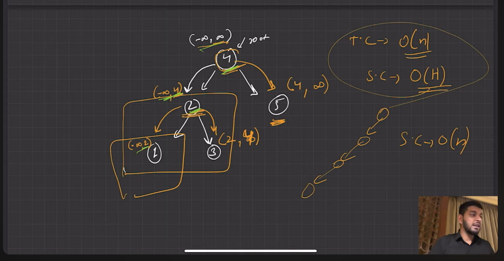

---

## 🌐 Practice Websites

Test and practice this concept on:

1. 🔗 [LeetCode – Validate Binary Search Tree](https://leetcode.com/problems/validate-binary-search-tree/)
2. 🔗 [Coding Ninjas – Check BST](https://www.codingninjas.com/studio/problems/check-bst_920073)
3. 🔗 [GeeksforGeeks – Check if a Binary Tree is BST](https://www.geeksforgeeks.org/a-program-to-check-if-a-binary-tree-is-bst-or-not/)

---

## 🧠 Approach  

### ✅ **Approach 1 — Inorder Traversal**  
If the **inorder traversal** of a tree is **sorted**, then it is a BST.  

### ✅ **Approach 2 — Range Check (Efficient)**  
Each node must lie within a valid range:  
- Initially between **(-∞, +∞)**  
- For each recursive call:  
  - Left subtree range: **(min, root->data)**  
  - Right subtree range: **(root->data, max)**  

If any node violates this property, the tree is **not a BST**.

---

## 💻 C++ Code  

```cpp
#include <bits/stdc++.h> 
/*************************************************************
    Following is the Binary Tree node structure

    template <typename T>
    class BinaryTreeNode {
    public: 
        T data;
        BinaryTreeNode<T> *left;
        BinaryTreeNode<T> *right;

        BinaryTreeNode(T data) {
            this -> data = data;
            left = NULL;
            right = NULL;
        }
    };
*************************************************************/

bool isBST(BinaryTreeNode<int> *root, int mini, int maxi) {
    // Base case
    if (root == NULL) {
        return true;
    }

    if (root->data >= mini && root->data <= maxi) {
        bool left = isBST(root->left, mini, root->data);
        bool right = isBST(root->right, root->data, maxi);
        return left && right;
    } else {
        return false;
    }
}

bool validateBST(BinaryTreeNode<int> *root) {
    return isBST(root, INT_MIN, INT_MAX);
}
```


# 9.🌲 Find K-th Smallest Element in a BST

## 🧩 Problem Statement
Given a **Binary Search Tree (BST)** and an integer **K**, your task is to find the **K-th smallest element** in the BST.  

### 🧠 Definition
A **Binary Search Tree (BST)** satisfies:
- All nodes in the **left subtree** are **smaller** than the current node.
- All nodes in the **right subtree** are **greater** than the current node.
- Both left and right subtrees are also BSTs.

---

## 🌐 Practice Websites

Test and practice this problem on:

1. 🔗 [LeetCode – Kth Smallest Element in a BST](https://leetcode.com/problems/kth-smallest-element-in-a-bst/)
2. 🔗 [Coding Ninjas – K-th Smallest Node in BST](https://www.codingninjas.com/studio/problems/kth-smallest-node-in-bst_893128)
3. 🔗 [GeeksforGeeks – Kth Smallest Element in BST](https://www.geeksforgeeks.org/kth-smallestlargest-element-in-bst/)

---

## 💡 Approach / Explanation

### 🪜 Step-by-Step Logic
1. Use **inorder traversal** because in a BST, inorder gives nodes in **sorted order**.
2. Keep a counter `i` while traversing inorder:
   - When `i == k`, we found the K-th smallest element.
3. Traverse recursively:
   - Visit left subtree
   - Visit current node (increment counter)
   - Visit right subtree

---

## ⏱️ Time & Space Complexity
| Operation | Complexity |
|------------|-------------|
| **Time** | O(N) — Inorder traversal in worst case |
| **Space** | O(H) — Recursion stack (H = height of BST) |

---
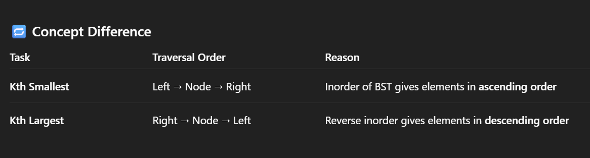
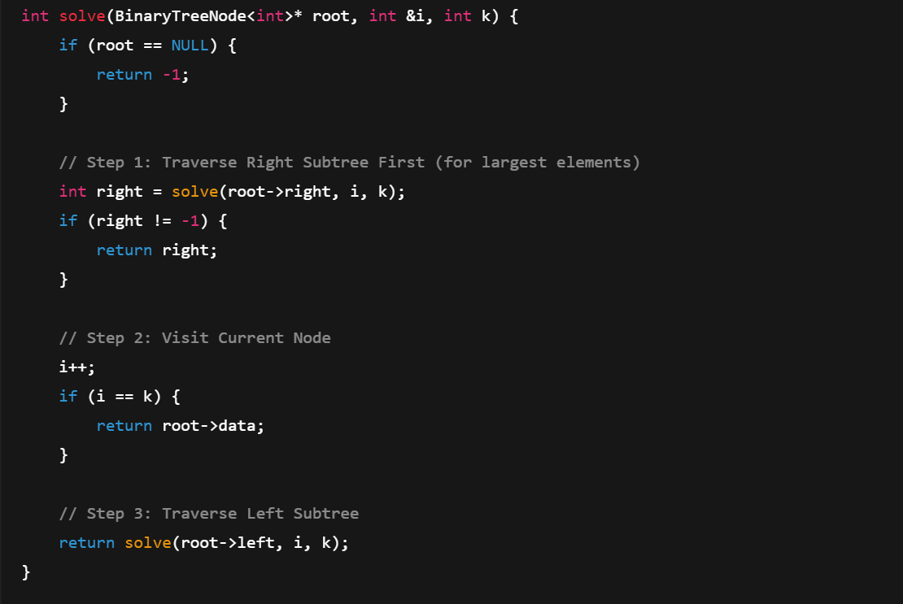
## 💻 C++ Code Implementation

```cpp
#include <bits/stdc++.h> 
using namespace std;

/*
    Following is the class structure of BinaryTreeNode:

    template <typename T>
    class BinaryTreeNode {
    public:
        T data;
        BinaryTreeNode<T> *left;
        BinaryTreeNode<T> *right;

        BinaryTreeNode(T data) {
            this->data = data;
            left = NULL;
            right = NULL;
        }
    };
*/

// 🌿 Helper function: inorder traversal to find K-th smallest
int solve(BinaryTreeNode<int>* root, int& i, int k) {
    if(root == NULL) return -1;

    // Left subtree
    int left = solve(root->left, i, k);
    if(left != -1) return left;

    // Current node
    i++;
    if(i == k) return root->data;

    // Right subtree
    return solve(root->right, i, k);
}

// 🌳 Main function to find K-th smallest
int kthSmallest(BinaryTreeNode<int>* root, int k) {
    int i = 0;
    return solve(root, i, k);
}
```


# 10. 🌲 Predecessor and Successor in BST  

## 🧩 Problem Statement  
You are given a **Binary Search Tree (BST)** of integers containing **‘N’ nodes** and a **‘KEY’**, which represents the data of a node in the tree.  

Your task is to **find the predecessor and successor** of the given node in the BST.  

A **predecessor** of a node is the **largest value smaller than the given key**,  
and a **successor** is the **smallest value greater than the given key**.  

---

## 🖼️ Example  

| BST Example | Predecessor | Successor |
|--------------|-------------|------------|
| 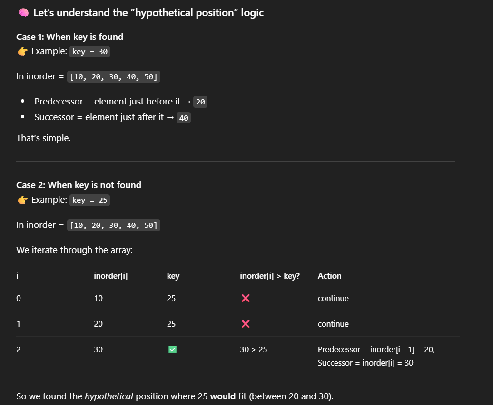 | 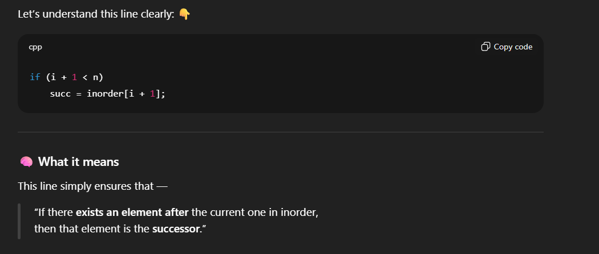 | 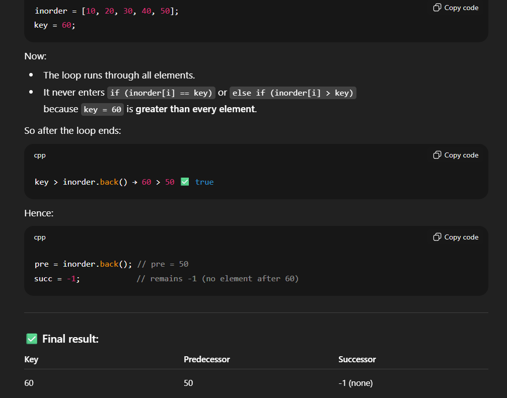 |

---

## 🌐 Practice Websites  

Here are some recommended websites to **practice and test** your understanding 👇  

1. 🔗 [LeetCode – Inorder Predecessor and Successor in BST](https://leetcode.com/problems/inorder-successor-in-bst/)  
2. 🔗 [Coding Ninjas – Predecessor And Successor In BST](https://www.codingninjas.com/studio/problems/predecessor-and-successor-in-bst_893049)  
3. 🔗 [GeeksforGeeks – Inorder Predecessor and Successor in BST](https://www.geeksforgeeks.org/inorder-predecessor-successor-given-key-bst/)  

---

## 💡 Approach / Explanation  

### 🪜 Step-by-Step Logic  

1. **Inorder Traversal Insight:**  
   Inorder traversal of a BST gives nodes in **sorted order**.  
   Hence, for a given key:
   - The **predecessor** is the **previous element** in inorder.
   - The **successor** is the **next element** in inorder.

2. **Steps:**  
   - Perform inorder traversal and store elements in a vector.  
   - Traverse the vector to locate the `key`.  
   - Assign:
     - `predecessor = inorder[i-1]` (if exists)
     - `successor = inorder[i+1]` (if exists)  
   - Handle cases when:
     - Key is **smaller than all nodes** → only successor exists.  
     - Key is **larger than all nodes** → only predecessor exists.  

---

## ⏱️ Time & Space Complexity  

| Operation | Complexity |
|------------|-------------|
| **Time** | O(N) — inorder traversal + single scan |
| **Space** | O(N) — storing inorder traversal |

---

## 💻 C++ Code Implementation  

```cpp
#include <bits/stdc++.h>
using namespace std;

/*************************************************************
    Following is the Binary Tree node structure
    class TreeNode {
    public:
        int data;
        TreeNode *left, *right;
        TreeNode() : data(0), left(NULL), right(NULL) {}
        TreeNode(int x) : data(x), left(NULL), right(NULL) {}
        TreeNode(int x, TreeNode *left, TreeNode *right) : data(x), left(left), right(right) {}
    };
*************************************************************/

// 🌿 Perform Inorder Traversal to collect sorted values
void inorderTraversal(TreeNode* root, vector<int>& inorder) {
    if (root == NULL) return;
    inorderTraversal(root->left, inorder);
    inorder.push_back(root->data);
    inorderTraversal(root->right, inorder);
}

// 🌳 Find Predecessor and Successor of a given key in BST
pair<int, int> predecessorSuccessor(TreeNode *root, int key) {
    vector<int> inorder;
    inorderTraversal(root, inorder);

    int pre = -1;
    int succ = -1;
    int n = inorder.size();

    for (int i = 0; i < n; i++) {
        // Case 1: key found in inorder
        if (inorder[i] == key) {
            if (i - 1 >= 0) pre = inorder[i - 1];
            if (i + 1 < n) succ = inorder[i + 1];
            break;
        }
        // Case 2: key not found but lies between two elements
        else if (inorder[i] > key) {
            if (i - 1 >= 0) pre = inorder[i - 1];
            succ = inorder[i];
            break;
        }
    }

    // Case 3: key greater than all nodes
    if (key > inorder.back())
        pre = inorder.back();

    return {pre, succ};
}
```

# 11. 🌿 LCA (Lowest Common Ancestor) of Two Nodes in a BST  

## 🧩 Problem Statement  
You are given a **Binary Search Tree (BST)** of integers with **‘N’ nodes**, and two given nodes **‘P’** and **‘Q’**.  

Your task is to **find the Lowest Common Ancestor (LCA)** of these two nodes.  

> The **Lowest Common Ancestor (LCA)** of two nodes P and Q is the **lowest node in the BST** that has both P and Q as descendants.  
> A node can be a descendant of itself.

---

## 🖼️ Example  

| Example 1 | Example 2 |
|------------|------------|
| 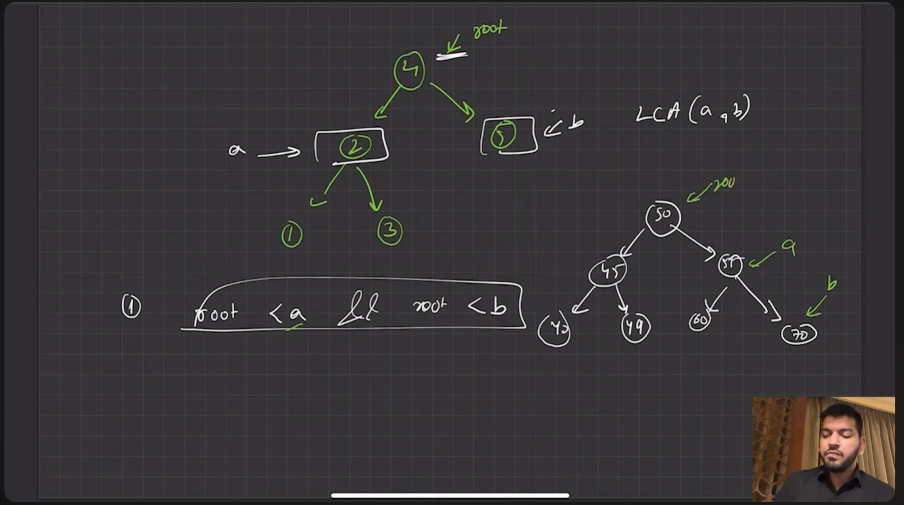 | 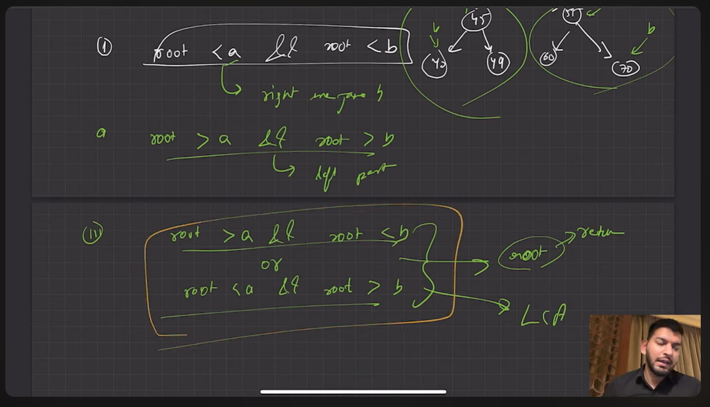 |

---

## 🌐 Practice Websites  

Practice and strengthen your concept on these platforms 👇  

1. 🔗 [LeetCode – Lowest Common Ancestor of a BST](https://leetcode.com/problems/lowest-common-ancestor-of-a-binary-search-tree/)  
2. 🔗 [Coding Ninjas – LCA of Two Nodes in BST](https://www.codingninjas.com/studio/problems/lca-of-two-nodes-in-bst_893103)  
3. 🔗 [GeeksforGeeks – LCA in BST](https://www.geeksforgeeks.org/lowest-common-ancestor-in-a-binary-search-tree/)  

---

## 💡 Approach / Explanation  

### 🪜 Step-by-Step Logic  

1. **Observation in BST:**  
   - If both `P` and `Q` are **smaller** than `root`, the LCA lies in the **left subtree**.  
   - If both are **greater** than `root`, the LCA lies in the **right subtree**.  
   - Otherwise, the current node is the **LCA**.  

2. **Two Approaches:**  
   - **Iterative:** Move along the tree without recursion.  
   - **Recursive:** Use the natural BST recursion property.  

---

## ⏱️ Time & Space Complexity  

| Operation | Complexity | Description |
|------------|-------------|-------------|
| **Time** | O(H) | H = height of BST → O(log N) for balanced tree, O(N) for skewed |
| **Space** | O(1) (Iterative) / O(H) (Recursive) | Iterative uses constant space; recursion adds stack calls |

---

## 💻 C++ Code Implementation  

```cpp
#include <bits/stdc++.h>
using namespace std;

/************************************************************
    Following is the Binary Search Tree node structure
    class TreeNode {
    public:
        int data;
        TreeNode *left, *right;
        TreeNode() : data(0), left(NULL), right(NULL) {}
        TreeNode(int x) : data(x), left(NULL), right(NULL) {}
        TreeNode(int x, TreeNode *left, TreeNode *right) : data(x), left(left), right(right) {}
    };
************************************************************/

// 🌳 Iterative Approach
TreeNode *LCAinaBST(TreeNode *root, TreeNode *P, TreeNode *Q) {
    while (root != NULL) {
        if (root->data < P->data && root->data < Q->data)
            root = root->right;
        else if (root->data > P->data && root->data > Q->data)
            root = root->left;
        else
            return root; // Found LCA
    }
    return NULL;
}

/*
// 🌿 Recursive Approach
TreeNode *LCAinaBST(TreeNode *root, TreeNode *P, TreeNode *Q) {
    if (root == NULL) return NULL;
    if (root->data < P->data && root->data < Q->data)
        return LCAinaBST(root->right, P, Q);
    if (root->data > P->data && root->data > Q->data)
        return LCAinaBST(root->left, P, Q);
    return root;
}
*/
```
---

# 12. 🌲 Merge Two BSTs  

## 🧩 Problem Statement  
You are given two **Binary Search Trees (BSTs)** of integers containing **‘N’** and **‘M’** nodes respectively.  
Your task is to **merge both BSTs** into a **single sorted list** of elements.  

> In other words, perform a **sorted merge** of the elements present in both BSTs.  

---

## 🖼️ Example  

| BST 1 | BST 2 | Merged Output |
|--------|--------|----------------|
| 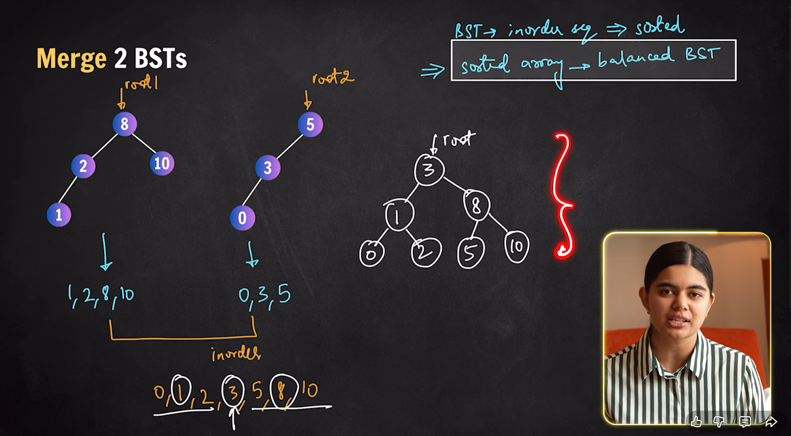 | 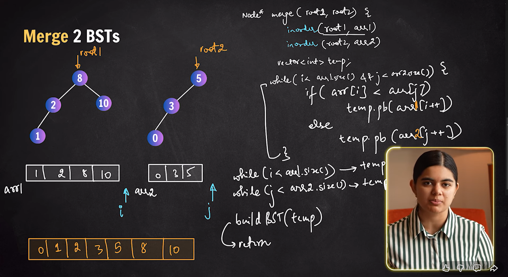 | `[1, 2, 3, 4, 5, 6, 7]` |

---

## 🌐 Practice Websites  

Here are some recommended platforms to practice this problem 👇  

1. 🔗 [LeetCode – All Elements in Two Binary Search Trees](https://leetcode.com/problems/all-elements-in-two-binary-search-trees/)  
2. 🔗 [Coding Ninjas – Merge Two BSTs](https://www.codingninjas.com/studio/problems/merge-two-bsts_920474)  
3. 🔗 [GeeksforGeeks – Merge Two BSTs](https://www.geeksforgeeks.org/merge-two-balanced-binary-search-trees/)  

---

## 💡 Approach / Explanation  

### 🪜 Step-by-Step Logic  
 #### 2 bst ko merge kar ke banana hai 1 bst toh hm dono bst ka inorder nikkal kar vector me store kra le phir merge kar de usko dusra ek vector bna ke aur phir usko return kar de , is question me bs return hi karneko bola hai val , agar bolta ki node bhi bna do means bst bhi toh node bna dete niche comment hai code 
1. **Inorder Traversal Insight:**  
   Inorder traversal of a BST gives elements in **sorted order**.  
   So, perform inorder traversal on both BSTs to get two sorted arrays.  

2. **Merge Step (Two Pointer Technique):**  
   Merge both sorted arrays (like merging in Merge Sort) to get a single sorted list.  

3. *(Optional)* You can rebuild a balanced BST from the merged sorted array if needed, using a recursive approach.  

---

## 🧠 Key Idea  
The main trick is realizing that inorder traversal of BST already gives a sorted list — so merging two BSTs is equivalent to **merging two sorted arrays**.  

---

## ⏱️ Time & Space Complexity  

| Operation | Complexity |
|------------|-------------|
| **Time** | O(N + M) — inorder traversal + merging |
| **Space** | O(N + M) — storing elements of both trees |

---

## 💻 C++ Code Implementation  

```cpp
#include <bits/stdc++.h>
using namespace std;

/*************************************************************
    Following is the Binary Tree node structure:

    class TreeNode {
    public:
        int data;
        TreeNode *left, *right;
        TreeNode() : data(0), left(NULL), right(NULL) {}
        TreeNode(int x) : data(x), left(NULL), right(NULL) {}
        TreeNode(int x, TreeNode *left, TreeNode *right) : data(x), left(left), right(right) {}
    };
*************************************************************/

// 🌿 Inorder traversal to get elements in sorted order
void inorder(TreeNode *root, vector<int> &arr) {
    if (root == NULL) return;
    inorder(root->left, arr);
    arr.push_back(root->data);
    inorder(root->right, arr);
}

// 🌳 Merge two BSTs into a single sorted array
vector<int> mergeBST(TreeNode *root1, TreeNode *root2) {
    vector<int> arr1, arr2;
    inorder(root1, arr1);
    inorder(root2, arr2);

    vector<int> merged;
    int i = 0, j = 0;

    // Merge both sorted arrays
    while (i < arr1.size() && j < arr2.size()) {
        if (arr1[i] < arr2[j]) {
            merged.push_back(arr1[i++]);
        } else {
            merged.push_back(arr2[j++]);
        }
    }

    // Add remaining elements
    while (i < arr1.size()) merged.push_back(arr1[i++]);
    while (j < arr2.size()) merged.push_back(arr2[j++]);

    return merged;
    // agar node banane bolta toh 
    // return buildBstFromSortedInorder(merged ,0, merged.size()-1);
}

/*
// 🌱 Optional: Build a balanced BST from merged inorder array
TreeNode* buildBstFromSortedInorder(vector<int>& temp, int s, int e) {
    if (s > e) return NULL;
    int mid = s + (e - s) / 2;
    TreeNode* root = new TreeNode(temp[mid]);
    root->left = buildBstFromSortedInorder(temp, s, mid - 1);
    root->right = buildBstFromSortedInorder(temp, mid + 1, e);
    return root;
}
*/
```
---


# 13. 🌳 Size of Largest BST in a Binary Tree  

## 🧩 Problem Statement  
You are given a **Binary Tree** containing **‘N’** nodes, where each node stores an integer value.  
Your task is to **find the size (number of nodes)** of the **largest subtree** that is also a **Binary Search Tree (BST)**.  

A **BST (Binary Search Tree)** is defined as:  
- The left subtree of a node contains only nodes with data **less than** the node’s data.  
- The right subtree of a node contains only nodes with data **greater than** the node’s data.  
- Both left and right subtrees must also be BSTs.  

---

## 🖼️ Example  

| Binary Tree | Valid BST Subtree | Size |
|--------------|------------------|------|
| 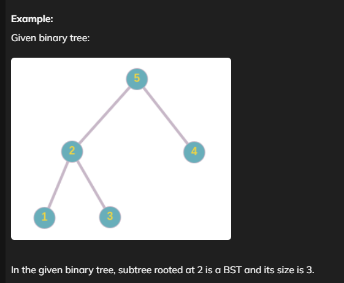 | 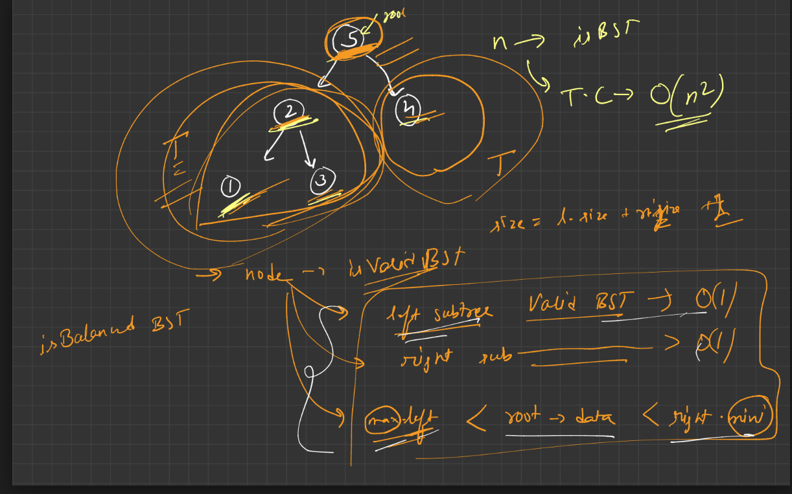 | 3 |
| 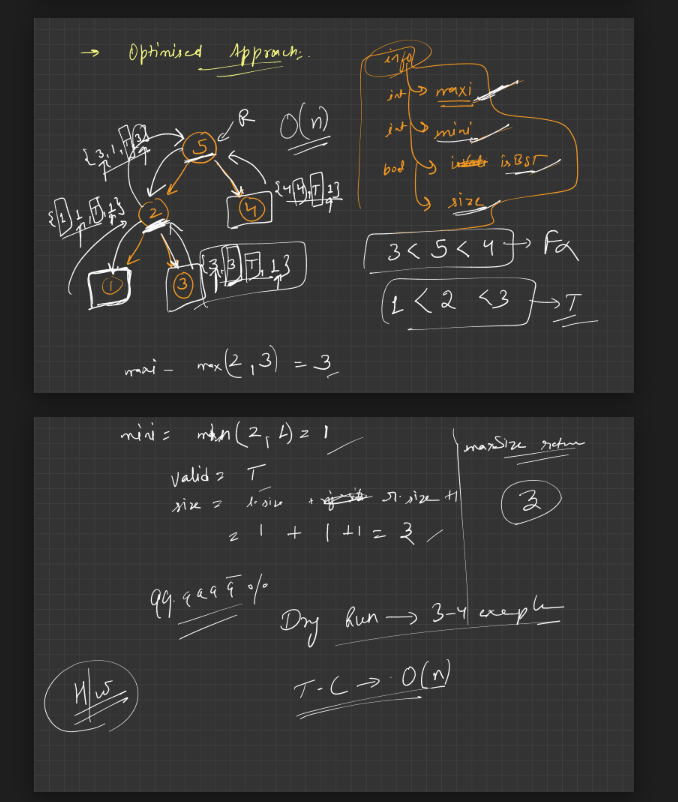 | ✅ Largest BST highlighted | 5 |

---

## 🌐 Practice Websites  

Sharpen your BST skills by solving this problem on multiple platforms 👇  

1. 🔗 [LeetCode – Largest BST Subtree](https://leetcode.com/problems/largest-bst-subtree/)  
2. 🔗 [Coding Ninjas – Size of Largest BST in Binary Tree](https://www.codingninjas.com/studio/problems/size-of-largest-bst-in-binary-tree_893103)  
3. 🔗 [GeeksforGeeks – Largest BST in a Binary Tree](https://www.geeksforgeeks.org/largest-bst-in-a-binary-tree-set-2/)  

---

## 💡 Approach / Explanation  

### 🪜 Step-by-Step Logic  

1. **Postorder Traversal Insight:**  
   To determine if a subtree is BST, you must know the **min**, **max**, and **BST validity** of its left and right subtrees.  

2. **Information Tracking:**  
   For every node, maintain:  
   - `maxi`: Maximum value in the subtree  
   - `mini`: Minimum value in the subtree  
   - `isBST`: Whether the subtree is a BST  
   - `size`: Total number of nodes in the subtree  

3. **Recursive Strategy:**  
   - Traverse the tree **bottom-up**.  
   - If both left and right subtrees are BSTs **and** the current node satisfies BST properties →  
     Mark current subtree as **BST** and update its size.  
   - Track the **maximum size** found so far using a global variable (`ans`).  

---

## 🧠 Key Idea  

> At each node, combine information from left and right subtrees to determine if the current subtree is a valid BST.  

If valid, update the maximum size.  
This ensures you only count the **largest possible BST** inside the binary tree.  

---

## ⏱️ Time & Space Complexity  

| Operation | Complexity |
|------------|-------------|
| **Time** | O(N) — visiting each node once |
| **Space** | O(H) — recursion stack (H = height of tree) |

---

## 💻 C++ Code Implementation  

```cpp
#include <bits/stdc++.h>
using namespace std;

/*
    Following is Binary Tree Node structure:
    class TreeNode {
    public:
        int data;
        TreeNode *left, *right;
        TreeNode() : data(0), left(NULL), right(NULL) {}
        TreeNode(int x) : data(x), left(NULL), right(NULL) {}
        TreeNode(int x, TreeNode *left, TreeNode *right) : data(x), left(left), right(right) {}
    };
*/

// 🌿 Helper structure to store information about each subtree
class info {
public:
    int maxi;   // Maximum value in the subtree
    int mini;   // Minimum value in the subtree
    bool isBST; // Whether the subtree is a BST
    int size;   // Size of the subtree
};

// 🌳 Helper function to find size of largest BST
info solve(TreeNode* root, int &ans) {
    // Base case: Empty tree is a BST
    if (root == NULL) {
        return {INT_MIN, INT_MAX, true, 0};
    }

    // Recursive calls for left and right subtrees
    info left = solve(root->left, ans);
    info right = solve(root->right, ans);
    
    // Information for current node
    info currNode;
    currNode.size = left.size + right.size + 1;
    currNode.maxi = max(root->data, right.maxi);
    currNode.mini = min(root->data, left.mini);

    // Check if current subtree is a valid BST
    if (left.isBST && right.isBST && (root->data > left.maxi && root->data < right.mini)) {
        currNode.isBST = true;
    } else {
        currNode.isBST = false;
    }

    // Update maximum BST size found so far
    if (currNode.isBST) {
        ans = max(ans, currNode.size);
    }

    return currNode;
}

// 🌲 Main function to find the largest BST in a Binary Tree
int largestBST(TreeNode *root) {
    int maxSize = 0;
    info temp = solve(root, maxSize);
    return maxSize;
}