# 🌲 Binary Tree Problem Set (C++)

Welcome to the **Binary Tree Problem Set**! 🌿
This collection contains common **binary tree problems** solved in **C++**, each with code, input/output format, time complexity, and practice links.

---

## 📑 Table of Contents

1. [🌳 Maximum Depth of Binary Tree](#1--maximum-depth-of-binary-tree)
2. [🌿 Diameter of Binary Tree](#2--diameter-of-binary-tree)
3. [🌴 Balanced Binary Tree](#3--balanced-binary-tree)
4. [🌲 Identical Binary Trees](#4--identical-binary-trees)
5. [🌰 Sum Tree Check](#5--sum-tree-check)
6. [🌾 Zigzag Traversal](#6--zigzag-traversal)

---

## 1️⃣  Maximum Depth of Binary Tree

**Problem:** Find the maximum depth (height) of a binary tree.

**Code:**

```cpp
/**
 * Definition for a binary tree node.
 * struct TreeNode {
 *     int val;
 *     TreeNode *left;
 *     TreeNode *right;
 *     TreeNode() : val(0), left(nullptr), right(nullptr) {}
 *     TreeNode(int x) : val(x), left(nullptr), right(nullptr) {}
 *     TreeNode(int x, TreeNode *left, TreeNode *right) : val(x), left(left), right(right) {}
 * };
 */
class Solution {
public:
    int maxDepth(TreeNode* root) {
        if(root==NULL){
            return 0;
        }
        int left = maxDepth(root->left); // height left tree ka 
        int right = maxDepth(root->right); // height right tree ka 
         
         int val = max(left , right)+ 1 ;// +1 because root ko alag se add kar rhe hai 
         return val;
    }
};

```

**Input Example:**

```
Input: [3,9,20,null,null,15,7]
```

**Output:**

```
Output: 3
```

**Time Complexity:** `O(N)`
**Space Complexity:** `O(H)` (where H = height of tree)

**Practice:** [LeetCode - 104. Maximum Depth of Binary Tree](https://leetcode.com/problems/maximum-depth-of-binary-tree/)

---

## 2️⃣ Diameter of Binary Tree

**Problem:** Find the diameter (longest path between any two nodes) of a binary tree.

**Code:**

```cpp
/*
class Node {
public:
    int data;
    Node* left;
    Node* right;

    Node(int val) {
        data = val;
        left = NULL;
        right = NULL;
    }
};
*/

class Solution {
    private:
    
    int height(struct Node* root){
        if(root==NULL){
            return 0;
        }
        
        int left = height(root->left);
        int right = height(root->right);
        int ans = max(left , right)+1;
        return ans;
    }
      // Helper function that returns {diameter, height}
    pair<int, int> diameterFast(Node* root) {
        // Base case
        if (root == NULL) {
            return {0, 0};
        }

        // Recursive calls
        pair<int, int> left = diameterFast(root->left);
        pair<int, int> right = diameterFast(root->right);

        int op1 = left.first;                       // Diameter of left subtree
        int op2 = right.first;                      // Diameter of right subtree
        int op3 = left.second + right.second + 1;   // Diameter through root

        pair<int, int> ans;
        ans.first = max(op1, max(op2, op3));        // Final diameter
        ans.second = max(left.second, right.second) + 1;  // Height

        return ans;
    }
  public:
    int diameter(Node* root) {
        //// Subtract 1 because the problem expects diameter in edges, not nodes
        return diameterFast(root).first-1; 
    }
};

```

**Input Example:**

```
Input: [1,2,3,4,5]
```

**Output:**

```
Output: 3
```

**Time Complexity:** `O(N)`
**Space Complexity:** `O(H)`

**Practice:** [LeetCode - 543. Diameter of Binary Tree](https://leetcode.com/problems/diameter-of-binary-tree/)

---

## 3️⃣ Balanced Binary Tree

**Problem:** Check whether a binary tree is height-balanced.

**Code:**

```cpp
/*
class Node {
  public:
    int data;
    Node* left;
    Node* right;

    // Constructor to initialize a new node
    Node(int val) {
        data = val;
        left = NULL;
        right = NULL;
    }
};
*/

class Solution {
public:
    // Helper function that returns a pair:
    // first  -> bool (true if subtree is balanced)
    // second -> int  (height of the subtree)
    pair<bool, int> isBalancedFast(Node* root) {
        
        // Base case: An empty tree is always balanced and its height is 0
        if (root == NULL) {
            pair<bool, int> p = make_pair(true, 0);
            return p;
        }

        // Recursive call for left and right subtrees
        // Each call returns {isBalanced, height}
        pair<bool, int> left = isBalancedFast(root->left);
        pair<bool, int> right = isBalancedFast(root->right);

        // Check if left and right subtrees are balanced
        bool leftAns = left.first;
        bool rightAns = right.first;

        // Check if the height difference between left and right subtrees is <= 1
        bool diff = abs(left.second - right.second) <= 1;

        // Prepare the answer for the current node
        pair<bool, int> ans;
        // Height = max height of both subtrees + 1 (for current node)
        ans.second = max(left.second, right.second) + 1;

        // If both subtrees are balanced and the height difference is within 1,
        // then the current subtree is balanced
        if (leftAns && rightAns && diff) {
            ans.first = true;
        } 
        else {
            ans.first = false;
        }

        // Return the pair {isBalanced, height} for current node
        return ans;
    }

    // Main function to check if the entire tree is balanced
    bool isBalanced(Node* root) {
        // Only return the boolean part from the helper function
        return isBalancedFast(root).first;
    }
};

```

**Input Example:**

```
Input: [3,9,20,null,null,15,7]
```

**Output:**

```
Output: true
```

**Time Complexity:** `O(N)`
**Space Complexity:** `O(H)`

**Practice:** [LeetCode - 110. Balanced Binary Tree](https://leetcode.com/problems/balanced-binary-tree/)

---

## 4️⃣ Identical Binary Trees

**Problem:** Check if two binary trees are identical.

**Code:**

```cpp
/*
class Node {
public:
    int data;
    Node* left;
    Node* right;

    Node(int x) {
        data = x;
        left = nullptr;
        right = nullptr;
    }
};
*/
class Solution {
  public:
    bool isIdentical(Node* r1, Node* r2) {
        // agar dono r1 and r2 null then return true 
        if(r1 ==NULL && r2 == NULL){
            return true;
        }
        //agar r1 null nhi hai aur r2 null taab bhi false identical nhi hoga 
        if(r1 != NULL && r2 == NULL){
            return false;
        }
        //agar r1 null hai aur r2 not null taab  bhi false identical nhi hoga
        if(r1==NULL && r2 != NULL){
            return false;
        }
        
        //ab compare kar rhe hai ek roo ko lekar ek tree ke root ke left node se aur dusre tree ke left se 
        bool left = isIdentical(r1->left , r2->left);
        //ab compare kar rhe hai ek roo ko lekar ek tree ke root ke right node se aur dusre tree ke right se 
        bool right = isIdentical(r1->right , r2->right);
        //root node compare kar rhe hai 
        bool val = r1->data == r2->data;
        //agar root , left , right dono tree ka similar then identical 
        if(left && right && val){
            return true;
        }
        else{
            return false;
        }
    }
};


```

**Input Example:**

```
Tree 1: [1,2,3]  
Tree 2: [1,2,3]
```

**Output:**

```
Output: true
```

**Time Complexity:** `O(N)`
**Space Complexity:** `O(H)`

**Practice:** [GeeksforGeeks - Identical Trees](https://www.geeksforgeeks.org/problems/determine-if-two-trees-are-identical/1)

---

## 5️⃣ Sum Tree Check

**Problem:** Check if a binary tree is a Sum Tree (every node’s value equals the sum of values of its children).

**Code:**

```cpp
class Solution {
  public:
    //   Returns a pair:
    //   1. first  -> true if the subtree is a Sum Tree, false otherwise.
    //   2. second -> the sum of all nodes in this subtree.
  pair<bool, int> isSumTreeFast(Node* root) {

      // Base Case 1: If the node is NULL, it is considered a Sum Tree.
      // Sum of an empty tree is 0.
      if (root == NULL) {
          return make_pair(true, 0);
      }

      // Base Case 2: If the node is a leaf node (no children),
      // it is also a Sum Tree by definition.
      if (root->left == NULL && root->right == NULL) {
          return make_pair(true, root->data);
      }

      // Recursive call to check left and right subtrees.
      pair<bool, int> leftAns = isSumTreeFast(root->left);
      pair<bool, int> rightAns = isSumTreeFast(root->right);

      // Extracting values from the returned pairs.
      bool isLeftSumTree = leftAns.first;    // Is left subtree a Sum Tree?
      bool isRightSumTree = rightAns.first;  // Is right subtree a Sum Tree?
      int leftSum = leftAns.second;          // Sum of left subtree nodes
      int rightSum = rightAns.second;        // Sum of right subtree nodes

      // Check the current node’s condition for Sum Tree:
      // A node is a Sum Tree if its data equals the sum of left and right subtree sums.
      bool cond = (root->data == leftSum + rightSum);

      // Create a pair to store the result for the current subtree.
      pair<bool, int> ans;

      // The current subtree is a Sum Tree if:
      // 1. Left subtree is a Sum Tree.
      // 2. Right subtree is a Sum Tree.
      // 3. The current node satisfies the Sum Tree property.
      if (isLeftSumTree && isRightSumTree && cond) {
          ans.first = true;  // Current subtree is a Sum Tree
          // Total sum of this subtree (including current node)
          ans.second = root->data + leftSum + rightSum;
      } 
      else {
          ans.first = false; // Not a Sum Tree
          ans.second = 0;    // Sum value doesn’t matter in this case
      }

      // Return the result for the current subtree
      return ans;
  }

  bool isSumTree(Node* root) {
    
      return isSumTreeFast(root).first;
  }
};


```

**Input Example:**

```
Input: [3,1,2]
```

**Output:**

```
Output: true
```

**Time Complexity:** `O(N)`
**Space Complexity:** `O(H)`

**Practice:** [GeeksforGeeks - Sum Tree](https://www.geeksforgeeks.org/problems/sum-tree/1)

---

## 6️⃣ Zigzag Traversal

**Problem:** Traverse the binary tree in zigzag (spiral) order.

**Code:**

```cpp
/*
class Node {
    int data;
    Node *left;
    Node *right;

    Node(int val) {
        data = val;
        left = right = NULL;
    }
};
*/
class Solution {
public:
    vector<int> zigZagTraversal(Node* root) {
        // Final result vector
        vector<int> result;

        // If tree is empty, return empty result
        if (root == NULL) {
            return result;
        }

        // Queue for level order traversal
        queue<Node*> q;
        q.push(root);

        // Direction flag: true → left to right, false → right to left
        bool leftToRight = true;

        // Traverse level by level
        while (!q.empty()) {
            int size = q.size();  // Number of nodes at the current level
            vector<int> ans(size); // Temporary vector to store current level data

            // Process all nodes at the current level
            for (int i = 0; i < size; i++) {
                Node* frontNode = q.front();
                q.pop();

                // Get index to insert depending on traversal direction
                int index = leftToRight ? i : (size - i - 1);
                ans[index] = frontNode->data;

                // Push left and right children into the queue
                if (frontNode->left) {
                    q.push(frontNode->left);
                }
                if (frontNode->right) {
                    q.push(frontNode->right);
                }
            }
            result.push_back(ans);

            // After processing one level, toggle direction
            leftToRight = !leftToRight;

            // Add current level's data to the final result
            // for (auto val : ans) {
            //     result.push_back(val);
            // }
        }

        return result;
    }
};
```

**Input Example:**

```
Input: [1,2,3,4,5,6,7]
```

**Output:**

```
Output: [1,3,2,4,5,6,7]
```

**Time Complexity:** `O(N)`
**Space Complexity:** `O(N)`

**Practice:** [GeeksforGeeks - ZigZag Tree Traversal](https://www.geeksforgeeks.org/problems/zigzag-tree-traversal/1)

---


## Pre, Post, Inorder in one traversal

---
### Given a binary tree with root node. Return the In-order,Pre-order and Post-order traversal of the binary tree.


Examples:
Input : root = [1, 3, 4, 5, 2, 7, 6 ]

Output : [ [5, 3, 2, 1, 7, 4, 6] , [1, 3, 5, 2, 4, 7, 6] , [5, 2, 3, 7, 6, 4, 1] ]

Explanation : The In-order traversal is [5, 3, 2, 1, 7, 4, 6].

The Pre-order traversal is [1, 3, 5, 2, 4, 7, 6].

The Post-order traversal is [5, 2, 3, 7, 6, 4, 1].

---
---

```cpp
/**
 * Definition for a binary tree node.
 * struct TreeNode {
 *     int data;
 *     TreeNode *left;
 *     TreeNode *right;
 *      TreeNode(int val) : data(val) , left(nullptr) , right(nullptr) {}
 * };
 **/

class Solution{
    private:
    void traverse(TreeNode* root, vector<int>& inorder, vector<int>& preorder, vector<int>& postorder) {
        if (root == nullptr)
            return;

       preorder.push_back(root->data);
       traverse(root->left , inorder , preorder , postorder);
       inorder.push_back(root->data);
       traverse(root->right , inorder , preorder , postorder);
       postorder.push_back(root->data);
    }
	public:
		vector<vector<int> > treeTraversal(TreeNode* root){
		vector<int> inorder;
        vector<int> preorder;
        vector<int> postorder;

        traverse(root, inorder, preorder, postorder);

        return {inorder, preorder, postorder};
		}
};
```
---


## BOUNDARY TRAVERSAL
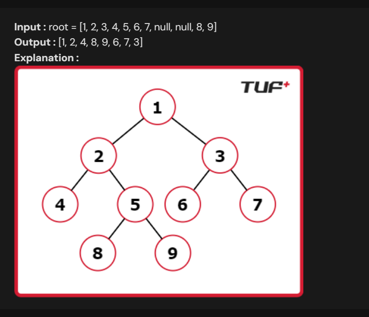
---
```cpp
/**
 * Definition for a binary tree node.
 * struct TreeNode {
 *     int data;
 *     TreeNode *left;
 *     TreeNode *right;
 *      TreeNode(int val) : data(val) , left(nullptr) , right(nullptr) {}
 * };
 **/

class Solution{
    void traverseleft(TreeNode* root, vector<int>&ans){
        if(root==NULL){
            return;
        }
        if(root->left ==NULL && root->right==NULL){
            return;
        }
        ans.push_back(root->data);
        if(root->left){
            traverseleft(root->left , ans);
        }
        else{
            traverseleft(root->right , ans);
        }
    }

  void traverseleaf(TreeNode* root, vector<int>& ans){
    if(root==NULL){
        return;
    }
    if(root->left==NULL && root->right==NULL){
        ans.push_back(root->data);
        return;
    }

    traverseleaf(root->left ,ans);
    traverseleaf(root->right , ans);

  }

void traverseright(TreeNode* root ,vector<int>& ans ){
    if(root==NULL){
        return;
    }
    if(root->left ==NULL && root->right==NULL){
            return;
    }
    if(root->right){
        traverseright(root->right ,ans);
    }
    else{
        traverseright(root->left , ans);
    }
    // waaps aa gye 
    ans.push_back(root->data);
}

public:
    vector <int> boundary(TreeNode* root){
      vector<int> ans;

      if(root==NULL){
        return ans;
      }
      // ✅ Step 1: Add root node
      ans.push_back(root->data);
      
        // ✅ Step 2: Left boundary (excluding leaf)
      traverseleft(root->left , ans);

        // ✅ Step 3: All leaf nodes (both subtrees)
      traverseleaf(root->left , ans);
      traverseleaf(root->right , ans);

        // ✅ Step 3: All leaf nodes (both subtrees)
      traverseright(root->right, ans);

       return ans;
    }

   
};
```
---


## vertical traversal 

```cpp
/**
 * Definition for a binary tree node.
 * struct TreeNode {
 *     int data;
 *     TreeNode *left;
 *     TreeNode *right;
 *      TreeNode(int val) : data(val) , left(nullptr) , right(nullptr) {}
 * };
 **/

class Solution {
public:
    vector<vector<int>> verticalTraversal(TreeNode* root) {

        // mapping between hd (horizontal distance) and lvl (level order)
        // nodes[hd][lvl] -> list of nodes at that hd and level
        map<int, map<int, vector<int>>> nodes;
      
        // Queue for level order traversal: stores node + (hd, lvl)
        queue<pair<TreeNode*, pair<int, int>>> q;

        // final answer
        vector<vector<int>> ans;

        if (root == NULL) {
            return ans;
        }

        // Push root node with horizontal distance = 0, level = 0
        q.push(make_pair(root, make_pair(0, 0)));

        // BFS traversal (level order)
        while (!q.empty()) {
            // Take the front element from queue
            pair<TreeNode*, pair<int, int>> temp = q.front();
            q.pop();

            TreeNode* frontNode = temp.first;  // current node
            int hd = temp.second.first;        // horizontal distance
            int lvl = temp.second.second;      // level (depth)

            // Store current node's data at corresponding hd and lvl
            nodes[hd][lvl].push_back(frontNode->data);

            // If left child exists → hd - 1, level + 1
            if (frontNode->left) {
                q.push(make_pair(frontNode->left, make_pair(hd - 1, lvl + 1)));
            }

            // If right child exists → hd + 1, level + 1
            if (frontNode->right) {
                q.push(make_pair(frontNode->right, make_pair(hd + 1, lvl + 1)));
            }
        }

        // Traverse the map to form the final 2D answer
        // Outer loop: horizontal distance (sorted automatically)
        for (auto i : nodes) {
            vector<int> col; // store all nodes for this vertical line

            // Inner loop: levels for that hd (also sorted automatically)
            for (auto j : i.second) {
                // Append all nodes at this hd & level
                col.insert(col.end(), j.second.begin(), j.second.end());
            }

            ans.push_back(col); // push one vertical column into result
        }

        return ans;
    }
};
```
#### 
---
🧠 Explanation

We use BFS so that nodes are processed level by level (top to bottom).

Each node is assigned:

Horizontal distance (hd) → position across vertical columns.

Level (lvl) → depth in tree.

Using map<int, map<int, vector<int>>>, nodes are sorted automatically:

Outer map → sorts by hd (vertical lines).

Inner map → sorts by lvl (top to bottom order).

Finally, we traverse the map and collect values in order.
---

## top view gfg 

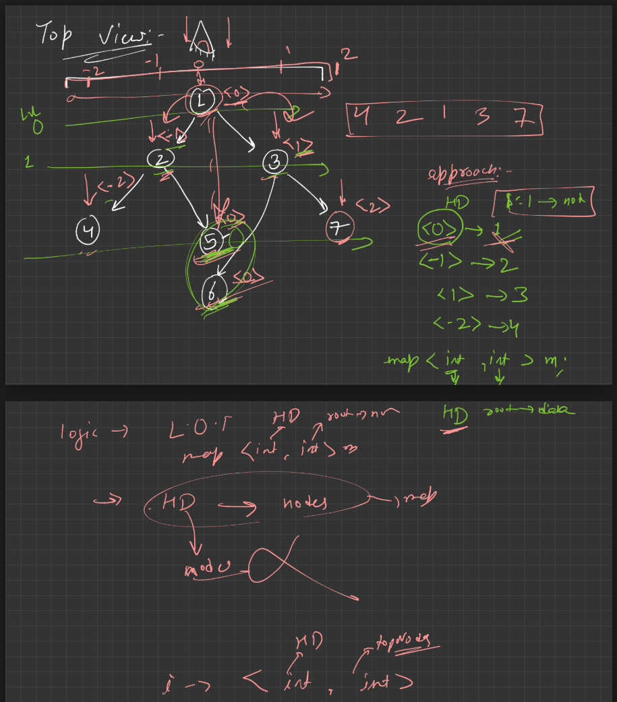
```cpp
/*
class Node {
  public:
    int data;
    Node* left;
    Node* right;

    Node(int val) {
        data = val;
        left = nullptr;
        right = nullptr;
    }
};
*/

class Solution {
  public:
    vector<int> topView(Node *root) {
      vector<int> ans;
      if(root==NULL){
          return ans;
      }
      
      // hd , data 
      map<int , int>topNode;
      // Queue to perform level order traversal (BFS)
      // Each element of the queue contains a pair of (Node*, HD)
      
      queue<pair<Node* , int>>q;
      //push the root node with horizontal distance =0 
      q.push(make_pair(root , 0));
      
       // Start BFS traversal
      while(!q.empty()){
          //get front element of the queue 
          pair<Node* , int> temp = q.front();
          q.pop();
          Node* frontNode = temp.first; // current node 
          int hd = temp.second;         // its horizontal distance
          
          // if the hd is encountered for the first time , store the node's data 
          // means agar pahla baar hd me data aa rha hai toh store kro baaki phir se aa rha hai toh ignore 
          if(topNode.find(hd) == topNode.end()){  // important lines 
              topNode[hd]= frontNode->data;
          }
          if(frontNode->left){
              q.push(make_pair(frontNode->left , hd-1));
          }
          if(frontNode->right){
              q.push(make_pair(frontNode->right , hd+1));
          }
      }
      for(auto i : topNode){
          ans.push_back(i.second);
      }
      
      return ans;
    }
};
```

## bottom view gfg

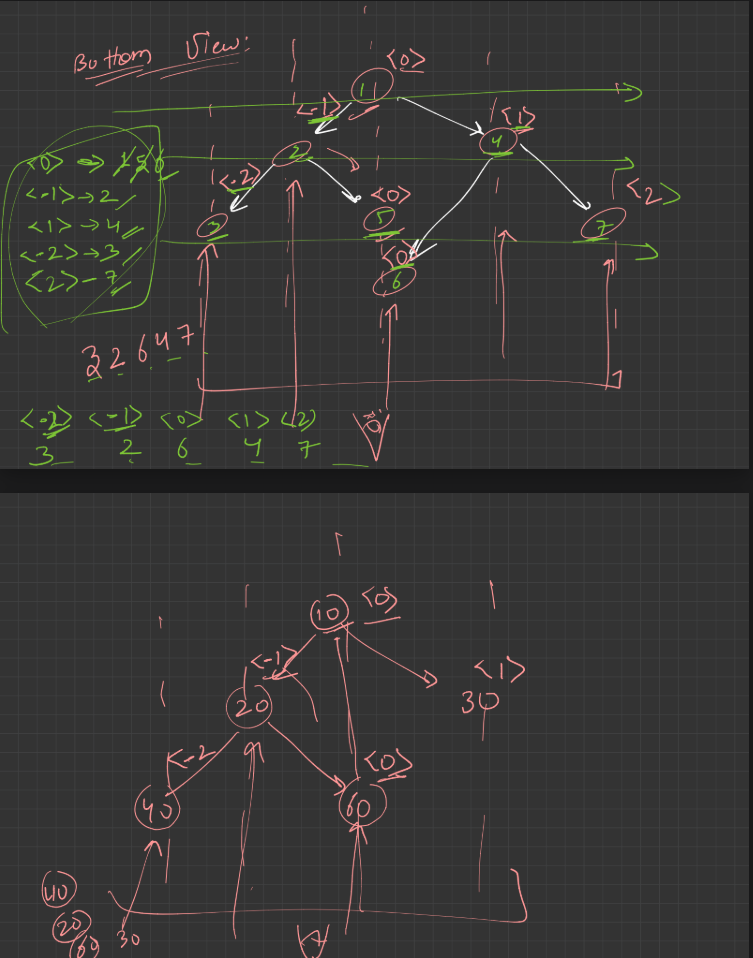
```cpp
/*
class Node {
public:
    int data;
    Node* left;
    Node* right;

    Node(int x) {
        data = x;
        left = right = NULL;
    }
};
*/

class Solution {
  public:
    vector<int> bottomView(Node *root) {
        vector<int> ans;
        
        if(root==NULL){
            return ans;
        }
         // 'topNode' stores the first node data that appears at each horizontal distance (HD)
        // Key -> horizontal distance (HD) from root
        // Value -> node->data at that HD
        map<int , int> bottomNode;
        queue<pair<Node* , int>>q;
        // Queue to perform level order traversal (BFS)
         // Each element of the queue contains a pair of (Node*, HD)
        q.push(make_pair(root , 0));
        
        // bfs traversal
        while(!q.empty()){
            // get the first element of the queue 
            pair<Node*, int> temp = q.front();
            q.pop();
            Node* frontNode = temp.first; // current node
            int hd = temp.second; // its horizontal distance
            
            bottomNode[hd]= frontNode->data;
            
            if(frontNode->left){
                q.push(make_pair(frontNode->left , hd-1));
            }
            if(frontNode->right){
                q.push(make_pair(frontNode->right , hd+1));
            }
        }
        for(auto i : bottomNode){
            ans.push_back(i.second);
        }
        return ans;
    }
    
};
```


## left view of binary tree gfg 
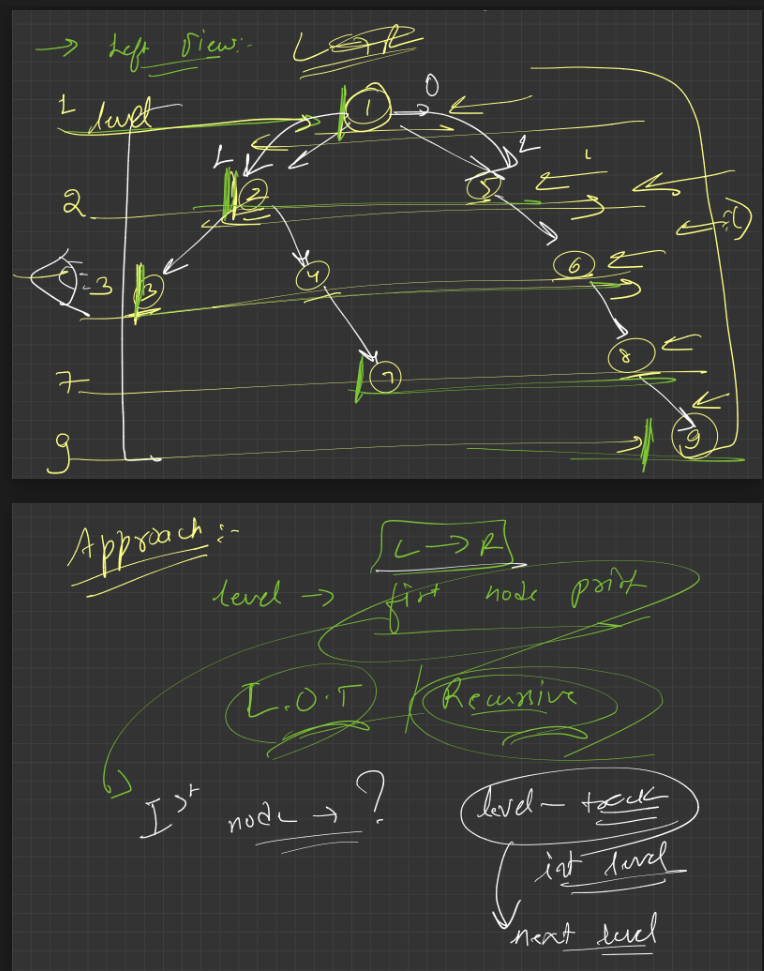
### using recurssion
```cpp
/*
class Node {
public:
    int data;
    Node* left;
    Node* right;

    Node(int val) {
        data = val;
        left = nullptr;
        right = nullptr;
    }
};
*/

class Solution {
      public:
    void solve(Node* root , vector<int>& ans , int level){
        if(root==NULL){
            return;
        }
        // If this is the first node of its level → add it to the answer
        if(level == ans.size()){
            ans.push_back(root->data);
        }
         // Recur for left subtree first (to ensure leftmost node comes first)
        solve(root->left , ans , level+1);
         // Then recur for right subtree
        solve(root->right , ans, level+1);
        
    }
    vector<int> leftView(Node *root) {
        vector<int> ans ;
        solve(root ,ans , 0); // root , ans , level 
        return ans;
    }
};

```
or 
#### ✅ Left View Using BFS (Same Style as Your Code)

```cpp
/*
class Node {
public:
    int data;
    Node* left;
    Node* right;

    Node(int x) {
        data = x;
        left = right = NULL;
    }
};
*/

class Solution {
  public:
    vector<int> leftView(Node *root) {
        vector<int> ans;

        // Base case: empty tree
        if (root == NULL) {
            return ans;
        }

        // Queue for level order traversal
        // Each element: (Node*, level)
        queue<pair<Node*, int>> q;
        q.push({root, 0});

        // Map to store first node at each level (for left view)
        // Key -> level, Value -> node->data
        map<int, int> leftNode;

        while (!q.empty()) {
            pair<Node*, int> temp = q.front();
            q.pop();

            Node* frontNode = temp.first;
            int level = temp.second;

            // If this level is visited for the first time → this is the leftmost node
            if (leftNode.find(level) == leftNode.end()) {
                leftNode[level] = frontNode->data;
            }

            // For left view, push left child first, then right
            if (frontNode->left) {
                q.push({frontNode->left, level + 1});
            }
            if (frontNode->right) {
                q.push({frontNode->right, level + 1});
            }
        }

        // Collect nodes in level order (0 → max level)
        for (auto i : leftNode) {
            ans.push_back(i.second);
        }

        return ans;
    }
};
```


## right view of binary tree gfg

#### using recurssion

```cpp
/*
class Node {
  public:
    int data;
    Node* left;
    Node* right;

    Node(int val) {
        data = val;
        left = nullptr;
        right = nullptr;
    }
};
*/

class Solution {
  public:
  void solve(Node* root , vector<int>& ans , int level){
      if(root ==NULL){
          return;
      }
      
      if(level == ans.size()){
          ans.push_back(root->data);
      }
     // Recur for right subtree first (to ensure rightmost node comes first)
      solve(root->right, ans , level+1);
      //then left wala 
      solve(root->left , ans , level+1);
  }
    vector<int> rightView(Node *root) {
     vector<int>ans ;
     solve(root , ans , 0); // root ,ans , level
     return ans;
        
    }
};
```

or 
### ✅ Right View of Binary Tree (Your Style — BFS Approach)

```cpp
/*
class Node {
public:
    int data;
    Node* left;
    Node* right;

    Node(int x) {
        data = x;
        left = right = NULL;
    }
};
*/

class Solution {
  public:
    vector<int> rightView(Node *root) {
        vector<int> ans;

        // Base case: if tree is empty
        if (root == NULL) {
            return ans;
        }

        // Queue for BFS (Node*, level)
        queue<pair<Node*, int>> q;
        q.push({root, 0});

        // Map to store the **last node** seen at each level
        // Key -> level, Value -> node->data
        map<int, int> rightNode;

        while (!q.empty()) {
            pair<Node*, int> temp = q.front();
            q.pop();

            Node* frontNode = temp.first;
            int level = temp.second;

            // For right view → we overwrite each time (keep last node of that level)
            rightNode[level] = frontNode->data;

            // Push left first, then right (so right overwrites last)
            if (frontNode->left) {
                q.push({frontNode->left, level + 1});
            }
            if (frontNode->right) {
                q.push({frontNode->right, level + 1});
            }
        }

        // Collect right view nodes in order (top to bottom)
        for (auto i : rightNode) {
            ans.push_back(i.second);
        }

        return ans;
    }
};
```


## Sum of nodes on the longest path
Difficulty: MediumAccuracy: 52.39%Submissions: 127K+Points: 4
Given a binary tree root[], you need to find the sum of the nodes on the longest path from the root to any leaf node. If two or more paths have the same length, the path with the maximum sum of node values should be considered.

Examples:
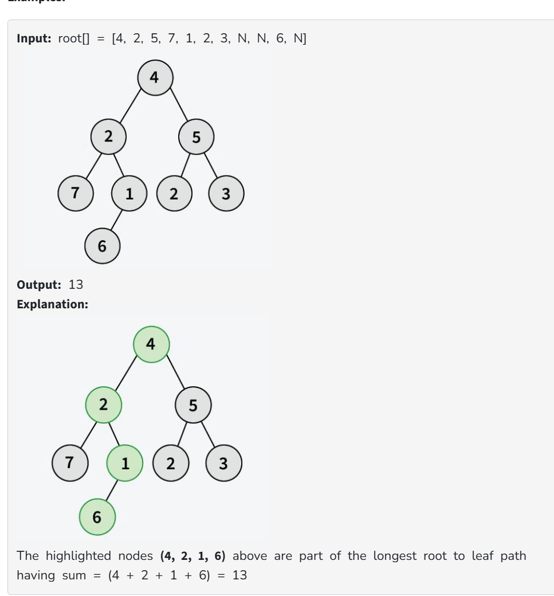

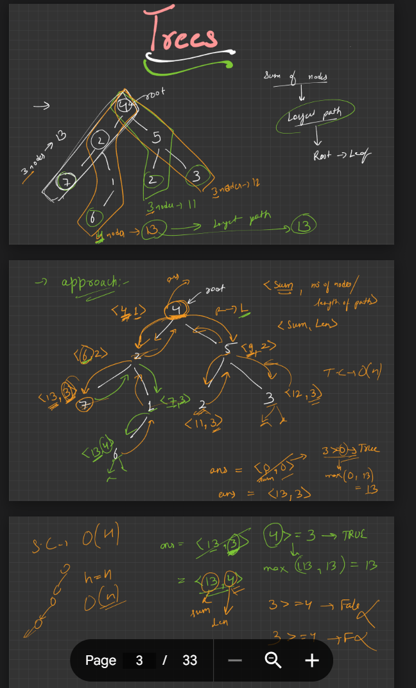
```cpp
/*
class Node {
  public:
    int data;
    Node *left;
    Node *right;

    Node(int x) {
        data = x;
        left = NULL;
        right = NULL;
    }
}; */

class Solution {
  public:
  void solve(Node* root , int len , int &maxLen , int sum ,int& maxSum){
      //if we reach a null node (end of a path)
      if(root==NULL){
           // If current path length is greater than maxLen found so far
          if(len>maxLen){
              maxLen = len;
              maxSum = sum;
          }
            // If current path length equals maxLen, take the path with larger sum
         else if(len==maxLen){
              maxSum = max(sum ,maxSum);
          }
          return;
      }
      // add current node data to  path sum
      sum =sum+root->data;
       // Recur for left subtree, increasing the path length
      solve(root->left , len+1 ,maxLen , sum , maxSum);
       // Recur for right subtree, increasing the path length
      solve(root->right , len+1 , maxLen ,sum , maxSum);
  }
    int sumOfLongRootToLeafPath(Node *root) {
     int len =0;
     int maxLen = 0;
     
     int sum =0;
     int maxSum = INT_MIN;
     
     solve(root , len , maxLen, sum , maxSum);
  // Return the maximum sum corresponding to the longest path
     return maxSum;
        
    }
};
```


## LCA in Binary Tree

Difficulty: MediumAccuracy: 52.85%Submissions: 204K+Points: 4Average Time: 20m
Given the root of a binary tree with all unique values and two nodes value, n1 and n2. Your task is to find the lowest common ancestor of the given two nodes. Both node values are always present in the Binary Tree.

Note: LCA is the first common ancestor of both the nodes n1 and n2 from bottom of tree.
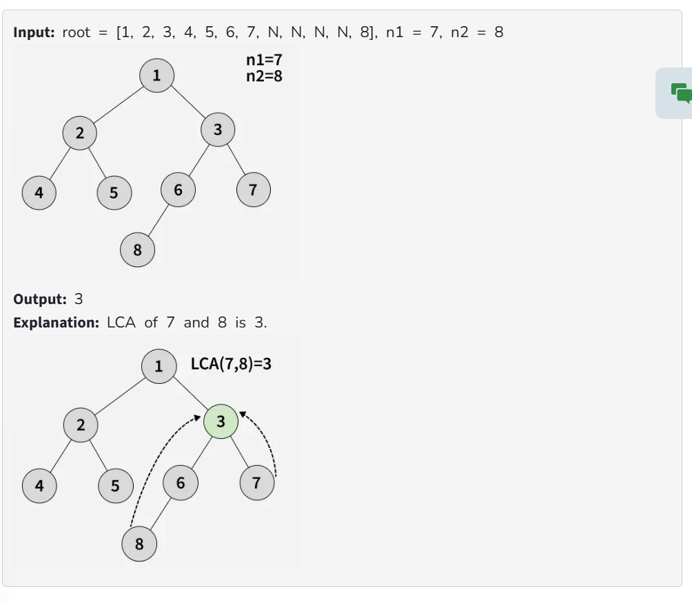

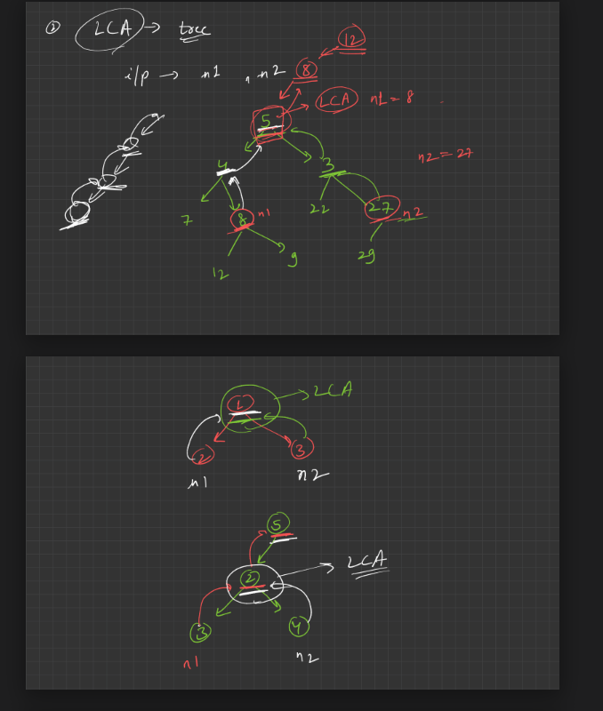
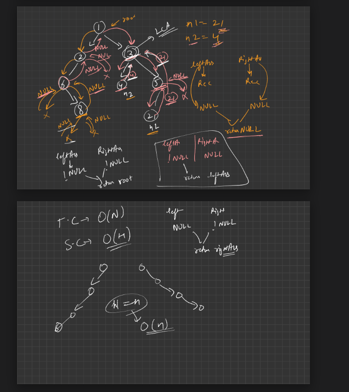
```cpp
/*
class Node {
public:
    int data;
    Node* left;
    Node* right;

    Node(int x) {
        data = x;
        left = right = NULL;
    }
};
*/

class Solution {
  public:
    Node* lca(Node* root, int n1, int n2) {
    if(root==NULL){
    return NULL;
    }
    
    // if either n1 or n2 matches the root data , then the root is part of lca
    if(root->data ==n1 || root->data == n2){
        return root;
    }
    //recursive left subtree
    Node* leftAns = lca(root->left , n1 , n2);
    Node* rightAns = lca(root->right, n1 , n2);
    
      // If n1 and n2 are found in left and right subtrees of root,
        // then root is their LCA
    if(leftAns!=NULL && rightAns!=NULL){
        return root;
    }
    // If both nodes are in left subtree
    else if(leftAns!=NULL &&rightAns==NULL){
        return leftAns;
    }
     // If both nodes are in right subtree
    else if(leftAns==NULL && rightAns!=NULL){
        return rightAns;
    }
    else{
        return NULL;
    }
    }
};
```


## k sum path
K Sum Paths
Difficulty: MediumAccuracy: 44.73%Submissions: 134K+Points: 4
Given the root of a binary tree and an integer k, determine the number of downward-only paths where the sum of the node values in the path equals k.

Note: A path can start and end at any node within the tree but must always move downward (from parent to child).

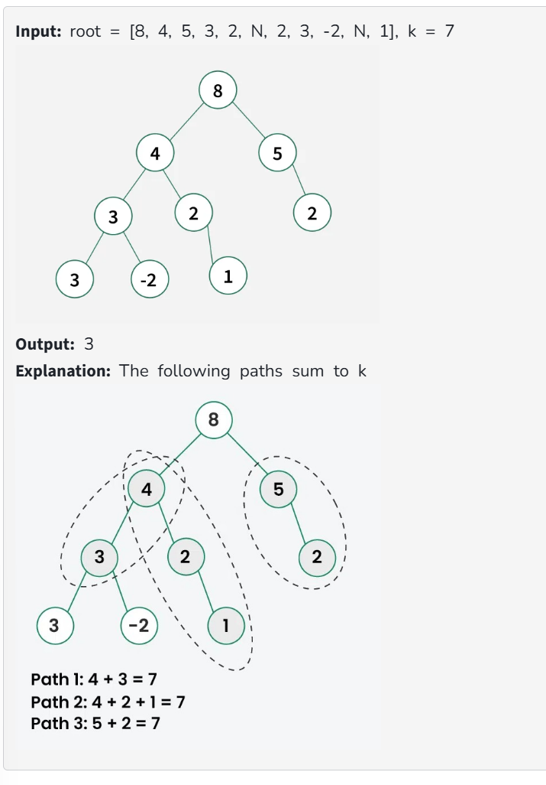
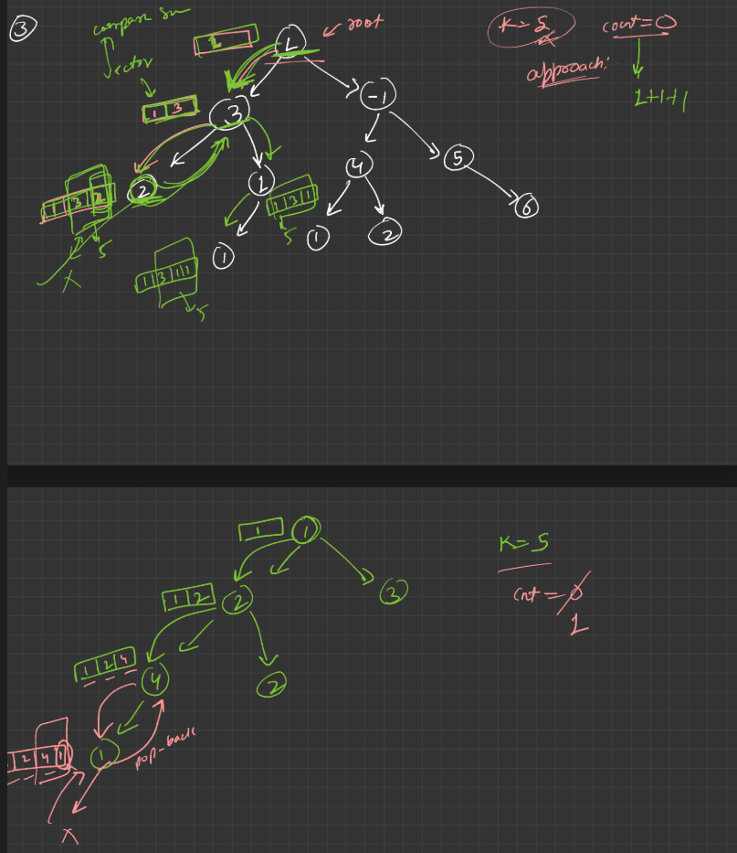
```cpp
/*
class Node {
  public:
    int data;
    Node *left;
    Node *right;

    Node(int val) {
        data = val;
        left = right = NULL;
    }
};
*/

class Solution {
  public:
    // Recursive function to find all paths with sum = k
    void solve(Node* root, int k, vector<int> path, int& count) {
        if(root == NULL) {
            // Base case: if current node is NULL, return
            return;
        }

        // Add current node's value to the path
        path.push_back(root->data);

        // Recur for left subtree
        solve(root->left, k, path, count);
        // Recur for right subtree
        solve(root->right, k, path, count);

        // Check all sub-paths ending at current node
        int size = path.size();
        int sum = 0;
        // Traverse path from current node to root
        for(int i = size - 1; i >= 0; i--) {
            sum += path[i];
            // If sum of this sub-path equals k, increment count
            if(sum == k) {
                count++;
            }
        }
    }

    // Function to count all paths with sum = k in the tree
    int countAllPaths(Node *root, int k) {
        vector<int> path; // Stores the current path from root to node
        int count = 0;    // Counts paths with sum = k
        solve(root, k, path, count); // Start recursion from root
        return count; // Return total count
    }
};
```

or 
correct code 
```cpp
/*
class Node {
  public:
    int data;
    Node *left;
    Node *right;

    Node(int val) {
        data = val;
        left = right = NULL;
    }
};
*/
class Solution {
  public:
    void solve(Node* root , int k , int currSum , map<int,int>&path ,int&count){
        if(root==NULL){
            return;
        }
       currSum+=root->data;
       if(currSum==k) count++;
       // If (currSum - k) exists in path map,
        // it means there is a subpath ending at current node with sum = k
       if(path.find(currSum-k)!=path.end()){
           count+=path[currSum-k];
       }
       // Store current running sum in map
        // Key: running sum (currSum)
        // Value: how many times this sum has appeared along current path
       path[currSum]++;
       
         solve(root->left, k, currSum, path, count);
        solve(root->right, k, currSum, path, count);
        // Backtrack: remove current sum before returning to parent
        // This ensures prefix map only contains sums along the current path
        path[currSum]--;
    }
    int countAllPaths(Node *root, int k) {
    // Key (int) → currSum (the sum of all nodes from the root down to the current node along the current path).
    // Value (int) → the number of times this prefix sum has appeared along the current path.
     // Stores prefix sums and their frequency along current path
      map<int , int> path;
      int count=0;
      int currSum =0;
      solve(root , k, currSum , path , count);
      return count;
        
    }
};
```

## Kth Ancestor in a Tree

Difficulty: MediumAccuracy: 35.06%Submissions: 128K+Points: 4
Given a binary tree of size  n, a node, and a positive integer k., Your task is to complete the function kthAncestor(), the function should return the kth ancestor of the given node in the binary tree. If there does not exist any such ancestor then return -1.
Note:
1. It is guaranteed that the node exists in the tree.
2. All the nodes of the tree have distinct values.

Examples :
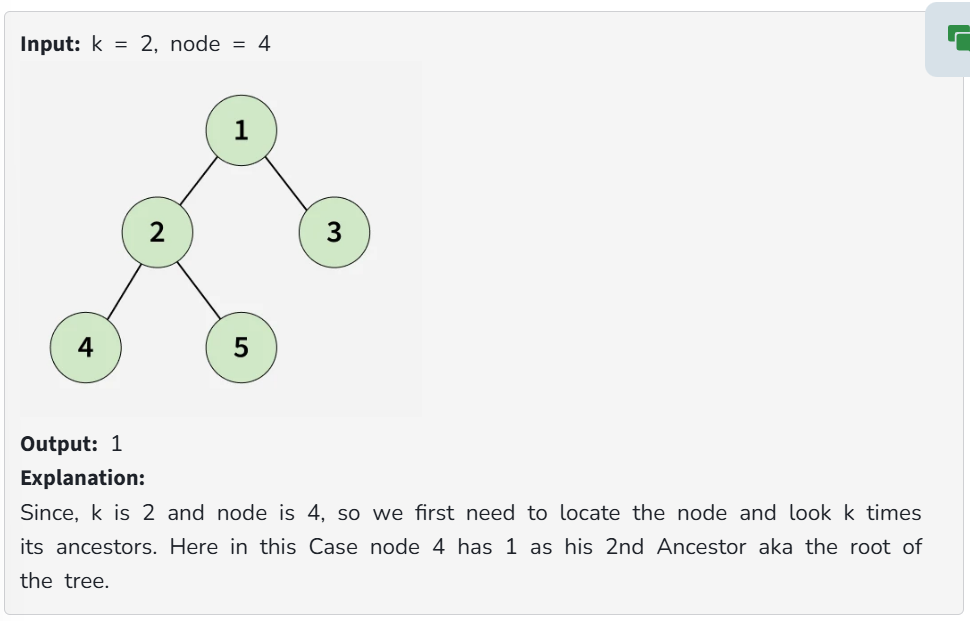
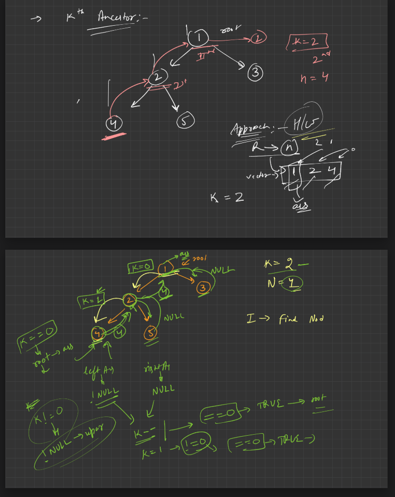

```cpp
/*
Structure of the node of the binary tree is as
struct Node
{
    int data;
    struct Node *left, *right;
};
*/
// your task is to complete this function
class Solution {
  public:
  Node* solve(Node* root ,int &k , int node){
      if(root==NULL){
          return NULL;
      }
      if(root->data == node){
          return root;
      }
      Node* leftAns= solve(root->left , k , node);
      Node* rightAns  = solve(root->right , k , node);
      
      if(leftAns != NULL && rightAns==NULL){
          k--;
          if(k==0){
              k= INT_MAX;
              return root;
          }
          return leftAns;
      }
      if(leftAns==NULL && rightAns!=NULL){
          k--;
          if(k==0){
              k=INT_MAX;
              return root;
          }
          return rightAns;
      }
  }
  
  
    int kthAncestor(Node *root, int k, int node) {
        Node* ans = solve(root , k,node);
        if(ans==NULL || ans->data ==node){   // ans->data == node then return -1 because k start from 1 and if ans-?data == node means k =0 thats why 
            return -1;
        }
        else{
            return ans->data;
        }
        
    }
};
```

## Maximum Non-Adjacent Nodes Sum
Difficulty: MediumAccuracy: 55.35%Submissions: 100K+Points: 4Average Time: 45m
Given the root of a binary tree with integer values. Your task is to select a subset of nodes such that the sum of their values is maximized, with the condition that no two selected nodes are directly connected that is, if a node is included in the subset, neither its parent nor its children can be included.

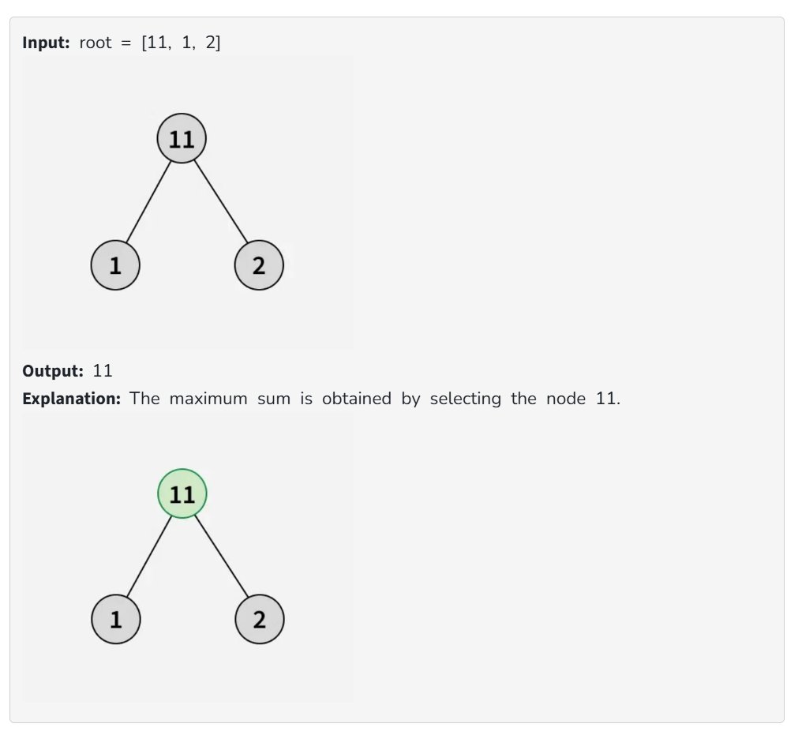
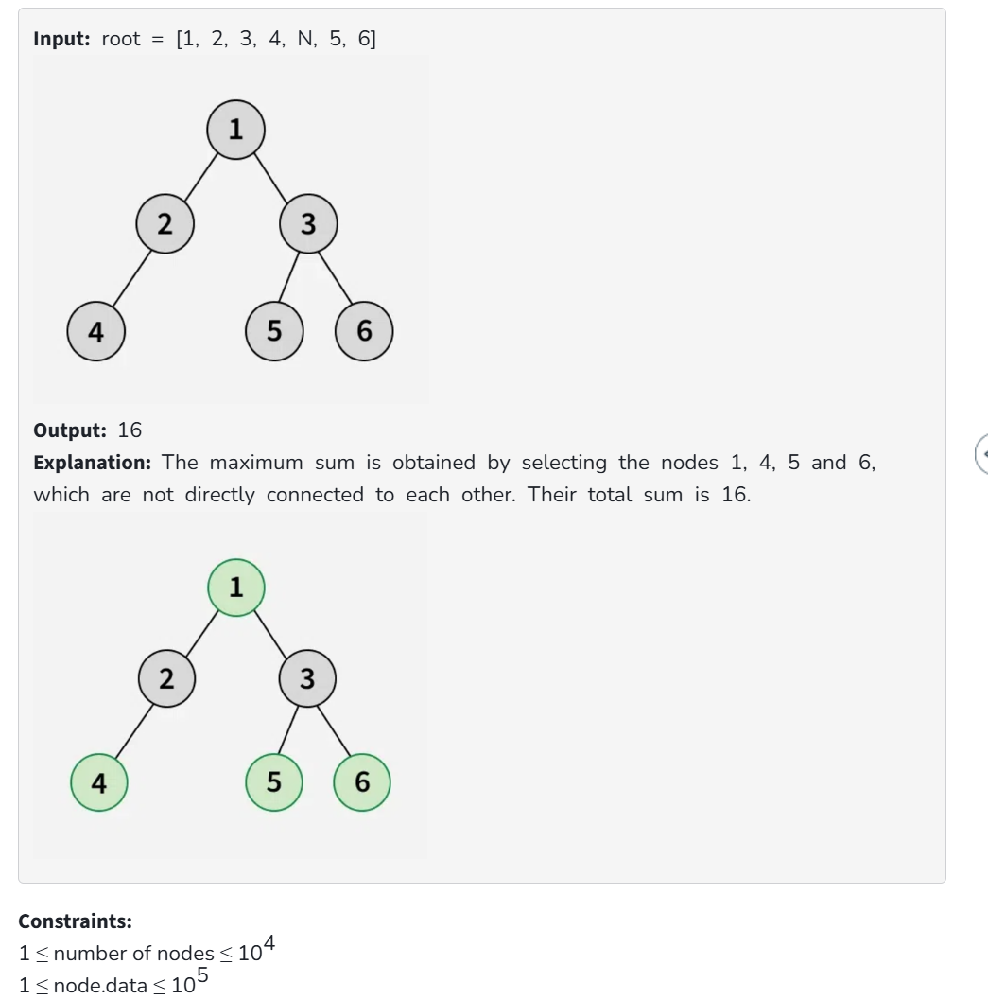

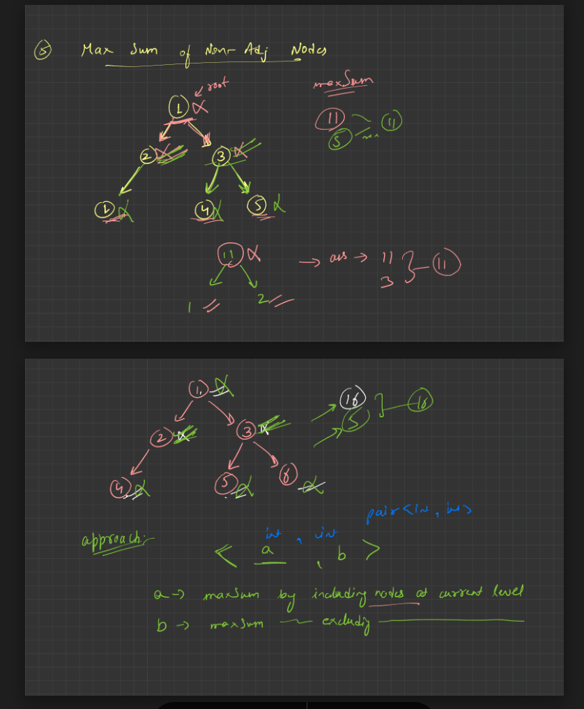
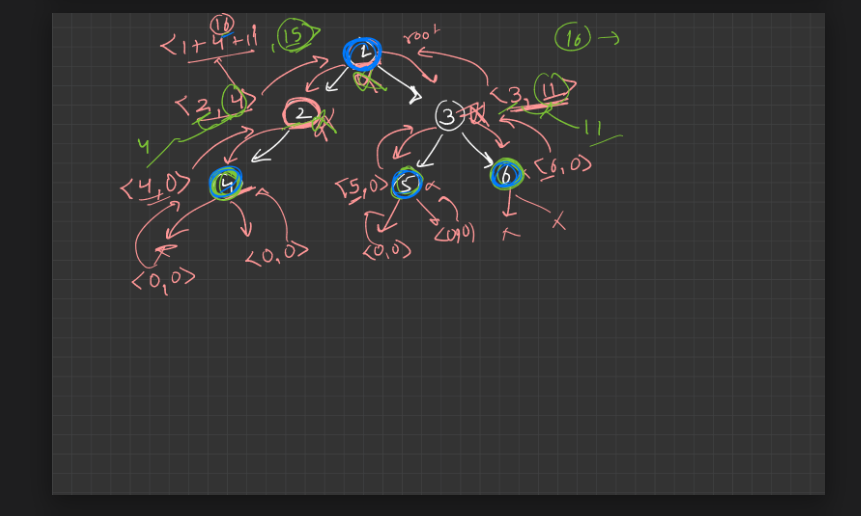

```cpp
/*
class Node {
public:
    int data;
    Node* left;
    Node* right;
    Node(int val) {
        data = val;
        left = nullptr;
        right = nullptr;
    }
};
*/

class Solution {
  public:
  pair<int, int> solve(Node* root){
      if(root==NULL){
          pair<int, int> p = make_pair(0,0);
          return p;
      }
      
     pair<int ,int> leftAns = solve(root->left);
     pair<int , int> rightAns =  solve(root->right);
      
        pair<int , int> result ;
        // include current node → can't include children
      result.first = root->data + leftAns.second + rightAns.second;
      // exclude current node → can choose max of include/exclude of children
      result.second = max(leftAns.first , leftAns.second) + max(rightAns.first ,rightAns.second);
      
      
      return result;
      
  }
    int getMaxSum(Node *root) {
         // include → max sum including this node (current node or parent)
         // exclude → max sum excluding this node (exclude parent)
     pair<int , int> ans;
      ans =  solve(root);
     return max(ans.first , ans.second);
        
    }
};
```


##  construct binary tree from inorder and preorder

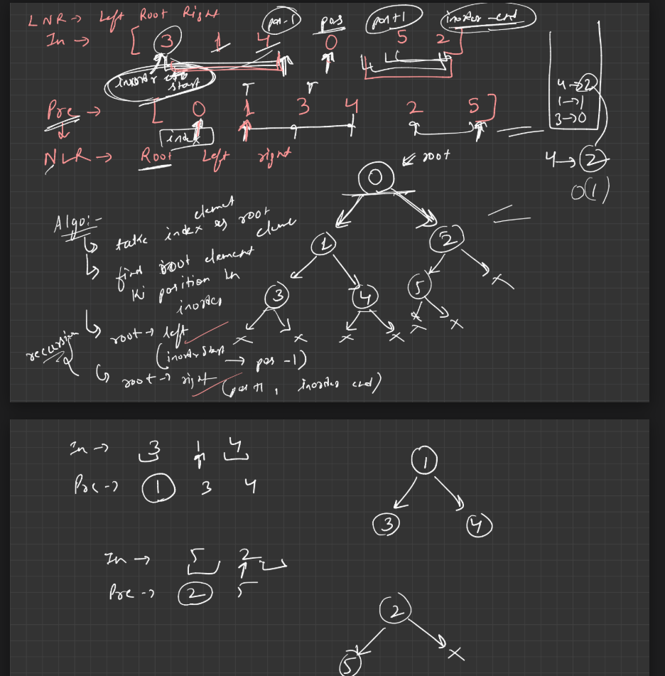
```cpp
/*
class Node {
public:
    int data;
    Node *left;
    Node *right;

    Node(int x) {
        data = x;
        left = NULL;
        right = NULL;
    }
};
*/

class Solution {
  public:
  //mapping kra diye index to inorder element 
  void createMapping(vector<int>& inorder , map<int , int> &nodeToIndex,int n){
      for(int i =0; i<n;i++){
         nodeToIndex[inorder[i]]= i;
      }
  }
   Node* solve(vector<int>&in,vector<int>& pre ,int& preorderIndex, int inorderStart ,int inorderEnd , int n, map<int ,int>&nodeToIndex){
       if(preorderIndex>n|| inorderStart>inorderEnd){
           return NULL;
       }
       //create root node for element
       int element = pre[preorderIndex++];
       Node* root =  new Node(element);
       //find element index in inorder
       int position = nodeToIndex[element];
       
       root->left = solve(in , pre , preorderIndex , inorderStart, position-1 , n ,nodeToIndex);
       root->right = solve(in , pre , preorderIndex ,position+1, inorderEnd , n ,nodeToIndex);
       
       return root;
   }
    Node *buildTree(vector<int> &inorder, vector<int> &preorder) {
      int size= inorder.size();
      int preorderIndex =0;
      int inorderStart = 0;
      int inorderEnd = size-1;
      
      //index ,element
      map<int,int>nodeToIndex;
      createMapping(inorder, nodeToIndex ,size);
      
     Node* ans = solve(inorder , preorder , preorderIndex ,inorderStart , inorderEnd , size ,nodeToIndex);
     return ans;
    }
};

```

## construct binary tree from  inorder and postorder

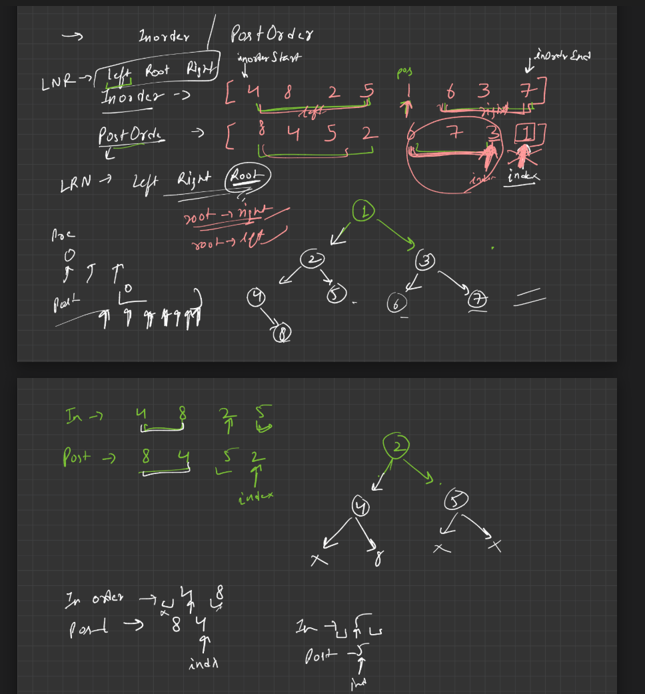
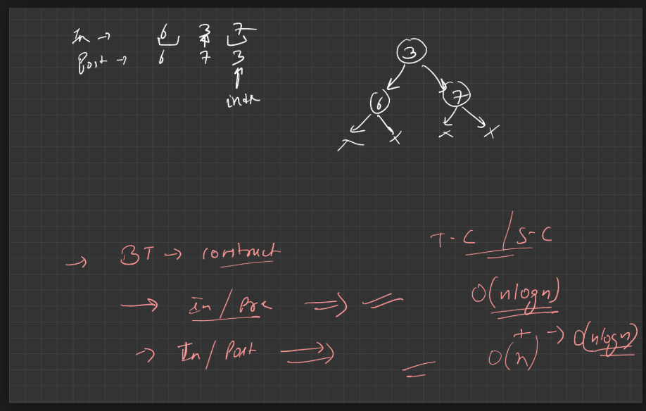
```cpp
/**
 * Definition for a binary tree node.
 * struct TreeNode {
 *     int val;
 *     TreeNode *left;
 *     TreeNode *right;
 *     TreeNode() : val(0), left(nullptr), right(nullptr) {}
 *     TreeNode(int x) : val(x), left(nullptr), right(nullptr) {}
 *     TreeNode(int x, TreeNode *left, TreeNode *right) : val(x), left(left), right(right) {}
 * };
 */
class Solution {
public:
  void createMapping(vector<int>& inorder , map<int , int>& nodeToIndex, int size){
    for(int i =0; i<size;i++){
        nodeToIndex[inorder[i]]=i;
    }
  }
 TreeNode* solve(vector<int>& inorder, vector<int>& postorder , int& postorderIndex , int inorderStart , int inorderEnd , map<int,int>&nodeToIndex ,int size){
   if(postorderIndex<0 ||inorderStart>inorderEnd){
    return NULL;
   }

   int element = postorder[postorderIndex--];
   TreeNode* root = new TreeNode(element);
   int position = nodeToIndex[element];

   root->right = solve(inorder ,postorder , postorderIndex, position+1 ,inorderEnd , nodeToIndex , size);
     root->left = solve(inorder ,postorder , postorderIndex, inorderStart ,position-1 , nodeToIndex , size);
   
   return root;
 }
    TreeNode* buildTree(vector<int>& inorder, vector<int>& postorder) {
        int size = inorder.size();
        int postorderIndex = size-1;
        int inorderStart =0;
        int inorderEnd=size-1;

        map<int , int> nodeToIndex;
        createMapping(inorder , nodeToIndex ,size);
        TreeNode* ans= solve(inorder , postorder , postorderIndex , inorderStart,inorderEnd , nodeToIndex , size);

        return ans;
    }
};
```