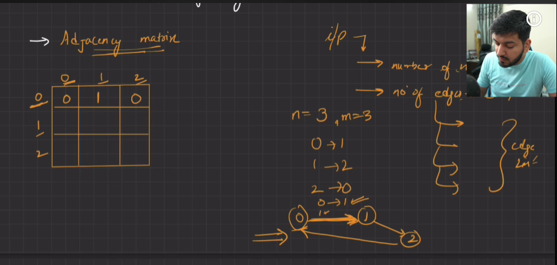
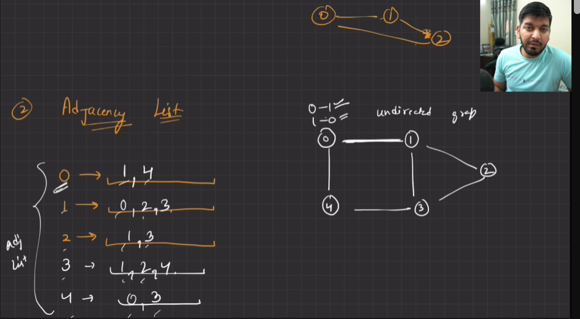
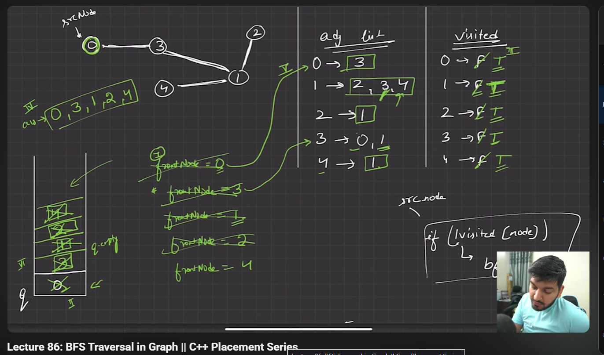

### **Topic: Graph Representation using Adjacency List (C++)**

Ye code **Graph Data Structure** ka hai jisme **Adjacency List** ka use karke **Undirected Graph** banaya gaya hai aur print kiya gaya hai.

---

## Complete Code

```cpp
#include <iostream>
#include <unordered_map>
#include <list>
using namespace std;

class graph {

public:
    unordered_map<int, list<int>> adj;

    void addEdge(int u, int v, bool direction) {

        // direction = 0 -> undirected
        // direction = 1 -> directed graph

        // create an edge from u to v
        adj[u].push_back(v);

        if (direction == 0) {
            adj[v].push_back(u);
        }
    }

    void printAdjList() {

        for (auto i : adj) {

            cout << i.first << " -> ";

            for (auto j : i.second) {
                cout << j << ", ";
            }

            cout << endl;
        }
    }
};

int main() {

    int n;
    cout << "Enter the number of nodes" << endl;
    cin >> n;

    int m;
    cout << "Enter the number of edges" << endl;
    cin >> m;

    graph g;

    for (int i = 0; i < m; i++) {

        int u, v;
        cin >> u >> v;

        // creating an undirected graph
        g.addEdge(u, v, 0);
    }

    // printing graph
    g.printAdjList();

    return 0;
}
```

---

# Topic Name

**Graph Data Structure – Graph Representation using Adjacency List (Undirected Graph)**

---

# Is code me kya ho raha hai?

### 1. `unordered_map<int, list<int>> adj;`

Adjacency List banayi gayi hai.

Example:

```
0 -> 1 2
1 -> 0 3
2 -> 0
3 -> 1
```

---

### 2. `addEdge(u, v, direction)`

Graph me edge add karta hai.

Agar

```
direction = 0
```

to

```
u -> v
v -> u
```

dono add honge (Undirected Graph)

Agar

```
direction = 1
```

to sirf

```
u -> v
```

add hoga (Directed Graph)

---

### 3. `printAdjList()`

Adjacency List print karta hai.

Output Example:

```
0 -> 1, 2,
1 -> 0, 3,
2 -> 0,
3 -> 1,
```

---

## Example Input

```
Enter the number of nodes
4

Enter the number of edges
4

0 1
0 2
1 2
1 3
```

### Output

```
3 -> 1,
2 -> 0, 1,
1 -> 0, 2, 3,
0 -> 1, 2,
```

> `unordered_map` hone ki wajah se order alag ho sakta hai.

---

## Important Interview Questions

1. What is a Graph?
2. What is an Adjacency List?
3. Difference between Adjacency Matrix and Adjacency List.
4. Difference between Directed and Undirected Graph.
5. Time Complexity of adding an edge in an Adjacency List.
6. Why is `unordered_map` used in graph representation?

Ye code **Love Babbar Graph Lecture 1 – Graph Introduction & Adjacency List Representation** ka hai.


😂 Haan bhai, sahi bola. Agar user se **character nodes** input lene hain, to aise likho.

## Graph using Template + User Input (Character)

```cpp
#include <iostream>
#include <unordered_map>
#include <list>
using namespace std;

template <typename T>
class Graph {

public:
    unordered_map<T, list<T>> adj;

    void addEdge(T u, T v, bool direction) {

        // direction = 0 -> Undirected
        // direction = 1 -> Directed

        adj[u].push_back(v);

        if(direction == 0)
            adj[v].push_back(u);
    }

    void printAdjList() {

        for(auto i : adj) {

            cout << i.first << " -> ";

            for(auto j : i.second)
                cout << j << " ";

            cout << endl;
        }
    }
};

int main() {

    int n, m;

    cout << "Enter number of nodes: ";
    cin >> n;

    cout << "Enter number of edges: ";
    cin >> m;

    Graph<char> g;

    cout << "Enter edges:\n";

    for(int i = 0; i < m; i++) {

        char u, v;
        cin >> u >> v;

        g.addEdge(u, v, 0);     // Undirected Graph
    }

    cout << "\nAdjacency List:\n";

    g.printAdjList();

    return 0;
}
```

---

## Input

```text
Enter number of nodes: 4
Enter number of edges: 4

A B
A C
B D
C D
```

## Output

```text
Adjacency List:

A -> B C
B -> A D
C -> A D
D -> B C
```

---

## Agar Directed Graph banana ho

Sirf ye line change kar do:

```cpp
g.addEdge(u, v, 1);
```

Output:

```text
A -> B C
B -> D
C -> D
D ->
```

---

### ⭐ Interview Point

Agar interviewer bole:

> "Nodes integer bhi ho sakte hain aur character bhi. Kya karoge?"

Bas object change kar do:

```cpp
Graph<int> g;      // Integer nodes
Graph<char> g;     // Character nodes
Graph<string> g;   // String nodes
```

**Baaki poora code same rahega**, isi liye template use karte hain.







Bilkul bhai. Ye **Love Babbar Graph Lecture 2 - BFS Traversal** hai aur **TCS NQT ke liye bahut important** topic hai.

Is topic ke liye hum do versions banayenge:

1. ✅ Coding Ninjas (Function Only)
2. ✅ TCS NQT (Complete Program)

---

# Topic: Breadth First Search (BFS)

## Coding Ninjas Version

```cpp
#include <queue>

vector<int> bfsTraversal(int n, vector<vector<int>> &adj) {

    vector<int> ans;
    vector<bool> visited(n, false);

    queue<int> q;

    q.push(0);
    visited[0] = true;

    while(!q.empty()) {

        int front = q.front();
        q.pop();

        ans.push_back(front);

        for(auto neighbour : adj[front]) {

            if(!visited[neighbour]) {

                visited[neighbour] = true;
                q.push(neighbour);

            }
        }
    }

    return ans;
}
```

---

# TCS NQT Version

```cpp
#include<iostream>
#include<vector>
#include<queue>
using namespace std;

int main()
{
    int n,m;
    cin>>n>>m;

    vector<vector<int>> adj(n);

    for(int i=0;i<m;i++)
    {
        int u,v;
        cin>>u>>v;

        adj[u].push_back(v);
        adj[v].push_back(u);
    }

    vector<bool> visited(n,false);
    vector<int> ans;

    queue<int> q;

    q.push(0);
    visited[0]=true;

    while(!q.empty())
    {
        int front=q.front();
        q.pop();

        ans.push_back(front);

        for(auto neighbour:adj[front])
        {
            if(!visited[neighbour])
            {
                visited[neighbour]=true;
                q.push(neighbour);
            }
        }
    }

    for(int x:ans)
        cout<<x<<" ";

    return 0;
}
```

---

# Example

### Input

```text
5 4
0 1
0 2
1 3
2 4
```

Graph

```text
      0
     / \
    1   2
    |   |
    3   4
```

---

### Queue Dry Run

| Queue | Output    |
| ----- | --------- |
| 0     |           |
| 1 2   | 0         |
| 2 3   | 0 1       |
| 3 4   | 0 1 2     |
| 4     | 0 1 2 3   |
| Empty | 0 1 2 3 4 |

---

Output

```text
0 1 2 3 4
```

---

# Logic (Yaad Karne Wali)

```
Start from 0

↓

Queue me daalo

↓

Visited mark karo

↓

Jab tak Queue empty na ho

↓

Front nikalo

↓

Answer me daalo

↓

Uske neighbours check karo

↓

Jo visit na hua ho

↓

Visited = true

↓

Queue me push karo
```

---

# Time Complexity

```
O(V + E)
```

# Space Complexity

```
O(V)
```

---

# TCS NQT Important Questions

Is topic se ye questions aa sakte hain:

1. BFS Traversal
2. Print BFS
3. Shortest Path in Unweighted Graph (BFS based)
4. Connected Components
5. Level Order Traversal (Tree me bhi BFS hi hai)

---

## 📌 Ek chhota correction

Tumne screenshot me likha hai:

```cpp
vector<int> ans(n);
```

Ye **galat choice** hai.

Use likhna chahiye:

```cpp
vector<int> ans;
```

### Kyu?

Kyuki hum answer ko dynamically bharte hain:

```cpp
ans.push_back(front);
```

Agar `vector<int> ans(n);` loge, to pehle se `n` zeroes aa jayenge aur output galat ho sakta hai.

---

### 📚 Notes banane ka rule

Aaj se har Love Babbar screenshot ke liye main ye format follow karunga:

* 📝 Topic Name
* 📖 2–3 line Theory
* 💻 Coding Ninjas Code
* 💻 TCS NQT Code
* 🔍 Dry Run (step by step)
* ⏱ Time & Space Complexity
* 🎯 TCS Interview / NQT Notes
* ⚠️ Common Mistakes (jaise `vector<int> ans(n)` wali mistake)

Is format se tumhe revision aur exam dono me bahut help milegi.


Done bhai 🤝

Ye idea bahut badhiya hai. Ab se **Love Babbar ke har code me main Hinglish comments add karunga**, taaki revision ke time bina explanation padhe hi samajh aa jaye.

Jaise BFS ka code:

```cpp
#include <queue>

vector<int> bfsTraversal(int n, vector<vector<int>> &adj) {

    // Final BFS traversal store karne ke liye
    vector<int> ans;

    // Kis node par ja chuke hain usko track karega
    vector<bool> visited(n, false);

    // BFS ke liye Queue use hoti hai
    queue<int> q;

    // Hamesha node 0 se traversal start hoga
    q.push(0);

    // Node 0 ko visited mark kar diya
    visited[0] = true;

    // Jab tak queue empty na ho
    while(!q.empty()) {

        // Queue ke front node ko nikalo
        int front = q.front();
        q.pop();

        // Answer me add kar do
        ans.push_back(front);

        // Front node ke saare neighbours check karo
        for(auto neighbour : adj[front]) {

            // Agar neighbour pehle visit nahi hua
            if(!visited[neighbour]) {

                // Visit mark karo
                visited[neighbour] = true;

                // Queue me daal do taaki baad me process ho
                q.push(neighbour);
            }
        }
    }

    // Final BFS traversal return kar do
    return ans;
}
```

---

## Ab se har topic me main ye format follow karunga:

### ✅ Topic Name

**Breadth First Search (BFS)**

### ✅ Code with Hinglish Comments

(Line by line comments)

### ✅ Dry Run

Step by Step

### ✅ Time Complexity

```text
O(V + E)
```

### ✅ Space Complexity

```text
O(V)
```

### ✅ TCS Interview Notes

```cpp
// Queue use hoti hai
// Visited array compulsory hai
// Starting node generally 0 hota hai
// Ek node ko sirf ek baar visit karna hai
```

### ✅ Common Mistakes

```cpp
// ❌ vector<int> ans(n);
// ✔ vector<int> ans;

// ❌ visited baad me mark karna
// ✔ Queue me push karte hi visited=true karna
```

---

## Aur ek kaam karunga 🔥

Jab bhi koi important line hogi, uske saath **"Exam Point"** bhi likh dunga.

Example:

```cpp
visited[0] = true;      // Exam Point: Queue me push karte hi visited mark karo

q.push(neighbour);      // Exam Point: BFS hamesha Queue use karta hai

ans.push_back(front);   // Exam Point: Node process hone ke baad answer me add hota hai
```

Isse tumhare notes **TCS NQT + Interview Ready** ban jayenge. Bas screenshots bhejte jao, main isi format me convert karta jaunga. 💯


Bilkul bhai. Ye **Love Babbar style DFS** hai, lekin maine **Hinglish comments** add kiye hain taaki revision ke time direct code dekhkar samajh aa jaye.

---

# Topic: Depth First Search (DFS)

## Coding Ninjas Version

```cpp
#include <vector>
using namespace std;

// DFS function
void dfs(int node, vector<vector<int>> &adj, vector<bool> &visited, vector<int> &ans)
{
    // Current node ko visit kar liya
    visited[node] = true;

    // Answer me add kar do
    ans.push_back(node);

    // Current node ke saare neighbours check karo
    for(auto neighbour : adj[node])
    {
        // Agar neighbour visit nahi hua
        if(!visited[neighbour])
        {
            // Recursive call laga do
            dfs(neighbour, adj, visited, ans);
        }
    }
}

vector<int> dfsTraversal(int n, vector<vector<int>> &adj)
{
    // Final DFS traversal store karega
    vector<int> ans;

    // Visited array
    vector<bool> visited(n, false);

    // DFS hamesha node 0 se start hogi
    dfs(0, adj, visited, ans);

    return ans;
}
```

---

# TCS NQT Version (Complete Program)

```cpp
#include<iostream>
#include<vector>
using namespace std;

// DFS Function
void dfs(int node, vector<vector<int>> &adj, vector<bool> &visited)
{
    // Current node visit kar liya
    visited[node] = true;

    // Current node print karo
    cout << node << " ";

    // Saare neighbours check karo
    for(auto neighbour : adj[node])
    {
        // Agar visit nahi hua
        if(!visited[neighbour])
        {
            // Recursive DFS call
            dfs(neighbour, adj, visited);
        }
    }
}

int main()
{
    int n, m;
    cin >> n >> m;

    // Adjacency List
    vector<vector<int>> adj(n);

    // Graph input
    for(int i = 0; i < m; i++)
    {
        int u, v;
        cin >> u >> v;

        // Undirected Graph
        adj[u].push_back(v);
        adj[v].push_back(u);
    }

    // Visited array
    vector<bool> visited(n, false);

    // DFS start from node 0
    dfs(0, adj, visited);

    return 0;
}
```

---

# Example

### Input

```text
5 4
0 1
0 2
1 3
2 4
```

Graph

```text
      0
     / \
    1   2
    |   |
    3   4
```

---

### Output

```text
0 1 3 2 4
```

---

# DFS Dry Run

```text
dfs(0)

0 visit

↓

1 visit

↓

3 visit

↓

Backtrack

↓

2 visit

↓

4 visit

↓

End
```

---

# Time Complexity

```text
O(V + E)
```

# Space Complexity

```text
O(V)
```

> **Note:** Recursive calls ki wajah se recursion stack bhi use hota hai, worst case me `O(V)`.

---

# 🎯 TCS NQT / Interview Notes

```cpp
// DFS me Queue nahi lagti

// DFS me Recursion ya Stack use hota hai

// Visited array compulsory hai

// Ek node ko sirf ek baar visit karna hai

// Recursion complete hone ke baad Backtracking hoti hai
```

---

# ⚠ Common Mistakes

```cpp
// ❌ visited baad me mark karna
// ✔ Function ke start me visited=true karo

// ❌ Recursive call bina condition ke
// ✔ Sirf unvisited neighbour par DFS call lagao

// ❌ Recursion ke baad bhi same node dobara visit karna
// ✔ visited[] isliye use hota hai
```

---

## ⭐ Yaad Rakhne ki Trick

### **BFS = Queue (FIFO)**

```cpp
queue<int> q;
```

### **DFS = Recursion (ya Stack)**

```cpp
dfs(neighbour, adj, visited, ans);
```

Bas itna yaad rakhna:

* **BFS → Queue → Level by Level**
* **DFS → Recursion/Stack → Depth me jao, fir Backtrack karo**

Ye dono TCS NQT ke Graph section ke sabse important traversals hain.


Haan bhai 😄, same format me deta hoon jaise BFS diya tha.

---

# Topic: Depth First Search (DFS)

## Coding Ninjas Version

```cpp
void dfs(int node, vector<vector<int>> &adj, vector<bool> &visited, vector<int> &ans)
{
    // Current node ko visit kar liya
    visited[node] = true;

    // Answer me add kar do
    ans.push_back(node);

    // Current node ke saare neighbours check karo
    for(auto neighbour : adj[node])
    {
        // Agar neighbour visit nahi hua
        if(!visited[neighbour])
        {
            // Recursive DFS call
            dfs(neighbour, adj, visited, ans);
        }
    }
}

vector<int> dfsTraversal(int n, vector<vector<int>> &adj)
{
    // Final DFS traversal store karega
    vector<int> ans;

    // Kis node par ja chuke hain usko track karega
    vector<bool> visited(n, false);

    // DFS hamesha node 0 se start hogi
    dfs(0, adj, visited, ans);

    // Final DFS traversal return kar do
    return ans;
}
```

---

# TCS NQT Version

```cpp
#include<iostream>
#include<vector>
using namespace std;

// DFS Function
void dfs(int node, vector<vector<int>> &adj, vector<bool> &visited, vector<int> &ans)
{
    // Current node ko visit kar liya
    visited[node] = true;

    // Answer me add kar do
    ans.push_back(node);

    // Current node ke saare neighbours check karo
    for(auto neighbour : adj[node])
    {
        // Agar neighbour visit nahi hua
        if(!visited[neighbour])
        {
            // Recursive DFS call
            dfs(neighbour, adj, visited, ans);
        }
    }
}

int main()
{
    int n,m;
    cin>>n>>m;

    // Adjacency List
    vector<vector<int>> adj(n);

    // Graph input
    for(int i=0;i<m;i++)
    {
        int u,v;
        cin>>u>>v;

        // Undirected Graph
        adj[u].push_back(v);
        adj[v].push_back(u);
    }

    // Kis node par ja chuke hain usko track karega
    vector<bool> visited(n,false);

    // Final DFS traversal store karega
    vector<int> ans;

    // DFS node 0 se start hogi
    dfs(0,adj,visited,ans);

    // DFS print karo
    for(int x:ans)
    {
        cout<<x<<" ";
    }

    return 0;
}
```

---

# Difference (BFS vs DFS)

### BFS

```cpp
// Queue use hoti hai
queue<int> q;

q.push(0);

while(!q.empty())
{
    int front=q.front();
    q.pop();

    for(auto neighbour:adj[front])
    {
        ...
    }
}
```

### DFS

```cpp
// Queue nahi hoti

dfs(0,adj,visited,ans);

// Function khud recursively call hoti hai
dfs(neighbour,adj,visited,ans);
```

---

## ⭐ Easy Trick (Interview + TCS)

BFS yaad rakhne ka formula:

```text
Queue
↓

Front nikalo
↓

Neighbours dekho
↓

Queue me daalo
```

DFS yaad rakhne ka formula:

```text
Node visit karo
↓

Answer me daalo
↓

Neighbour par DFS call

↓

Aur andar jaate jao

↓

End par Backtracking
```

---

## 🔥 Main ek aur improvement karunga

Ab se har code me comments **sirf Hinglish** hi nahi, balki **Love Babbar ke explanation ke order me** add karunga. Matlab video dekhne ki zarurat hi nahi padegi. Har important line ke upar uska reason bhi likhunga. Isse tumhare notes ekdum placement-ready ban jayenge.


Bhai **ye wala DFS pehle wale se thoda alag hai.**

Difference dekho:

### Pehle wala Question

```cpp
vector<int> dfsTraversal(int n, vector<vector<int>> &adj)
```

Yaha **adjacency list already bani hui thi**.

---

### Ye wala Question

```cpp
vector<vector<int>> depthFirstSearch(int V, int E, vector<vector<int>> &edges)
```

Yaha **sirf edges di hui hain**.

Sabse pehle hume **Adjacency List banani padegi**, fir DFS chalani padegi.

Aur ek aur important baat 👇

> **Graph disconnected bhi ho sakta hai.**

Isliye sirf

```cpp
dfs(0,...)
```

nahi chalega.

Har vertex check karna padega.

---

# Coding Ninjas Version (With Hinglish Comments)

```cpp
#include <vector>
using namespace std;

// DFS Function
void dfs(int node,
         vector<vector<int>> &adj,
         vector<bool> &visited,
         vector<int> &component)
{
    // Current node visit kar liya
    visited[node] = true;

    // Current component me add kar do
    component.push_back(node);

    // Saare neighbours check karo
    for(auto neighbour : adj[node])
    {
        // Agar visit nahi hua
        if(!visited[neighbour])
        {
            // DFS call
            dfs(neighbour, adj, visited, component);
        }
    }
}

vector<vector<int>> depthFirstSearch(int V, int E, vector<vector<int>> &edges)
{
    // Sabse pehle Adjacency List banao
    vector<vector<int>> adj(V);

    for(int i=0;i<E;i++)
    {
        int u = edges[i][0];
        int v = edges[i][1];

        // Undirected Graph
        adj[u].push_back(v);
        adj[v].push_back(u);
    }

    // Visited array
    vector<bool> visited(V,false);

    // Final Answer
    vector<vector<int>> ans;

    // Har node check karo
    // Kyuki graph disconnected ho sakta hai
    for(int i=0;i<V;i++)
    {
        if(!visited[i])
        {
            // Ek connected component store karega
            vector<int> component;

            // DFS call
            dfs(i,adj,visited,component);

            // Component answer me add kar do
            ans.push_back(component);
        }
    }

    return ans;
}
```

---

# ⭐ Difference from Previous DFS

### Previous DFS

```cpp
dfs(0,adj,visited,ans);
```

Sirf **0** se start kiya.

---

### Is Question me

```cpp
for(int i=0;i<V;i++)
{
    if(!visited[i])
    {
        dfs(i,adj,visited,component);
    }
}
```

Kyuki graph **Disconnected** ho sakta hai.

---

# Example

Suppose Graph

```
0 -----1

2 -----3
```

Agar

```
dfs(0)
```

karoge

Output

```
0 1
```

❌ Galat

---

Isliye

```
for(i=0;i<V;i++)
```

lagaya.

Output

```
0 1
2 3
```

✅ Sahi

---

# 🔥 TCS NQT Note

Ye question **TCS NQT me direct nahi aata**, lekin **interview me bahut famous** hai.

Interviewer aksar poochta hai:

> "Agar graph disconnected ho to DFS kaise karoge?"

Uska answer bas ye loop hai:

```cpp
for(int i=0;i<V;i++)
{
    if(!visited[i])
        dfs(i,adj,visited,component);
}
```

---

## 📌 Main Suggestion

Bhai, Love Babbar Graph complete hone ke baad main tumhare liye **"TCS NQT Graph Notes.pdf"** bana dunga jisme har topic ke liye:

* ✅ Love Babbar Code
* ✅ Coding Ninjas Version
* ✅ TCS NQT Version
* ✅ Hinglish Comments
* ✅ Dry Run
* ✅ Interview Notes
* ✅ Common Mistakes

Ek hi jagah mil jayega. Exam se pehle 30–40 minutes me pura Graph revise ho jayega.


Bilkul bhai. Ab se main **Love Babbar ke topic ke baad us topic ke TCS NQT Pattern Questions** bhi dunga.

TCS me Graph se generally **Easy-Medium** questions aate hain. Ye rahe DFS/BFS ke baad practice questions.

---

# TCS NQT Question 1 ⭐ (Very Easy)

## Print DFS Traversal

### Problem

Given an undirected graph, print the DFS traversal starting from node `0`.

### Input

```text
5 4
0 1
0 2
1 3
2 4
```

### Output

```text
0 1 3 2 4
```

---

# TCS NQT Question 2 ⭐

## Print BFS Traversal

### Input

```text
5 4
0 1
0 2
1 3
2 4
```

### Output

```text
0 1 2 3 4
```

---

# TCS NQT Question 3 ⭐⭐

## Check Path Exists

### Problem

Given source and destination, print **YES** if path exists otherwise **NO**.

### Input

```text
5 4
0 1
0 2
1 3
2 4
0 4
```

Last line

```text
0 4
```

means Source = 0

Destination = 4

### Output

```text
YES
```

---

# TCS NQT Question 4 ⭐⭐

## Count Connected Components

### Input

```text
6 3
0 1
1 2
4 5
```

Graph

```text
0--1--2

3

4--5
```

### Output

```text
3
```

Explanation

```text
Component 1 -> 0 1 2

Component 2 -> 3

Component 3 -> 4 5
```

---

# TCS NQT Question 5 ⭐⭐

## Count Number of Nodes Reachable from 0

### Input

```text
6 4
0 1
1 2
2 3
4 5
```

### Output

```text
4
```

Reachable

```text
0 1 2 3
```

---

# TCS NQT Question 6 ⭐⭐⭐

## Detect Cycle

### Input

```text
4 4
0 1
1 2
2 0
2 3
```

### Output

```text
Cycle Found
```

---

# TCS NQT Question 7 ⭐⭐⭐

## Find Degree of Every Vertex

### Input

```text
4 4
0 1
0 2
1 2
2 3
```

### Output

```text
Degree(0)=2
Degree(1)=2
Degree(2)=3
Degree(3)=1
```

---

# TCS NQT Question 8 ⭐⭐⭐

## Print All Neighbours

### Input

```text
5 4
0 1
0 2
1 3
2 4
```

Node

```text
2
```

### Output

```text
0 4
```

---

# TCS NQT Question 9 ⭐⭐⭐

## Shortest Distance using BFS

### Input

```text
6 6
0 1
0 2
1 3
2 3
3 4
4 5
0 5
```

Last line

```text
0 5
```

### Output

```text
4
```

Shortest Path

```text
0 → 1 → 3 → 4 → 5
```

---

# ⭐ Interview Question

Difference between BFS and DFS

| BFS                        | DFS                              |
| -------------------------- | -------------------------------- |
| Queue                      | Recursion / Stack                |
| Level by Level             | Depth First                      |
| Shortest Path (Unweighted) | Does not guarantee shortest path |
| FIFO                       | LIFO                             |

---

# 🔥 Hamara Plan

Love Babbar ka har topic complete hote hi main ye 3 cheezein dunga:

### 1️⃣ Original Love Babbar Code

(Hinglish comments ke saath)

### 2️⃣ TCS NQT Version

(Complete `main()` wala program)

### 3️⃣ TCS Practice Questions

* Easy
* Medium
* Interview level

Is tarah Graph khatam hote-hote tumhare paas **50+ TCS-style Graph Questions** ready ho jayenge, jo placement preparation ke liye kaafi strong practice de denge.


Bilkul bhai. Ye **TCS NQT Pattern** ke codes hain. Inko practice kar lo, Graph ka 80–90% basic part cover ho jayega.

---

# 1. DFS Traversal ⭐

```cpp
#include<iostream>
#include<vector>
using namespace std;

void dfs(int node, vector<vector<int>> &adj, vector<bool> &visited)
{
    // Current node visit kar liya
    visited[node]=true;

    // Node print karo
    cout<<node<<" ";

    // Saare neighbours check karo
    for(auto neighbour:adj[node])
    {
        if(!visited[neighbour])
        {
            dfs(neighbour,adj,visited);
        }
    }
}

int main()
{
    int n,m;
    cin>>n>>m;

    vector<vector<int>> adj(n);

    // Graph input
    for(int i=0;i<m;i++)
    {
        int u,v;
        cin>>u>>v;

        adj[u].push_back(v);
        adj[v].push_back(u);
    }

    vector<bool> visited(n,false);

    dfs(0,adj,visited);
}
```

---

# 2. BFS Traversal ⭐

```cpp
#include<iostream>
#include<vector>
#include<queue>
using namespace std;

int main()
{
    int n,m;
    cin>>n>>m;

    vector<vector<int>> adj(n);

    for(int i=0;i<m;i++)
    {
        int u,v;
        cin>>u>>v;

        adj[u].push_back(v);
        adj[v].push_back(u);
    }

    vector<bool> visited(n,false);

    queue<int> q;

    q.push(0);
    visited[0]=true;

    while(!q.empty())
    {
        int front=q.front();
        q.pop();

        cout<<front<<" ";

        for(auto neighbour:adj[front])
        {
            if(!visited[neighbour])
            {
                visited[neighbour]=true;
                q.push(neighbour);
            }
        }
    }
}
```

---

# 3. Check Path Exists ⭐⭐

```cpp
#include<iostream>
#include<vector>
using namespace std;

bool dfs(int node,int dest,vector<vector<int>> &adj,vector<bool> &visited)
{
    if(node==dest)
        return true;

    visited[node]=true;

    for(auto neighbour:adj[node])
    {
        if(!visited[neighbour])
        {
            if(dfs(neighbour,dest,adj,visited))
                return true;
        }
    }

    return false;
}

int main()
{
    int n,m;
    cin>>n>>m;

    vector<vector<int>> adj(n);

    for(int i=0;i<m;i++)
    {
        int u,v;
        cin>>u>>v;

        adj[u].push_back(v);
        adj[v].push_back(u);
    }

    int src,dest;
    cin>>src>>dest;

    vector<bool> visited(n,false);

    if(dfs(src,dest,adj,visited))
        cout<<"YES";
    else
        cout<<"NO";
}
```

---

# 4. Count Connected Components ⭐⭐

```cpp
#include<iostream>
#include<vector>
using namespace std;

void dfs(int node,vector<vector<int>> &adj,vector<bool> &visited)
{
    visited[node]=true;

    for(auto neighbour:adj[node])
    {
        if(!visited[neighbour])
        {
            dfs(neighbour,adj,visited);
        }
    }
}

int main()
{
    int n,m;
    cin>>n>>m;

    vector<vector<int>> adj(n);

    for(int i=0;i<m;i++)
    {
        int u,v;
        cin>>u>>v;

        adj[u].push_back(v);
        adj[v].push_back(u);
    }

    vector<bool> visited(n,false);

    int count=0;

    for(int i=0;i<n;i++)
    {
        if(!visited[i])
        {
            dfs(i,adj,visited);
            count++;
        }
    }

    cout<<count;
}
```

---

# 5. Degree of Every Vertex ⭐

```cpp
#include<iostream>
#include<vector>
using namespace std;

int main()
{
    int n,m;
    cin>>n>>m;

    vector<vector<int>> adj(n);

    for(int i=0;i<m;i++)
    {
        int u,v;
        cin>>u>>v;

        adj[u].push_back(v);
        adj[v].push_back(u);
    }

    for(int i=0;i<n;i++)
    {
        cout<<"Degree("<<i<<") = "<<adj[i].size()<<endl;
    }
}
```

---

# 6. Print Neighbours of Given Node ⭐

```cpp
#include<iostream>
#include<vector>
using namespace std;

int main()
{
    int n,m;
    cin>>n>>m;

    vector<vector<int>> adj(n);

    for(int i=0;i<m;i++)
    {
        int u,v;
        cin>>u>>v;

        adj[u].push_back(v);
        adj[v].push_back(u);
    }

    int node;
    cin>>node;

    for(auto neighbour:adj[node])
    {
        cout<<neighbour<<" ";
    }
}
```

---

# 📌 TCS Graph Practice Order

```
✔ Create Graph
✔ Adjacency Matrix
✔ Adjacency List
✔ BFS
✔ DFS
✔ Count Components
✔ Path Exists
✔ Degree of Vertex
✔ Cycle Detection
✔ Shortest Path (BFS)
```

## 🔥 Mera suggestion

Ab se **sirf Love Babbar ka screenshot mat bhejna**.

Main har topic ke liye ye package dunga:

1. 📖 Love Babbar Code (Hinglish comments)
2. 💻 Coding Ninjas/GFG Version
3. 💻 TCS NQT Version
4. 🎯 2–3 TCS-style coding questions
5. ✅ Unke complete solutions

Isse Love Babbar complete hote-hote tumhare paas **Graph ke lagbhag 40–50 TCS-level solved questions** ready honge.


Bhai ye **Graph ka sabse important topic** hai. **TCS NQT, Infosys, Accenture, Capgemini** me Cycle Detection bahut poocha jata hai.

Main Love Babbar style me **Hinglish comments** ke saath de raha hoon.

---

# Method 1 : Cycle Detection using BFS ⭐⭐⭐

## Coding Ninjas Version

```cpp
#include <queue>
using namespace std;

// BFS Function
bool bfs(int src, vector<vector<int>> &adj, vector<bool> &visited)
{
    // Queue me {Node, Parent} store hoga
    queue<pair<int,int>> q;

    // Starting node visit kar liya
    visited[src]=true;

    // Parent initially -1
    q.push({src,-1});

    while(!q.empty())
    {
        // Front node aur uska parent nikalo
        int node=q.front().first;
        int parent=q.front().second;
        q.pop();

        // Saare neighbours check karo
        for(auto neighbour:adj[node])
        {
            // Agar visit nahi hua
            if(!visited[neighbour])
            {
                visited[neighbour]=true;

                // Parent update karke queue me daal do
                q.push({neighbour,node});
            }

            // Agar visit ho chuka hai aur parent nahi hai
            // To cycle mil gayi
            else if(neighbour!=parent)
            {
                return true;
            }
        }
    }

    // Cycle nahi mili
    return false;
}

bool cycleDetection(vector<vector<int>> &edges, int n, int m)
{
    // Adjacency List banao
    vector<vector<int>> adj(n);

    for(int i=0;i<m;i++)
    {
        int u=edges[i][0];
        int v=edges[i][1];

        adj[u].push_back(v);
        adj[v].push_back(u);
    }

    vector<bool> visited(n,false);

    // Disconnected graph ke liye
    for(int i=0;i<n;i++)
    {
        if(!visited[i])
        {
            if(bfs(i,adj,visited))
                return true;
        }
    }

    return false;
}
```

---

# Method 2 : Cycle Detection using DFS ⭐⭐⭐⭐

```cpp
using namespace std;

// DFS Function
bool dfs(int node,
         int parent,
         vector<vector<int>> &adj,
         vector<bool> &visited)
{
    // Current node visit kar liya
    visited[node]=true;

    // Saare neighbours check karo
    for(auto neighbour:adj[node])
    {
        // Agar visit nahi hua
        if(!visited[neighbour])
        {
            // Recursive DFS call
            if(dfs(neighbour,node,adj,visited))
                return true;
        }

        // Visit ho chuka hai aur parent nahi hai
        else if(neighbour!=parent)
        {
            return true;
        }
    }

    return false;
}

bool cycleDetection(vector<vector<int>> &edges, int n, int m)
{
    // Adjacency List
    vector<vector<int>> adj(n);

    for(int i=0;i<m;i++)
    {
        int u=edges[i][0];
        int v=edges[i][1];

        adj[u].push_back(v);
        adj[v].push_back(u);
    }

    vector<bool> visited(n,false);

    // Disconnected graph ke liye
    for(int i=0;i<n;i++)
    {
        if(!visited[i])
        {
            if(dfs(i,-1,adj,visited))
                return true;
        }
    }

    return false;
}
```

---

# TCS NQT Version (Complete Program)

```cpp
#include<iostream>
#include<vector>
using namespace std;

bool dfs(int node,int parent,vector<vector<int>> &adj,vector<bool> &visited)
{
    // Current node visit kar liya
    visited[node]=true;

    // Saare neighbours check karo
    for(auto neighbour:adj[node])
    {
        // Agar visit nahi hua
        if(!visited[neighbour])
        {
            if(dfs(neighbour,node,adj,visited))
                return true;
        }

        // Parent ke alawa kisi visited node par pahunch gaye
        // To cycle hai
        else if(neighbour!=parent)
        {
            return true;
        }
    }

    return false;
}

int main()
{
    int n,m;
    cin>>n>>m;

    vector<vector<int>> adj(n);

    // Graph input
    for(int i=0;i<m;i++)
    {
        int u,v;
        cin>>u>>v;

        adj[u].push_back(v);
        adj[v].push_back(u);
    }

    vector<bool> visited(n,false);

    bool cycle=false;

    for(int i=0;i<n;i++)
    {
        if(!visited[i])
        {
            if(dfs(i,-1,adj,visited))
            {
                cycle=true;
                break;
            }
        }
    }

    if(cycle)
        cout<<"Cycle Found";
    else
        cout<<"No Cycle";
}
```

---

# Example

### Input

```text
4 4
0 1
1 2
2 0
2 3
```

Graph

```
      0
     / \
    1---2
         |
         3
```

Output

```text
Cycle Found
```

---

# ⭐ Sabse Important Interview Point

Ye line yaad rakhna:

```cpp
else if(neighbour != parent)
```

## Kyu?

Graph me

```
0 ----- 1
```

Jab

```
0 → 1
```

jaoge

phir

```
1 → 0
```

wapas aaoge.

Agar hum sirf

```cpp
if(visited[neighbour])
```

likh denge

to har graph me cycle mil jayegi ❌

Isliye check karte hain

```cpp
neighbour != parent
```

Matlab

**Parent ko ignore karo.**

Agar parent ke alawa koi visited node mil gaya

👉 **Cycle hai.**

---

# 🔥 TCS NQT Shortcut

Ye 3 lines yaad rakh lo:

```cpp
// BFS -> Queue<pair<Node,Parent>>

// DFS -> dfs(node,parent)

// Cycle -> visited && neighbour!=parent
```

Yahi **Cycle Detection ka pura concept** hai aur interview me sabse zyada isi condition ke baare me poocha jata hai.


Bhai **TCS NQT me "Cycle Detection in Undirected Graph" title dekar direct nahi poochta**. Wo **real-life ya simple statement** bana deta hai.

Ye rahe **actual TCS pattern** ke questions.

---

# Pattern 1 ⭐⭐⭐ (Sabse Common)

### Question

Given an undirected graph, determine whether it contains a cycle.

If cycle exists print

```text
YES
```

otherwise print

```text
NO
```

### Input

```text
5 5
0 1
1 2
2 3
3 4
4 1
```

### Output

```text
YES
```

---

# Pattern 2 ⭐⭐⭐

### Question

A road network connects cities.

Determine whether any circular route exists.

If yes

```text
Cycle Found
```

Otherwise

```text
No Cycle
```

Input

```text
4 4
0 1
1 2
2 0
2 3
```

Output

```text
Cycle Found
```

> Yaha graph word ki jagah **road network** likh diya.

---

# Pattern 3 ⭐⭐

### Question

An office network contains computers connected using cables.

Print

```text
SAFE
```

if no cycle exists

Otherwise

```text
LOOP DETECTED
```

Input

```text
4 3
0 1
1 2
2 3
```

Output

```text
SAFE
```

---

# Pattern 4 ⭐⭐⭐

### Question

Count the number of connected components.

Agar

```text
Components = 1
```

to graph connected hai.

Phir interviewer puch sakta hai

> Isme cycle bhi check kar sakte ho?

---

# Pattern 5 ⭐⭐⭐⭐ (Interview Favourite)

Input

```text
6 5

0 1
1 2
2 0
3 4
4 5
```

Output

```text
Component 1 : Cycle Present

Component 2 : No Cycle
```

Ye interview me poochte hain.

---

# Pattern 6 ⭐⭐⭐

### Question

Given N cities and M roads.

Determine whether adding another road will definitely create a cycle.

Input

```text
4 3

0 1
1 2
2 3
```

Road

```text
0 3
```

Output

```text
YES
```

---

# Pattern 7 ⭐⭐⭐

Given friendships

```text
A-B
B-C
C-D
D-A
```

Output

```text
Cycle Exists
```

---

# Pattern 8 ⭐⭐⭐⭐ (Most TCS Like)

### Problem

Given an undirected graph.

Print

```text
1
```

if graph contains cycle

Otherwise

```text
0
```

Input

```text
5 4

0 1
1 2
2 3
3 4
```

Output

```text
0
```

---

# Pattern 9 ⭐⭐⭐

Given a graph.

Check whether graph is a tree.

### Hint

Tree ka matlab

```text
Connected

AND

No Cycle
```

Ye bahut famous interview question hai.

---

# ⭐ Agar main TCS Paper Setter hota

Main question kuch aisa banata.

### Question

There are N junctions connected using M roads.

If there exists any circular path through the roads, print

```text
Cycle Found
```

Otherwise print

```text
No Cycle
```

Input

```text
6 6

0 1
1 2
2 3
3 4
4 1
4 5
```

Output

```text
Cycle Found
```

---

# 🔥 TCS NQT Graph Questions Priority

| Topic                | Chance |
| -------------------- | ------ |
| BFS                  | ⭐⭐⭐⭐⭐  |
| DFS                  | ⭐⭐⭐⭐⭐  |
| Path Exists          | ⭐⭐⭐⭐   |
| Connected Components | ⭐⭐⭐⭐   |
| Cycle Detection      | ⭐⭐⭐⭐   |
| Degree               | ⭐⭐⭐    |
| Shortest Path        | ⭐⭐⭐    |
| Topological Sort     | ⭐⭐     |

---

## 📌 Mera Plan

Bhai, ab hum **Love Babbar ke topics ke saath sirf theory nahi padhenge**.

Har topic ke baad main dunga:

* ✅ Love Babbar Code
* ✅ Coding Ninjas Code
* ✅ TCS NQT Version
* ✅ **5 TCS-style Questions**
* ✅ Unke Complete Solutions

Isse Graph complete hone tak tumhare paas **40–50 TCS NQT pattern questions with solutions** ready ho jayenge. Ye placement ke liye kaafi strong practice hogi.


Bilkul bhai. Agar **TCS NQT** me cycle detection aa gaya, to **poora `main()` wala code** likhna hoga. Ye code direct exam me likh sakte ho.

---

# TCS Pattern 1: Print "Cycle Found" or "No Cycle" (Using DFS) ⭐⭐⭐⭐

```cpp
#include<iostream>
#include<vector>
using namespace std;

// DFS Function
bool dfs(int node, int parent, vector<vector<int>> &adj, vector<bool> &visited)
{
    // Current node visit kar liya
    visited[node] = true;

    // Current node ke saare neighbours check karo
    for(auto neighbour : adj[node])
    {
        // Agar neighbour visit nahi hua
        if(!visited[neighbour])
        {
            // DFS call
            if(dfs(neighbour, node, adj, visited))
                return true;
        }

        // Parent ke alawa koi visited node mil gaya
        else if(neighbour != parent)
        {
            return true;
        }
    }

    // Cycle nahi mili
    return false;
}

int main()
{
    int n,m;
    cin>>n>>m;

    // Adjacency List
    vector<vector<int>> adj(n);

    // Graph input
    for(int i=0;i<m;i++)
    {
        int u,v;
        cin>>u>>v;

        // Undirected Graph
        adj[u].push_back(v);
        adj[v].push_back(u);
    }

    vector<bool> visited(n,false);

    bool cycle=false;

    // Disconnected graph bhi ho sakta hai
    for(int i=0;i<n;i++)
    {
        if(!visited[i])
        {
            if(dfs(i,-1,adj,visited))
            {
                cycle=true;
                break;
            }
        }
    }

    if(cycle)
        cout<<"Cycle Found";
    else
        cout<<"No Cycle";

    return 0;
}
```

---

## Input

```text
5 5
0 1
1 2
2 3
3 4
4 1
```

## Output

```text
Cycle Found
```

---

# TCS Pattern 2: Print YES / NO

Bas last me change:

```cpp
if(cycle)
    cout<<"YES";
else
    cout<<"NO";
```

---

# TCS Pattern 3: Print 1 / 0

```cpp
if(cycle)
    cout<<1;
else
    cout<<0;
```

---

# TCS Pattern 4: Is Graph Tree?

Tree ke liye **2 conditions** hoti hain:

* Graph Connected hona chahiye.
* Cycle nahi honi chahiye.

```cpp
if(cycle)
    cout<<"Not a Tree";
else
    cout<<"Tree";
```

---

# ⭐ Exam Trick (Bahut Important)

Agar question me ye words aaye:

* Road Network
* Computer Network
* Friendship Network
* Cities and Roads
* Social Network

👉 **Samajh jaana ki Graph ka question hai.**

Aur agar likha ho:

> "Check whether any circular path exists"

To turant **Cycle Detection** yaad aani chahiye.

---

# 🔥 TCS NQT Practice Question

### Problem

There are **N cities** connected by **M roads**. Check whether the road network contains any circular route.

If a circular route exists print:

```text
Cycle Found
```

Otherwise print:

```text
No Cycle
```

### Sample Input

```text
6 6
0 1
1 2
2 3
3 4
4 1
4 5
```

### Sample Output

```text
Cycle Found
```

---

## 📌 Ye wala code **yaad kar lo**, kyunki isi logic ko TCS alag-alag story (roads, computers, cities, friendship) me ghuma kar poochta hai. Bas **output** (`YES/NO`, `1/0`, `Cycle Found/No Cycle`) badalta hai, **logic wahi rehta hai**.


Bilkul bhai. Ye **TCS NQT Pattern (Complete Program)** hai jo **BFS se Cycle Detection** karta hai. Hinglish comments bhi add kar diye hain.

---

# TCS NQT: Cycle Detection using BFS ⭐⭐⭐⭐

```cpp
#include<iostream>
#include<vector>
#include<queue>
using namespace std;

// BFS Function
bool bfs(int src, vector<vector<int>> &adj, vector<bool> &visited)
{
    // Queue me {Node, Parent} store hoga
    queue<pair<int,int>> q;

    // Starting node ko visit kar liya
    visited[src]=true;

    // Parent initially -1
    q.push({src,-1});

    while(!q.empty())
    {
        // Front node aur uska parent nikalo
        int node=q.front().first;
        int parent=q.front().second;
        q.pop();

        // Current node ke saare neighbours check karo
        for(auto neighbour:adj[node])
        {
            // Agar neighbour visit nahi hua
            if(!visited[neighbour])
            {
                visited[neighbour]=true;

                // Queue me neighbour aur current node(parent) daal do
                q.push({neighbour,node});
            }

            // Agar neighbour pehle se visited hai
            // Aur wo parent nahi hai
            // To cycle mil gayi
            else if(neighbour!=parent)
            {
                return true;
            }
        }
    }

    // Cycle nahi mili
    return false;
}

int main()
{
    int n,m;
    cin>>n>>m;

    // Adjacency List
    vector<vector<int>> adj(n);

    // Graph input
    for(int i=0;i<m;i++)
    {
        int u,v;
        cin>>u>>v;

        // Undirected Graph
        adj[u].push_back(v);
        adj[v].push_back(u);
    }

    vector<bool> visited(n,false);

    bool cycle=false;

    // Graph disconnected bhi ho sakta hai
    for(int i=0;i<n;i++)
    {
        if(!visited[i])
        {
            if(bfs(i,adj,visited))
            {
                cycle=true;
                break;
            }
        }
    }

    if(cycle)
        cout<<"Cycle Found";
    else
        cout<<"No Cycle";

    return 0;
}
```

---

# Input

```text
5 5
0 1
1 2
2 3
3 4
4 1
```

## Output

```text
Cycle Found
```

---

# 🔥 Dry Run

Graph:

```text
0 ---- 1
       |
       2
       |
       3
       |
       4
       |
       ----
```

### Step 1

Queue

```text
(0,-1)
```

Visited

```text
0
```

---

### Step 2

Pop

```text
(0,-1)
```

Neighbour

```text
1
```

Queue

```text
(1,0)
```

---

### Step 3

Pop

```text
(1,0)
```

Neighbours

```text
0
2
4
```

* `0` = Parent ✅ Ignore
* `2` = Not visited → Push
* `4` = Not visited → Push

Queue

```text
(2,1)
(4,1)
```

---

### Step 4

Pop

```text
(2,1)
```

Neighbour

```text
3
```

Push

```text
(3,2)
```

---

### Step 5

Pop

```text
(4,1)
```

Neighbour

```text
3
```

`3` **already visited hai aur parent bhi nahi hai** ❌

Isliye

```cpp
else if(neighbour != parent)
```

true ho jayega.

👉 **Cycle Found**

---

# ⭐ Interview Question

**Q. BFS me `queue<pair<int,int>>` kyu use kiya?**

**Answer:**

Normal queue me sirf node store hota hai:

```cpp
queue<int> q;
```

Cycle Detection me hume **node ke saath uska parent bhi yaad rakhna padta hai**, isliye:

```cpp
queue<pair<int,int>> q;
```

* `first` → Current Node
* `second` → Parent Node

---

# 📌 Yaad Rakhne ka Shortcut

```cpp
// BFS Traversal
queue<int> q;

// BFS Cycle Detection
queue<pair<int,int>> q;
```

👉 **Bas itna hi difference hai BFS Traversal aur BFS Cycle Detection me.** Baaki logic lagbhag same rehta hai.


Haan bhai, **agar question me clearly likha hai ki graph connected hai**, to `for` loop ki zarurat **nahi** hai.

### Connected Graph

```cpp
vector<bool> visited(n,false);

if(bfs(0,adj,visited))
    cout<<"Cycle Found";
else
    cout<<"No Cycle";
```

Ya DFS me:

```cpp
vector<bool> visited(n,false);

if(dfs(0,-1,adj,visited))
    cout<<"Cycle Found";
else
    cout<<"No Cycle";
```

---

### Disconnected Graph

Tab ye loop lagana padega:

```cpp
vector<bool> visited(n,false);

bool cycle=false;

for(int i=0;i<n;i++)
{
    if(!visited[i])
    {
        if(bfs(i,adj,visited))
        {
            cycle=true;
            break;
        }
    }
}
```

---

## TCS Trick ⭐⭐⭐⭐⭐

Question me ye line dhyan se padhna:

### Agar likha ho:

```text
The graph is connected.
```

✅ Sirf

```cpp
bfs(0,adj,visited);
```

ya

```cpp
dfs(0,-1,adj,visited);
```

kaafi hai.

---

### Agar likha ho:

```text
The graph may be disconnected.
```

ya

```text
The graph is not necessarily connected.
```

ya kuch mention hi na ho,

✅ To hamesha:

```cpp
for(int i=0;i<n;i++)
```

wala loop lagao.

---

## 💡 Interview Tip

Agar question me **connected/disconnected ka kuch bhi mention nahi hai**, to **safe solution** hamesha disconnected wala hota hai, kyunki wo connected graph par bhi sahi kaam karta hai.

**Rule yaad rakhna:**

* ✅ Connected graph → `bfs(0)` / `dfs(0)`
* ✅ Disconnected ya not mentioned → `for (int i = 0; i < n; i++)` + BFS/DFS from every unvisited node.


Bilkul bhai. Dono cases ka code ek saath de raha hoon.

---

# 1️⃣ Connected Graph (No `for` Loop)

> Question me likha ho:
>
> **"Graph is connected."**

```cpp
#include<iostream>
#include<vector>
#include<queue>
using namespace std;

bool bfs(int src, vector<vector<int>> &adj, vector<bool> &visited)
{
    queue<pair<int,int>> q;

    visited[src]=true;
    q.push({src,-1});

    while(!q.empty())
    {
        int node=q.front().first;
        int parent=q.front().second;
        q.pop();

        for(auto neighbour:adj[node])
        {
            if(!visited[neighbour])
            {
                visited[neighbour]=true;
                q.push({neighbour,node});
            }
            else if(neighbour!=parent)
            {
                return true;
            }
        }
    }

    return false;
}

int main()
{
    int n,m;
    cin>>n>>m;

    vector<vector<int>> adj(n);

    for(int i=0;i<m;i++)
    {
        int u,v;
        cin>>u>>v;

        adj[u].push_back(v);
        adj[v].push_back(u);
    }

    vector<bool> visited(n,false);

    // Graph connected hai
    if(bfs(0,adj,visited))
        cout<<"Cycle Found";
    else
        cout<<"No Cycle";
}
```

---

# 2️⃣ Disconnected Graph (`for` Loop)

> Question me likha ho:
>
> **"Graph may be disconnected."**
>
> Ya kuch bhi mention na ho.

```cpp
#include<iostream>
#include<vector>
#include<queue>
using namespace std;

bool bfs(int src, vector<vector<int>> &adj, vector<bool> &visited)
{
    queue<pair<int,int>> q;

    visited[src]=true;
    q.push({src,-1});

    while(!q.empty())
    {
        int node=q.front().first;
        int parent=q.front().second;
        q.pop();

        for(auto neighbour:adj[node])
        {
            if(!visited[neighbour])
            {
                visited[neighbour]=true;
                q.push({neighbour,node});
            }
            else if(neighbour!=parent)
            {
                return true;
            }
        }
    }

    return false;
}

int main()
{
    int n,m;
    cin>>n>>m;

    vector<vector<int>> adj(n);

    for(int i=0;i<m;i++)
    {
        int u,v;
        cin>>u>>v;

        adj[u].push_back(v);
        adj[v].push_back(u);
    }

    vector<bool> visited(n,false);

    bool cycle=false;

    // Har component check karo
    for(int i=0;i<n;i++)
    {
        if(!visited[i])
        {
            if(bfs(i,adj,visited))
            {
                cycle=true;
                break;
            }
        }
    }

    if(cycle)
        cout<<"Cycle Found";
    else
        cout<<"No Cycle";
}
```

---

# ⭐ Bas itna hi Difference hai

### Connected Graph

```cpp
vector<bool> visited(n,false);

if(bfs(0,adj,visited))
    cout<<"Cycle Found";
else
    cout<<"No Cycle";
```

### Disconnected Graph

```cpp
vector<bool> visited(n,false);

bool cycle=false;

for(int i=0;i<n;i++)
{
    if(!visited[i])
    {
        if(bfs(i,adj,visited))
        {
            cycle=true;
            break;
        }
    }
}

if(cycle)
    cout<<"Cycle Found";
else
    cout<<"No Cycle";
```

📌 **Exam Tip (TCS):** Agar question me connected/disconnected ka kuch mention na ho, to **hamesha disconnected wala code likho**, kyunki wo connected graph ke liye bhi sahi kaam karta hai.


Bhai **Directed Graph me BFS se cycle detect nahi karte** (normally interviews aur Love Babbar me nahi padhaya jata). Directed Graph ke liye **2 methods** famous hain:

1. ✅ **DFS + Visited + DFS Visited (Recursion Stack)** ⭐⭐⭐⭐⭐
2. ✅ **BFS (Kahn's Algorithm / Topological Sort)** ⭐⭐⭐⭐⭐

TCS aur Coding Ninjas me **DFS wala sabse zyada poocha jata hai.**

---

# Method 1: DFS (Visited + DFS Visited)

## Coding Ninjas / TCS Logic

```cpp
#include<iostream>
#include<vector>
using namespace std;

// DFS Function
bool dfs(int node, vector<vector<int>> &adj,
         vector<bool> &visited,
         vector<bool> &dfsVisited)
{
    // Node ko visit kar liya
    visited[node]=true;

    // Current DFS path me bhi mark kar diya
    dfsVisited[node]=true;

    // Saare neighbours check karo
    for(auto neighbour:adj[node])
    {
        // Agar visit nahi hua
        if(!visited[neighbour])
        {
            if(dfs(neighbour,adj,visited,dfsVisited))
                return true;
        }

        // Agar current DFS path me already hai
        else if(dfsVisited[neighbour])
        {
            return true;
        }
    }

    // DFS se bahar aa rahe hain
    dfsVisited[node]=false;

    return false;
}

int main()
{
    int n,m;
    cin>>n>>m;

    vector<vector<int>> adj(n);

    // Directed Graph
    for(int i=0;i<m;i++)
    {
        int u,v;
        cin>>u>>v;

        adj[u].push_back(v);
    }

    vector<bool> visited(n,false);
    vector<bool> dfsVisited(n,false);

    bool cycle=false;

    for(int i=0;i<n;i++)
    {
        if(!visited[i])
        {
            if(dfs(i,adj,visited,dfsVisited))
            {
                cycle=true;
                break;
            }
        }
    }

    if(cycle)
        cout<<"Cycle Found";
    else
        cout<<"No Cycle";
}
```

---

# ⭐ Sabse Important Difference

## Undirected Graph

```cpp
else if(neighbour!=parent)
```

👉 Parent check karte the.

---

## Directed Graph

```cpp
else if(dfsVisited[neighbour])
```

👉 Parent check **nahi** karte.

Current recursion stack me node mila

➡️ **Cycle Found**

---

# Example

Input

```text
4 4
0 1
1 2
2 3
3 1
```

Graph

```text
0 → 1 → 2 → 3
    ↑       |
    └───────┘
```

Output

```text
Cycle Found
```

---

# ⭐ TCS NQT Pattern Question

**Problem**

Given a directed graph having `N` vertices and `M` directed edges, determine whether the graph contains a cycle.

Print

```
Cycle Found
```

otherwise

```
No Cycle
```

---

# 📌 Yaad Rakhne ki Trick

### Undirected Graph

```cpp
visited
parent
```

Condition

```cpp
neighbour != parent
```

---

### Directed Graph

```cpp
visited
dfsVisited
```

Condition

```cpp
dfsVisited[neighbour]
```

---

# 🔥 Love Babbar Order

1. ✅ Cycle Detection in Undirected Graph (BFS)
2. ✅ Cycle Detection in Undirected Graph (DFS)
3. ✅ **Cycle Detection in Directed Graph (DFS)** ← **Ye**
4. 🔜 Cycle Detection in Directed Graph (BFS / Kahn's Algorithm)

Bhai, **agla topic Love Babbar me Kahn's Algorithm (BFS)** hai. Ye bhi TCS aur interviews ke liye important hai. Main uska bhi Hinglish comments ke saath TCS-style code de dunga.


Bilkul bhai. Ye **TCS NQT style** question aur uska **complete code** hai.

---

# ⭐ TCS Pattern 1: Course Prerequisite

### Question

There are **N courses** and **M prerequisite relations**.

Each relation `(u, v)` means **u must be completed before v**.

Check whether all courses can be completed.

If yes print

```text
YES
```

Otherwise print

```text
NO
```

---

## Sample Input

```text
4 4
0 1
1 2
2 3
3 1
```

## Sample Output

```text
NO
```

---

# TCS Code (DFS)

```cpp
#include<iostream>
#include<vector>
using namespace std;

// DFS Function
bool dfs(int node, vector<vector<int>> &adj,
         vector<bool> &visited,
         vector<bool> &dfsVisited)
{
    // Node visit kar liya
    visited[node]=true;

    // Current recursion stack me bhi mark kar diya
    dfsVisited[node]=true;

    // Saare neighbours check karo
    for(auto neighbour:adj[node])
    {
        // Agar visit nahi hua
        if(!visited[neighbour])
        {
            if(dfs(neighbour,adj,visited,dfsVisited))
                return true;
        }

        // Agar neighbour current recursion stack me hai
        else if(dfsVisited[neighbour])
        {
            return true;
        }
    }

    // DFS complete ho gaya
    dfsVisited[node]=false;

    return false;
}

int main()
{
    int n,m;
    cin>>n>>m;

    vector<vector<int>> adj(n);

    // Directed Graph
    for(int i=0;i<m;i++)
    {
        int u,v;
        cin>>u>>v;

        adj[u].push_back(v);
    }

    vector<bool> visited(n,false);
    vector<bool> dfsVisited(n,false);

    bool cycle=false;

    for(int i=0;i<n;i++)
    {
        if(!visited[i])
        {
            if(dfs(i,adj,visited,dfsVisited))
            {
                cycle=true;
                break;
            }
        }
    }

    if(cycle)
        cout<<"NO";
    else
        cout<<"YES";
}
```

---

# ⭐ TCS Pattern 2: Task Scheduling

### Question

There are **N tasks**.

Each dependency `(u,v)` means

```
Task u must be completed before task v.
```

Determine whether all tasks can be completed.

---

### Output

```
YES
```

or

```
NO
```

👉 **Same code chalega.**

---

# ⭐ TCS Pattern 3: Software Dependency

### Question

Module `u` depends on module `v`.

If circular dependency exists print

```
Dependency Cycle Found
```

Else

```
No Dependency Cycle
```

### Last me sirf output change

```cpp
if(cycle)
    cout<<"Dependency Cycle Found";
else
    cout<<"No Dependency Cycle";
```

---

# ⭐ TCS Pattern 4: Deadlock Detection

### Question

Processes wait for each other.

If deadlock exists print

```
Deadlock Detected
```

Else

```
No Deadlock
```

### Last me

```cpp
if(cycle)
    cout<<"Deadlock Detected";
else
    cout<<"No Deadlock";
```

---

# ⭐ TCS Pattern 5: Package Installation

### Question

Package dependencies diye gaye hain.

Can all packages be installed?

Output

```
YES
```

or

```
NO
```

👉 **Wahi same code.**

---

# 🔥 Sirf ye line badalti hai

Road/Friendship (Undirected)

```cpp
adj[u].push_back(v);
adj[v].push_back(u);
```

Directed Graph

```cpp
adj[u].push_back(v);
```

---

Undirected Cycle Detection

```cpp
else if(neighbour!=parent)
```

Directed Cycle Detection

```cpp
else if(dfsVisited[neighbour])
```

---

## 📌 TCS Revision Trick

| Question me keyword       | Algorithm                  |
| ------------------------- | -------------------------- |
| Roads, Cities, Friendship | Undirected Cycle Detection |
| Prerequisite              | Directed Cycle Detection   |
| Dependency                | Directed Cycle Detection   |
| Task Scheduling           | Directed Cycle Detection   |
| Package Installation      | Directed Cycle Detection   |
| Deadlock                  | Directed Cycle Detection   |

Ye **DFS (visited + dfsVisited)** wala code TCS, Coding Ninjas aur Love Babbar tino jagah standard solution maana jata hai. Agla topic **Kahn's Algorithm (BFS)** hai, jo isi directed cycle detection ka doosra aur bahut important approach hai.


Bilkul bhai 🔥. Ye **Love Babbar + Coding Ninjas + TCS NQT** style complete notes hain.

---

# 📚 Topic: Topological Sort (Using DFS)

> **Topological Sort sirf Directed Acyclic Graph (DAG) par hi possible hota hai.**

Agar graph me cycle hai to **Topological Ordering possible nahi hai.**

---

# 🤔 Topological Sort Kya Hota Hai?

Topological Sort ek **linear ordering** hai vertices ki, jisme

> Agar edge `u → v` hai, to ordering me **u hamesha v se pehle aayega**.

Example:

```text
0 → 1 → 3
 \
  → 2 → 3
```

Possible Topological Order:

```text
0 2 1 3
```

ya

```text
0 1 2 3
```

Dono correct hain.

---

# 📌 Real Life Examples

* Course Prerequisites
* Task Scheduling
* Project Planning
* Package Installation
* Software Dependency
* Build Order

---

# 📌 Algorithm (DFS)

1. Visited array banao.
2. Har unvisited node par DFS lagao.
3. DFS complete hone ke baad node ko **stack me push** karo.
4. End me stack ko pop karo.
5. Wahi Topological Order hai.

---

# 🔥 Trick

**DFS me entry par push nahi karte.**

DFS complete hone ke baad push karte hain.

```cpp
dfs()

↓

Sab neighbours visit

↓

Stack.push(node)
```

---

# Love Babbar Code

```cpp
#include<iostream>
#include<vector>
#include<stack>
using namespace std;

void dfs(int node,
         vector<vector<int>> &adj,
         vector<bool> &visited,
         stack<int> &st)
{
    // Current node visit
    visited[node]=true;

    // Sab neighbours par DFS
    for(auto neighbour:adj[node])
    {
        if(!visited[neighbour])
        {
            dfs(neighbour,adj,visited,st);
        }
    }

    // DFS complete hone ke baad stack me push
    st.push(node);
}

int main()
{
    int n,m;
    cin>>n>>m;

    vector<vector<int>> adj(n);

    // Directed Graph
    for(int i=0;i<m;i++)
    {
        int u,v;
        cin>>u>>v;

        adj[u].push_back(v);
    }

    vector<bool> visited(n,false);

    stack<int> st;

    // Disconnected Graph bhi handle karega
    for(int i=0;i<n;i++)
    {
        if(!visited[i])
        {
            dfs(i,adj,visited,st);
        }
    }

    cout<<"Topological Order : ";

    while(!st.empty())
    {
        cout<<st.top()<<" ";
        st.pop();
    }
}
```

---

# Dry Run

Input

```text
6 6

5 2
5 0
4 0
4 1
2 3
3 1
```

Graph

```text
5 → 2 → 3 → 1

↓

0

4 → 0

↓

1
```

DFS

```text
Start 0

Push 0

Start 1

Push 1

Start 2

Go 3

3 completed

Push 3

Push 2

Start 4

Push 4

Start 5

Push 5
```

Stack

```text
Top

5

4

2

3

1

0
```

Output

```text
5 4 2 3 1 0
```

---

# Time Complexity

```text
O(V+E)
```

---

# Space Complexity

```text
O(V)
```

---

# Coding Ninjas Format

Function

```cpp
void topoSort(int node,
              vector<vector<int>>& adj,
              vector<bool>& visited,
              stack<int>& st)
```

Return

```cpp
vector<int> topologicalSort(vector<vector<int>>& edges,
                            int v,
                            int e)
```

---

# Coding Ninjas Code

```cpp
void dfs(int node,
         vector<vector<int>>& adj,
         vector<bool>& visited,
         stack<int>& st)
{
    visited[node]=true;

    for(auto neighbour:adj[node])
    {
        if(!visited[neighbour])
        {
            dfs(neighbour,adj,visited,st);
        }
    }

    st.push(node);
}

vector<int> topologicalSort(vector<vector<int>>& edges,
                            int v,
                            int e)
{
    vector<vector<int>> adj(v);

    for(auto edge:edges)
    {
        adj[edge[0]].push_back(edge[1]);
    }

    vector<bool> visited(v,false);

    stack<int> st;

    for(int i=0;i<v;i++)
    {
        if(!visited[i])
            dfs(i,adj,visited,st);
    }

    vector<int> ans;

    while(!st.empty())
    {
        ans.push_back(st.top());
        st.pop();
    }

    return ans;
}
```

---

# TCS Pattern 1

### Course Schedule

Question

```text
Print the order in which courses should be completed.
```

Output

```text
5 4 2 3 1 0
```

---

# TCS Pattern 2

### Task Scheduling

Question

```text
Find valid execution order.
```

Algorithm

```text
Topological Sort
```

---

# TCS Pattern 3

### Software Build Order

Question

```text
Modules have dependencies.

Print build order.
```

---

# TCS Pattern 4

### Package Installation

Question

```text
Print installation order.
```

---

# TCS Pattern 5

### Workflow Execution

Question

```text
Print execution sequence.
```

---

# Interview Questions

### Q1

Topological Sort kis graph me hota hai?

Answer

```text
Directed Acyclic Graph (DAG)
```

---

### Q2

Cycle ho to?

Answer

```text
Topological Ordering Possible nahi hai.
```

---

### Q3

DFS me stack me kab push karte hain?

Answer

```text
DFS complete hone ke baad.
```

---

### Q4

Kyun?

Taaki dependent node pehle complete ho jaye aur parent uske baad stack me aaye. Jab stack ko pop karenge, parent pehle print hoga.

---

# Common Mistakes ❌

### Galat

```cpp
st.push(node);

for(...)
```

---

### Sahi

```cpp
for(...)
{
    ...
}

st.push(node);
```

---

# TCS Shortcut

| Keyword              | Algorithm        |
| -------------------- | ---------------- |
| Course Order         | Topological Sort |
| Build Order          | Topological Sort |
| Package Installation | Topological Sort |
| Dependency Order     | Topological Sort |
| Task Scheduling      | Topological Sort |
| Workflow Execution   | Topological Sort |

---

# Difference

| DFS Traversal       | Topological Sort                        |
| ------------------- | --------------------------------------- |
| Visit hote hi print | DFS complete hone ke baad stack me push |
| Kisi bhi graph par  | Sirf DAG par                            |
| Stack optional      | Stack mandatory                         |

---

# Revision Box

```text
Graph Type
↓

Directed

↓

Cycle nahi hona chahiye

↓

DFS

↓

Backtracking

↓

Stack Push

↓

Pop

↓

Topological Order
```

---

## 💡 Love Babbar Important Point

Love Babbar ke flow me **Topological Sort (DFS)** ke baad next topic hota hai:

➡️ **Topological Sort Using BFS (Kahn's Algorithm)**

Ye TCS aur Coding Ninjas dono me bahut important hai, kyunki isi algorithm se **Cycle Detection in Directed Graph (BFS)** bhi ki jaati hai.


Bilkul bhai 👍. Ye **Love Babbar style + Hinglish comments** ke saath code hai. Exam aur revision ke liye best rahega.

```cpp
// DFS Function
void dfs(int node,
         vector<vector<int>>& adj,
         vector<bool>& visited,
         stack<int>& st)
{
    // Current node ko visit mark karo
    visited[node] = true;

    // Current node ke saare neighbours check karo
    for(auto neighbour : adj[node])
    {
        // Agar neighbour abhi tak visit nahi hua
        if(!visited[neighbour])
        {
            // To us neighbour par DFS call karo
            dfs(neighbour, adj, visited, st);
        }
    }

    // Jab current node ke saare neighbours process ho jaye,
    // tab current node ko stack me push karo
    // (Yehi Topological Sort ka main logic hai)
    st.push(node);
}

vector<int> topologicalSort(vector<vector<int>>& edges,
                            int v,
                            int e)
{
    // Adjacency List banao
    vector<vector<int>> adj(v);

    // Edge List ko Adjacency List me convert karo
    for(auto edge : edges)
    {
        adj[edge[0]].push_back(edge[1]);
    }

    // Sab nodes ko initially unvisited mark karo
    vector<bool> visited(v, false);

    // Topological order store karne ke liye stack
    stack<int> st;

    // Agar graph disconnected hai to har node se DFS chalao
    for(int i = 0; i < v; i++)
    {
        if(!visited[i])
        {
            dfs(i, adj, visited, st);
        }
    }

    // Final Topological Order store karne ke liye
    vector<int> ans;

    // Stack se elements nikal kar answer me store karo
    while(!st.empty())
    {
        ans.push_back(st.top());
        st.pop();
    }

    // Final Topological Sort return karo
    return ans;
}
```

### 🔥 Yaad rakhne wali line (Love Babbar Trick)

```cpp
visited[node] = true;      // Entry

// Neighbours par DFS

st.push(node);             // Exit (Backtracking)
```

👉 **Topological Sort ka Golden Rule:**

> **"DFS complete hone ke baad hi node ko stack me push karna hai."**

Yahi line interview aur TCS me sabse important hoti hai.


Bilkul bhai 🔥. Ye **Love Babbar + Coding Ninjas + TCS NQT** style complete notes hain.

---

# 📚 Topic: Topological Sort (Using Kahn's Algorithm / BFS)

## ⭐ What is Kahn's Algorithm?

Kahn's Algorithm **BFS based Topological Sort** hai.

Isme hum **Indegree** ka concept use karte hain.

👉 **Indegree = Kisi node ke andar kitni incoming edges aa rahi hain.**

Example:

```text
0 → 1 ← 2
```

Indegree

```text
0 = 0
1 = 2
2 = 0
```

---

# ⭐ Algorithm

1. Sabhi nodes ka **Indegree** calculate karo.
2. Jinki **Indegree = 0** hai unhe queue me daal do.
3. Queue se node nikalo aur answer me add karo.
4. Uske neighbours ki indegree 1 se kam karo.
5. Agar kisi neighbour ki indegree 0 ho jaye to queue me daal do.
6. Queue empty hone tak repeat karo.

---

# ⭐ Love Babbar Code (With Hinglish Comments)

```cpp
#include<iostream>
#include<vector>
#include<queue>
using namespace std;

vector<int> topologicalSort(vector<vector<int>>& edges,
                            int v,
                            int e)
{
    // Adjacency List
    vector<vector<int>> adj(v);

    // Indegree Array
    vector<int> indegree(v,0);

    // Edge List ko Adjacency List me convert karo
    for(auto edge : edges)
    {
        int u = edge[0];
        int w = edge[1];

        adj[u].push_back(w);

        // Incoming edge count badhao
        indegree[w]++;
    }

    // BFS Queue
    queue<int> q;

    // Jinki indegree 0 hai unhe queue me daalo
    for(int i=0;i<v;i++)
    {
        if(indegree[i]==0)
        {
            q.push(i);
        }
    }

    vector<int> ans;

    // BFS Start
    while(!q.empty())
    {
        int front = q.front();
        q.pop();

        // Current node answer me store karo
        ans.push_back(front);

        // Saare neighbours check karo
        for(auto neighbour : adj[front])
        {
            // Incoming edge remove ho gayi
            indegree[neighbour]--;

            // Agar indegree 0 ho gayi to queue me daalo
            if(indegree[neighbour]==0)
            {
                q.push(neighbour);
            }
        }
    }

    return ans;
}
```

---

# ⭐ Dry Run

Input

```text
6 6

5 2
5 0
4 0
4 1
2 3
3 1
```

Graph

```text
5 → 2 → 3 → 1

↓

0

4 → 0

↓

1
```

---

### Step 1

Indegree

```text
0 = 2

1 = 2

2 = 1

3 = 1

4 = 0

5 = 0
```

Queue

```text
4 5
```

---

### Pop 4

Answer

```text
4
```

Indegree

```text
0 = 1

1 = 1
```

Queue

```text
5
```

---

### Pop 5

Answer

```text
4 5
```

Indegree

```text
0 = 0

2 = 0
```

Queue

```text
0 2
```

---

### Pop 0

Answer

```text
4 5 0
```

---

### Pop 2

Answer

```text
4 5 0 2
```

Indegree

```text
3 = 0
```

Queue

```text
3
```

---

### Pop 3

Answer

```text
4 5 0 2 3
```

Indegree

```text
1 = 0
```

Queue

```text
1
```

---

### Pop 1

Final Answer

```text
4 5 0 2 3 1
```

---

# ⭐ Time Complexity

```text
O(V+E)
```

---

# ⭐ Space Complexity

```text
O(V)
```

---

# ⭐ Coding Ninjas Format

```cpp
vector<int> topologicalSort(vector<vector<int>>& edges,
                            int v,
                            int e)
```

Return

```cpp
vector<int>
```

---

# ⭐ TCS Format

Input

```text
6 6

5 2
5 0
4 0
4 1
2 3
3 1
```

Output

```text
4 5 0 2 3 1
```

---


Bilkul bhai. Ye **TCS NQT style questions + complete code** hain. Inme **sirf output badalta hai**, algorithm wahi **Kahn's Algorithm (BFS Topological Sort)** rehta hai.

---

# ⭐ Pattern 1 : Course Schedule (Most Asked)

## Question

There are **N courses** and **M prerequisite relations**.

Each pair `(u,v)` means

```text
Course u must be completed before Course v.
```

Print a valid order of completing all courses.

### Input

```text
6 6

5 2
5 0
4 0
4 1
2 3
3 1
```

### Output

```text
4 5 0 2 3 1
```

## Code

```cpp
#include<iostream>
#include<vector>
#include<queue>
using namespace std;

int main()
{
    int v,e;
    cin>>v>>e;

    vector<vector<int>> adj(v);
    vector<int> indegree(v,0);

    // Graph banao aur indegree calculate karo
    for(int i=0;i<e;i++)
    {
        int u,w;
        cin>>u>>w;

        adj[u].push_back(w);
        indegree[w]++;
    }

    queue<int> q;

    // Indegree 0 wale nodes queue me daalo
    for(int i=0;i<v;i++)
    {
        if(indegree[i]==0)
            q.push(i);
    }

    // BFS
    while(!q.empty())
    {
        int front=q.front();
        q.pop();

        cout<<front<<" ";

        for(auto neighbour:adj[front])
        {
            indegree[neighbour]--;

            if(indegree[neighbour]==0)
                q.push(neighbour);
        }
    }
}
```

---

# ⭐ Pattern 2 : Task Scheduling

### Question

Print execution order of tasks.

### Input

```text
5 4

0 1
0 2
1 3
2 4
```

### Output

```text
0 1 2 3 4
```

### Code

👉 **Same code chalega.**

Bas question badal gaya.

---

# ⭐ Pattern 3 : Software Build Order

### Question

Modules have dependencies.

Print build order.

### Input

```text
6 6

5 2
5 0
4 0
4 1
2 3
3 1
```

### Output

```text
5 4 2 3 1 0
```

### Code

👉 Same code.

---

# ⭐ Pattern 4 : Package Installation

### Question

Print installation sequence.

### Input

```text
5 4

0 1
1 2
2 3
3 4
```

### Output

```text
0 1 2 3 4
```

### Code

👉 Same code.

---

# ⭐ Pattern 5 : Employee Training

### Question

Training modules have prerequisites.

Print training order.

### Input

```text
5 4

0 2
1 2
2 3
3 4
```

### Output

```text
0 1 2 3 4
```

### Code

👉 Same code.

---

# ⭐ Pattern 6 : Manufacturing Process

### Question

Find production sequence.

### Input

```text
5 5

0 1
0 2
1 3
2 3
3 4
```

### Output

```text
0 1 2 3 4
```

### Code

👉 Same code.

---

# ⭐ Pattern 7 : Project Planning

### Question

Print activity order.

### Input

```text
5 5

0 2
1 2
2 3
2 4
4 5
```

### Output

```text
0 1 2 4 5 3
```

### Code

👉 Same code.

---

# ⭐ Pattern 8 : Workflow Execution

### Question

Print execution sequence.

### Input

```text
6 5

0 2
1 2
2 3
3 4
4 5
```

### Output

```text
0 1 2 3 4 5
```

### Code

👉 Same code.

---

# ⭐ Pattern 9 : Database Migration

### Question

Print migration order.

### Input

```text
5 4

0 2
1 2
2 3
3 4
```

### Output

```text
1 0 2 3 4
```

### Code

👉 Same code.

---

# ⭐ Pattern 10 : File Compilation

### Question

Print compilation order.

### Input

```text
4 3

0 1
1 2
2 3
```

### Output

```text
0 1 2 3
```

### Code

👉 Same code.

---

# ⭐ TCS Twist (Very Important)

Kabhi TCS bolta hai:

> **If valid ordering is not possible print -1**

### Input

```text
3 3

0 1
1 2
2 0
```

### Output

```text
-1
```

### Code

```cpp
#include<iostream>
#include<vector>
#include<queue>
using namespace std;

int main()
{
    int v,e;
    cin>>v>>e;

    vector<vector<int>> adj(v);
    vector<int> indegree(v,0);

    for(int i=0;i<e;i++)
    {
        int u,w;
        cin>>u>>w;

        adj[u].push_back(w);
        indegree[w]++;
    }

    queue<int> q;

    for(int i=0;i<v;i++)
    {
        if(indegree[i]==0)
            q.push(i);
    }

    vector<int> ans;

    while(!q.empty())
    {
        int front=q.front();
        q.pop();

        ans.push_back(front);

        for(auto neighbour:adj[front])
        {
            indegree[neighbour]--;

            if(indegree[neighbour]==0)
                q.push(neighbour);
        }
    }

    // Agar saare nodes process nahi hue,
    // to cycle hai aur topological order possible nahi hai.
    if(ans.size()!=v)
    {
        cout<<-1;
    }
    else
    {
        for(auto node:ans)
            cout<<node<<" ";
    }
}
```

---

# ⭐ TCS Revision Table

| Question me kya likha hoga | Algorithm        |
| -------------------------- | ---------------- |
| Course Order               | Kahn's Algorithm |
| Task Scheduling            | Kahn's Algorithm |
| Build Order                | Kahn's Algorithm |
| Package Installation       | Kahn's Algorithm |
| Project Planning           | Kahn's Algorithm |
| Workflow Execution         | Kahn's Algorithm |
| Compilation Order          | Kahn's Algorithm |
| Dependency Order           | Kahn's Algorithm |
| Migration Order            | Kahn's Algorithm |
| Training Order             | Kahn's Algorithm |

## 💡 Interview Tip

Topological Sort ka **DFS** aur **Kahn's Algorithm** dono valid hain, lekin **TCS me agar "Order print karo" ya "If not possible print -1"** jaisa condition ho, to **Kahn's Algorithm (BFS)** zyada useful rehta hai kyunki isi se cycle bhi easily detect ho jati hai.


Bilkul bhai. **TCS NQT** me ye question **"Cycle Detection in Directed Graph"** naam se almost kabhi nahi aata. Wo **real-life scenario** dega aur tujhe samajhna hoga ki **Kahn's Algorithm + count!=V** use karna hai.

---

# ⭐ TCS Pattern 1 : Course Schedule (Most Important)

### Question

There are **N courses** numbered from **0 to N-1**.

Each prerequisite `(u,v)` means

```text
Course u must be completed before Course v.
```

Determine whether it is possible to complete all courses.

If possible print

```text
YES
```

otherwise print

```text
NO
```

### Input

```text
4 4

0 1
1 2
2 3
3 1
```

### Output

```text
NO
```

---

## Code

```cpp
#include<iostream>
#include<vector>
#include<queue>
using namespace std;

int main()
{
    int v,e;
    cin>>v>>e;

    vector<vector<int>> adj(v);
    vector<int> indegree(v,0);

    for(int i=0;i<e;i++)
    {
        int u,w;
        cin>>u>>w;

        adj[u].push_back(w);
        indegree[w]++;
    }

    queue<int> q;

    for(int i=0;i<v;i++)
    {
        if(indegree[i]==0)
            q.push(i);
    }

    int count=0;

    while(!q.empty())
    {
        int front=q.front();
        q.pop();

        count++;

        for(auto neighbour:adj[front])
        {
            indegree[neighbour]--;

            if(indegree[neighbour]==0)
                q.push(neighbour);
        }
    }

    if(count==v)
        cout<<"YES";
    else
        cout<<"NO";
}
```

---

# ⭐ TCS Pattern 2 : Task Scheduling

### Question

There are **N tasks**.

Each dependency `(u,v)` means

```text
Task u must finish before Task v.
```

Determine whether all tasks can be completed.

If yes print

```text
Tasks Completed
```

Else print

```text
Impossible
```

### Input

```text
4 4

0 1
1 2
2 3
3 1
```

### Output

```text
Impossible
```

### Code

```cpp
// Sirf last if-else change hoga

if(count==v)
    cout<<"Tasks Completed";
else
    cout<<"Impossible";
```

---

# ⭐ TCS Pattern 3 : Package Installation

### Question

There are N software packages.

Each dependency `(u,v)` means

```text
Package u must be installed before Package v.
```

Determine whether installation is possible.

### Output

```text
Installation Possible
```

otherwise

```text
Circular Dependency Found
```

### Code

```cpp
if(count==v)
    cout<<"Installation Possible";
else
    cout<<"Circular Dependency Found";
```

---

# ⭐ TCS Pattern 4 : Build System

### Question

Several software modules depend on each other.

Determine whether build order exists.

### Output

```text
Build Possible
```

or

```text
Build Failed
```

### Code

```cpp
if(count==v)
    cout<<"Build Possible";
else
    cout<<"Build Failed";
```

---

# ⭐ TCS Pattern 5 : Deadlock Detection

### Question

Processes are waiting for each other.

Each edge represents dependency.

Determine whether deadlock exists.

### Output

```text
Deadlock
```

or

```text
No Deadlock"
```

### Code

```cpp
if(count==v)
    cout<<"No Deadlock";
else
    cout<<"Deadlock";
```

---

# ⭐ TCS Pattern 6 : Workflow Validation

### Question

Company approval workflow is represented as a directed graph.

Check whether workflow is valid.

### Output

```text
Valid Workflow
```

or

```text
Invalid Workflow"
```

### Code

```cpp
if(count==v)
    cout<<"Valid Workflow";
else
    cout<<"Invalid Workflow";
```

---

# ⭐ TCS Pattern 7 : Project Dependency

### Question

A project has multiple activities.

Some activities depend on others.

Determine whether project can be completed.

### Output

```text
Project Possible
```

or

```text
Project Not Possible
```

### Code

```cpp
if(count==v)
    cout<<"Project Possible";
else
    cout<<"Project Not Possible";
```

---

# ⭐ TCS Pattern 8 : File Compilation

### Question

Source files have dependencies.

Determine whether compilation is possible.

### Output

```text
Compilation Successful
```

or

```text
Compilation Failed
```

### Code

```cpp
if(count==v)
    cout<<"Compilation Successful";
else
    cout<<"Compilation Failed";
```

---

# ⭐ TCS Pattern 9 : Database Migration

### Question

Tables have foreign key dependencies.

Check whether migration is possible.

### Output

```text
Migration Possible
```

or

```text
Migration Failed
```

### Code

```cpp
if(count==v)
    cout<<"Migration Possible";
else
    cout<<"Migration Failed";
```

---

# ⭐ TCS Pattern 10 : Employee Training

### Question

Some training modules depend on other modules.

Determine whether all modules can be completed.

### Output

```text
Training Complete
```

or

```text
Training Not Possible
```

### Code

```cpp
if(count==v)
    cout<<"Training Complete";
else
    cout<<"Training Not Possible";
```

---

# ⭐ Sabka Same Logic

```cpp
int count = 0;

// BFS

count++;

if(count == v)
{
    // No Cycle
}
else
{
    // Cycle Present
}
```

---

# 🔥 TCS Interview Trick

Agar question me ye keywords dikhe:

* Course Schedule
* Prerequisite
* Task Dependency
* Circular Dependency
* Deadlock
* Workflow
* Build System
* Package Installation
* Project Dependency
* Can all tasks be completed?

👉 Turant dimag me aana chahiye:

```text
Directed Graph

↓

Kahn's Algorithm (BFS)

↓

count == vertices ?

↓

YES → No Cycle

NO → Cycle Present
```

**Yaad rakh:** TCS me **sirf story change hoti hai**, algorithm aur code lagbhag **same hi rehta hai**. Sirf last me print hone wala message (`YES/NO`, `Build Failed`, `Deadlock`, etc.) badal jata hai.


Bilkul bhai 🔥. Ye Love Babbar ke baad wala topic hai.

# 📚 Topic: Shortest Path in Undirected Graph (Unweighted Graph)

---

# ⭐ Concept

**Condition:**

* Graph **Undirected** hona chahiye.
* Graph **Unweighted** hona chahiye (har edge ka weight = 1).

👉 **Shortest Path nikalne ke liye BFS use hota hai.**

**Kyun?**

BFS level by level chalti hai.

Jo node pehli baar milta hai, wahi uska shortest distance hota hai.

---

# ⭐ Algorithm

```text
Source Node

↓

BFS Start

↓

Neighbour Visit

↓

Distance Update

↓

Parent Store

↓

Queue

↓

Destination Tak

↓

Parent Array se Path Bana Lo
```

---

# ⭐ Love Babbar Code (With Hinglish Comments)

```cpp
#include<iostream>
#include<vector>
#include<queue>
#include<algorithm>
using namespace std;

vector<int> shortestPath(int n, vector<vector<int>> &edges,
                         int src, int dest)
{
    // Adjacency List
    vector<vector<int>> adj(n);

    // Undirected Graph
    for(auto edge:edges)
    {
        int u=edge[0];
        int v=edge[1];

        adj[u].push_back(v);
        adj[v].push_back(u);
    }

    // Parent Array
    vector<int> parent(n);

    // Distance Array
    vector<int> dist(n,-1);

    queue<int> q;

    q.push(src);

    dist[src]=0;

    parent[src]=-1;

    while(!q.empty())
    {
        int front=q.front();
        q.pop();

        for(auto neighbour:adj[front])
        {
            // Pehli baar visit hua
            if(dist[neighbour]==-1)
            {
                dist[neighbour]=dist[front]+1;

                parent[neighbour]=front;

                q.push(neighbour);
            }
        }
    }

    vector<int> ans;

    int current=dest;

    // Parent ki help se path banao
    while(current!=-1)
    {
        ans.push_back(current);

        current=parent[current];
    }

    reverse(ans.begin(),ans.end());

    return ans;
}
```

---

# ⭐ Dry Run

Input

```text
6 7

0 1
0 2
1 3
2 3
2 4
3 5
4 5

Source = 0

Destination = 5
```

Graph

```text
      0
     / \
    1   2
     \ / \
      3   4
       \ /
        5
```

---

### BFS

Queue

```text
0
```

Distance

```text
0 = 0
```

Parent

```text
0 = -1
```

---

Visit

```text
1

2
```

Distance

```text
1 = 1

2 = 1
```

Parent

```text
1 <- 0

2 <- 0
```

---

Visit

```text
3

4
```

Distance

```text
3 = 2

4 = 2
```

Parent

```text
3 <- 1

4 <- 2
```

---

Visit

```text
5
```

Distance

```text
5 = 3
```

Parent

```text
5 <- 3
```

---

Parent Array

```text
5

↓

3

↓

1

↓

0
```

Reverse

```text
0 1 3 5
```

Shortest Path

---

# ⭐ Time Complexity

```text
O(V+E)
```

---

# ⭐ Space Complexity

```text
O(V)
```

---

# ⭐ Coding Ninjas Version

```cpp
vector<int> shortestPath(vector<pair<int,int>> edges,
                         int n,
                         int m,
                         int s,
                         int t)
```

Return

```cpp
vector<int>
```

---

# ⭐ TCS Pattern 1 (Most Asked)

## Road Network

### Question

There are **N cities**.

Each road connects two cities.

Find the shortest route from **Source** to **Destination**.

### Input

```text
6 7

0 1
0 2
1 3
2 3
2 4
3 5
4 5

0 5
```

### Output

```text
0 1 3 5
```

---

# ⭐ TCS Pattern 2

## Social Network

Question

Find minimum friend connections.

Algorithm

```text
BFS
```

---

# ⭐ TCS Pattern 3

## Metro Station

Question

Find minimum stations to travel.

Output

```text
Shortest Path
```

---

# ⭐ TCS Pattern 4

## Flight Network

Question

Find minimum flights.

---

# ⭐ TCS Pattern 5

## Computer Network

Question

Find minimum hops.

---

# ⭐ TCS Pattern 6

## Maze

Question

Reach destination using minimum moves.

---

# ⭐ TCS Complete Program

```cpp
#include<iostream>
#include<vector>
#include<queue>
#include<algorithm>
using namespace std;

int main()
{
    int n,m;
    cin>>n>>m;

    vector<vector<int>> adj(n);

    for(int i=0;i<m;i++)
    {
        int u,v;
        cin>>u>>v;

        adj[u].push_back(v);
        adj[v].push_back(u);
    }

    int src,dest;
    cin>>src>>dest;

    vector<int> parent(n);
    vector<int> dist(n,-1);

    queue<int> q;

    q.push(src);

    dist[src]=0;

    parent[src]=-1;

    while(!q.empty())
    {
        int front=q.front();
        q.pop();

        for(auto neighbour:adj[front])
        {
            if(dist[neighbour]==-1)
            {
                dist[neighbour]=dist[front]+1;

                parent[neighbour]=front;

                q.push(neighbour);
            }
        }
    }

    vector<int> ans;

    int current=dest;

    while(current!=-1)
    {
        ans.push_back(current);

        current=parent[current];
    }

    reverse(ans.begin(),ans.end());

    for(auto node:ans)
        cout<<node<<" ";
}
```

---

# ⭐ TCS Interview Twist

### Twist 1

Print only minimum distance.

```cpp
cout<<dist[dest];
```

---

### Twist 2

Print path.

```cpp
0 1 3 5
```

---

### Twist 3

Destination unreachable.

```cpp
if(dist[dest]==-1)
{
    cout<<"Not Possible";
}
```

---

# ⭐ BFS vs Dijkstra

| BFS                   | Dijkstra               |
| --------------------- | ---------------------- |
| Unweighted Graph      | Weighted Graph         |
| Queue                 | Priority Queue         |
| O(V+E)                | O((V+E) log V)         |
| Every edge weight = 1 | Different edge weights |

---

# ⭐ Love Babbar Trick

```text
Undirected

+

Unweighted

↓

BFS

↓

Distance Array

+

Parent Array

↓

Shortest Path
```

## 💯 Revision Box

```text
Source

↓

Queue

↓

Distance[]

↓

Parent[]

↓

Destination

↓

Reverse Parent

↓

Shortest Path
```

### 🔥 TCS Shortcut

Agar question me ye keywords dikhe:

* **Minimum Hops**
* **Minimum Moves**
* **Minimum Stops**
* **Minimum Friend Connections**
* **Shortest Route**
* **Shortest Path**
* **Minimum Roads**

Aur graph **Undirected + Unweighted** ho, to turant **BFS + Distance Array + Parent Array** use karna hai. Ye TCS NQT me bahut common pattern hai.


Bilkul bhai. **Ye wahi format hoga jo ab se har topic me follow karenge (TCS Preparation Format).**

---

# 📚 Topic: Shortest Path in Undirected Graph (Using BFS)

---

# ⭐ TCS Me Kaise Puch Sakta Hai?

## Question (City Road Network)

There are **N cities** connected by **M two-way roads**.

Each road connects two cities.

Find the **shortest path** from **Source City** to **Destination City**.

If destination cannot be reached print

```text
Not Possible
```

otherwise print the shortest path.

---

## Sample Input

```text
6 7

0 1
0 2
1 3
2 3
2 4
3 5
4 5

0 5
```

## Sample Output

```text
0 1 3 5
```

---

# ⭐ Question Ko Kaise Samjhen?

Question me likha hai

```text
Cities
```

↓

Nodes

Question me likha hai

```text
Roads
```

↓

Edges

Question me likha hai

```text
Two-way Roads
```

↓

Undirected Graph

Question me likha hai

```text
Shortest Path
```

↓

BFS

---

# ⭐ Algorithm

```
Graph Banao

↓

BFS

↓

Distance Array

↓

Parent Array

↓

Destination Mil Gaya

↓

Parent Array Se Reverse Path Nikalo
```

---

# ⭐ Love Babbar Code (Coding Ninjas)

```cpp
#include<bits/stdc++.h>
using namespace std;

vector<int> shortestPath(vector<pair<int,int>> edges,
                         int n,
                         int m,
                         int s,
                         int t)
{
    // Adjacency List
    vector<vector<int>> adj(n);

    for(auto edge:edges)
    {
        int u=edge.first;
        int v=edge.second;

        // Undirected Graph
        adj[u].push_back(v);
        adj[v].push_back(u);
    }

    // Distance Array
    vector<int> dist(n,-1);

    // Parent Array
    vector<int> parent(n);

    queue<int> q;

    q.push(s);

    dist[s]=0;
    parent[s]=-1;

    while(!q.empty())
    {
        int front=q.front();
        q.pop();

        for(auto neighbour:adj[front])
        {
            // Pehli baar visit hua
            if(dist[neighbour]==-1)
            {
                dist[neighbour]=dist[front]+1;

                parent[neighbour]=front;

                q.push(neighbour);
            }
        }
    }

    vector<int> ans;

    if(dist[t]==-1)
        return ans;

    int current=t;

    while(current!=-1)
    {
        ans.push_back(current);

        current=parent[current];
    }

    reverse(ans.begin(),ans.end());

    return ans;
}
```

---

# ⭐ TCS Complete Program

```cpp
#include<iostream>
#include<vector>
#include<queue>
#include<algorithm>
using namespace std;

int main()
{
    int n,m;
    cin>>n>>m;

    vector<vector<int>> adj(n);

    // Graph Input
    for(int i=0;i<m;i++)
    {
        int u,v;
        cin>>u>>v;

        adj[u].push_back(v);
        adj[v].push_back(u);
    }

    int src,dest;
    cin>>src>>dest;

    vector<int> dist(n,-1);
    vector<int> parent(n);

    queue<int> q;

    q.push(src);

    dist[src]=0;
    parent[src]=-1;

    while(!q.empty())
    {
        int front=q.front();
        q.pop();

        for(auto neighbour:adj[front])
        {
            if(dist[neighbour]==-1)
            {
                dist[neighbour]=dist[front]+1;

                parent[neighbour]=front;

                q.push(neighbour);
            }
        }
    }

    // Destination nahi mila
    if(dist[dest]==-1)
    {
        cout<<"Not Possible";
        return 0;
    }

    vector<int> path;

    int current=dest;

    while(current!=-1)
    {
        path.push_back(current);

        current=parent[current];
    }

    reverse(path.begin(),path.end());

    cout<<"Shortest Distance = "<<dist[dest]<<endl;

    cout<<"Shortest Path = ";

    for(auto node:path)
        cout<<node<<" ";
}
```

---

# ⭐ Dry Run

Input

```
6 7

0 1
0 2
1 3
2 3
2 4
3 5
4 5

0 5
```

### Step 1

Queue

```
0
```

Distance

```
0 = 0
```

Parent

```
0 = -1
```

---

### Step 2

Visit

```
1

2
```

Distance

```
1 = 1

2 = 1
```

Parent

```
1 ← 0

2 ← 0
```

---

### Step 3

Visit

```
3

4
```

Distance

```
3 = 2

4 = 2
```

Parent

```
3 ← 1

4 ← 2
```

---

### Step 4

Visit

```
5
```

Distance

```
5 = 3
```

Parent

```
5 ← 3
```

---

### Parent Array

```
5

↓

3

↓

1

↓

0
```

Reverse

```
0 1 3 5
```

---

# ⭐ Time Complexity

```
O(V + E)
```

---

# ⭐ Space Complexity

```
O(V)
```

---

# ⭐ TCS Keywords (Ye Dekhte Hi BFS Yaad Aana Chahiye)

| Question Keywords | Algorithm |
| ----------------- | --------- |
| Shortest Route    | BFS       |
| Minimum Roads     | BFS       |
| Minimum Hops      | BFS       |
| Minimum Stops     | BFS       |
| Minimum Moves     | BFS       |
| Nearest City      | BFS       |
| Friend Connection | BFS       |
| Metro Route       | BFS       |
| Delivery Route    | BFS       |
| Robot Movement    | BFS       |

---

# 🔥 TCS Interview Trick

Agar question me ye teen conditions ho:

```
Undirected Graph

+

Unweighted Graph

+

Shortest Path
```

👉 **Seedha BFS + Distance Array + Parent Array** use karna hai.

**Yaad rakhne ka shortcut:**

> **Distance[] batata hai "kitni door", Parent[] batata hai "kis raste se".** BFS ke baad Parent ko reverse karke final shortest path mil jata hai.


Bilkul bhai. **Ye topic TCS ke liye bahut important hai**, lekin isme sabse bada confusion hota hai ki **BFS kab lagana hai aur DAG + Topological Sort kab lagana hai**.

Isliye pehle **question ko decode karna seekhte hain**, code baad me.

---

# 📚 Topic: Shortest Path in Directed Acyclic Graph (DAG)

---

# ⭐ Sabse Pehle Ye Samjho

Is topic ke naam me hi 3 words hain.

### 1. Directed

Matlab edge **sirf ek direction** me jayegi.

```
0 -----> 1
```

Wapas nahi aa sakte.

---

### 2. Acyclic

Matlab graph me **cycle nahi honi chahiye**.

Ye galat hai ❌

```
0 → 1 → 2
↑       ↓
└───────┘
```

Ye sahi hai ✅

```
0 → 1 → 2 → 3 → 4
```

---

### 3. Shortest Path

Source se destination tak minimum cost ya minimum distance nikalni hai.

---

# ⭐ Sabse Important Difference

## Previous Topic

```
Undirected

+

Unweighted

↓

BFS
```

---

## Ye Topic

```
Directed

+

Weighted

+

No Cycle

↓

Topological Sort

↓

Distance Relaxation
```

> **Yahi sabse bada interview/TCS point hai.**

---

# ⭐ TCS Me Kaise Puch Sakta Hai?

TCS kabhi nahi likhega

> Find Shortest Path in DAG.

Wo story bana dega.

---

# Pattern 1 (Most Important)

## Project Scheduling

Question

A company has multiple projects.

Some projects can start only after completing previous projects.

Each dependency has a completion time.

Find the minimum time to reach the final project.

Example

```
Project A ----2----> Project B

Project B ----3----> Project C

Project A ----5----> Project C
```

Question

Minimum cost from A to C.

---

## Tumhe kya samajhna hai?

Projects

↓

Nodes

Dependencies

↓

Directed Edge

Time

↓

Weight

No Circular Dependency

↓

DAG

Minimum Time

↓

Shortest Path in DAG

---

# Pattern 2

## Course Prerequisites

Each subject depends on another subject.

Every subject takes some time.

Find minimum total time to reach final subject.

---

# Pattern 3

## Software Build System

Module A depends on Module B.

Each compilation takes time.

Find minimum compilation time.

---

# Pattern 4

## Manufacturing Process

Machine A produces raw material.

Machine B depends on Machine A.

Each process consumes time.

Find minimum production time.

---

# Pattern 5

## Workflow Automation

Task A

↓

Task B

↓

Task C

Every task has execution time.

Find minimum execution cost.

---

# Pattern 6

## Package Installation

Package A

↓

Package B

↓

Package C

Each installation has cost.

Find minimum installation cost.

---

# Pattern 7

## Airline Cargo

Cargo moves

Warehouse

↓

Airport

↓

Destination

Each route has transportation cost.

Find minimum cost.

---

# ⭐ Question Ko Decode Kaise Karoge?

Suppose TCS ne likha

> There are N software modules.

Har module dusre module par depend karta hai.

Har dependency ka compilation cost diya gaya hai.

Find minimum compilation cost.

Tumhara dimaag

```
Software Modules

↓

Nodes

Dependency

↓

Directed Graph

Compilation Cost

↓

Weight

Dependency

↓

No Cycle

↓

DAG

↓

Shortest Path in DAG
```

Bas algorithm mil gaya.

---

# ⭐ Ab Sawal

## BFS Kyu Nahi?

Suppose

```
0 ----10----> 1

0 ----1----> 2

2 ----1----> 1
```

Shortest path

```
0 → 2 → 1

Cost = 2
```

Lekin BFS bolega

```
0 → 1

Cost = 10
```

Kyun?

Kyuki BFS sirf edges count karta hai.

Weight nahi dekhta.

Isliye

```
Weighted Graph

↓

BFS Nahi
```

---

# ⭐ Fir Dijkstra Kyu Nahi?

Ye bhi valid question hai.

Answer

Dijkstra har node ko Priority Queue me daalta hai.

Lekin DAG me cycle hi nahi hoti.

To hum ek hi baar Topological Order me graph process kar sakte hain.

Isliye

```
DAG

↓

Topological Sort

↓

Relaxation

↓

Shortest Path
```

Time

```
O(V+E)
```

Dijkstra

```
O((V+E)logV)
```

Isliye DAG wala algorithm fast hai.

---

# ⭐ Algorithm

```
Topological Sort

↓

Distance[source]=0

↓

Topo Order me ek-ek node uthao

↓

Neighbour ka distance update karo

↓

Answer
```

---

# ⭐ Dry Run

Graph

```
        0
      /   \
    2/     \4
    /       \
   1 ----1-->2
    \       /
     \2    /3
       \  /
        3
```

Source

```
0
```

Initial

```
dist

0 = 0

1 = INF

2 = INF

3 = INF
```

Topo Order

```
0 1 2 3
```

Process 0

```
1 = 2

2 = 4
```

Process 1

```
2 = min(4,2+1)

=3

3 = 4
```

Process 2

```
3=min(4,3+3)

=4
```

Answer

```
0

↓

1

↓

3
```

Cost

```
4
```

---

# ⭐ TCS Shortcut

Question me ye words dikhe

* Dependency
* Compilation Time
* Project Scheduling
* Workflow
* Build Order
* Course Dependency
* Installation Order
* Manufacturing Process

Aur

```
Directed

+

Weighted

+

No Cycle
```

Turant dimag me

```
Topological Sort

+

Distance Relaxation
```

aana chahiye.

---

# 💯 Exam Trick (Bahut Important)

| Graph Type                | Algorithm                     |
| ------------------------- | ----------------------------- |
| Undirected + Unweighted   | BFS                           |
| Directed + Unweighted     | BFS (agar shortest path ho)   |
| Directed + Weighted + DAG | Topological Sort + Relaxation |
| Weighted Graph (general)  | Dijkstra                      |
| Negative Weights          | Bellman-Ford                  |

---

## 🔥 TCS Golden Rule

**Pehle question padho, algorithm mat socho.**

Sirf ye 4 cheeze identify karo:

1. Graph **Directed hai ya Undirected?**
2. **Weight hai ya nahi?**
3. **Cycle ho sakti hai ya nahi?**
4. **Question shortest path puch raha hai ya sirf traversal?**

Ye 4 questions ka answer mil gaya, to algorithm bhi mil jayega.

**Next message me main isi topic ka Love Babbar code, uska intuition, dry run aur TCS-style complete program dunga.**


Bilkul bhai 😎. Ab **Love Babbar wala code + TCS Version + explanation** deta hoon.

---

# 📚 Topic: Shortest Path in Directed Acyclic Graph (DAG)

## ⭐ Love Babbar Algorithm

```text
Step 1 → Graph banao

↓

Step 2 → Topological Sort nikalo

↓

Step 3 → Source ka distance = 0

↓

Step 4 → Topological Order me node uthao

↓

Step 5 → Neighbour ka distance update (Relaxation)

↓

Final Distance Array
```

---

# ⭐ Love Babbar Code (Coding Ninjas Style)

```cpp
#include<bits/stdc++.h>
using namespace std;

// DFS for Topological Sort
void topoSort(int node,
              vector<pair<int,int>> adj[],
              vector<int> &vis,
              stack<int> &st)
{
    vis[node]=1;

    for(auto neighbour:adj[node])
    {
        if(!vis[neighbour.first])
        {
            topoSort(neighbour.first,adj,vis,st);
        }
    }

    st.push(node);
}

vector<int> shortestPath(int N,int M, vector<vector<int>>& edges)
{
    // Adjacency List
    vector<pair<int,int>> adj[N];

    for(int i=0;i<M;i++)
    {
        int u=edges[i][0];
        int v=edges[i][1];
        int wt=edges[i][2];

        adj[u].push_back({v,wt});
    }

    // Topological Sort
    vector<int> vis(N,0);
    stack<int> st;

    for(int i=0;i<N;i++)
    {
        if(!vis[i])
        {
            topoSort(i,adj,vis,st);
        }
    }

    // Distance Array
    vector<int> dist(N,INT_MAX);

    dist[0]=0;

    // Process in Topological Order
    while(!st.empty())
    {
        int top=st.top();
        st.pop();

        if(dist[top]!=INT_MAX)
        {
            for(auto neighbour:adj[top])
            {
                if(dist[top]+neighbour.second < dist[neighbour.first])
                {
                    dist[neighbour.first]=dist[top]+neighbour.second;
                }
            }
        }
    }

    // Unreachable Node
    for(int i=0;i<N;i++)
    {
        if(dist[i]==INT_MAX)
            dist[i]=-1;
    }

    return dist;
}
```

---

# ⭐ Hinglish Comments (Exam Revision)

```cpp
// Graph banao

// Topological Sort nikalo

// Source ka distance = 0

// Topological order me process karo

// Har neighbour ka distance update karo

// Agar node unreachable hai to -1
```

---

# ⭐ TCS Complete Program

```cpp
#include<iostream>
#include<vector>
#include<stack>
#include<climits>
using namespace std;

void dfs(int node,
         vector<pair<int,int>> adj[],
         vector<int> &vis,
         stack<int> &st)
{
    vis[node]=1;

    for(auto neighbour:adj[node])
    {
        if(!vis[neighbour.first])
        {
            dfs(neighbour.first,adj,vis,st);
        }
    }

    st.push(node);
}

int main()
{
    int n,m;
    cin>>n>>m;

    vector<pair<int,int>> adj[n];

    for(int i=0;i<m;i++)
    {
        int u,v,wt;
        cin>>u>>v>>wt;

        adj[u].push_back({v,wt});
    }

    vector<int> vis(n,0);

    stack<int> st;

    for(int i=0;i<n;i++)
    {
        if(!vis[i])
            dfs(i,adj,vis,st);
    }

    vector<int> dist(n,INT_MAX);

    dist[0]=0;

    while(!st.empty())
    {
        int top=st.top();
        st.pop();

        if(dist[top]!=INT_MAX)
        {
            for(auto neighbour:adj[top])
            {
                int v=neighbour.first;
                int wt=neighbour.second;

                if(dist[top]+wt < dist[v])
                {
                    dist[v]=dist[top]+wt;
                }
            }
        }
    }

    for(int i=0;i<n;i++)
    {
        if(dist[i]==INT_MAX)
            cout<<-1<<" ";
        else
            cout<<dist[i]<<" ";
    }
}
```

---

# ⭐ Dry Run

Input

```text
6 7

0 1 2
0 4 1
1 2 3
4 2 2
2 3 6
4 5 4
5 3 1
```

Graph

```text
        0
      /   \
    2/     \1
    /       \
   1         4
    \3      / \
     \     /2  \4
      \   /     \
        2        5
         \6     /
          \    /1
            3
```

Topological Order

```text
0 4 5 1 2 3
```

Distance Initially

```text
0 INF INF INF INF INF
```

Process 0

```text
1 = 2

4 = 1
```

Process 4

```text
2 = 3

5 = 5
```

Process 5

```text
3 = 6
```

Process 1

```text
2=min(3,5)

=3
```

Process 2

```text
3=min(6,9)

=6
```

Final Distance

```text
0 2 3 6 1 5
```

---

# ⭐ Time Complexity

```text
Topological Sort

O(V+E)

+

Relaxation

O(E)

Total

O(V+E)
```

---

# ⭐ Space Complexity

```text
O(V+E)
```

---

# ⭐ TCS Me Kaise Puch Sakta Hai?

| TCS Story                 | Hidden Topic      |
| ------------------------- | ----------------- |
| Project Scheduling        | DAG Shortest Path |
| Build System              | DAG Shortest Path |
| Software Compilation      | DAG Shortest Path |
| Manufacturing Workflow    | DAG Shortest Path |
| Package Installation Time | DAG Shortest Path |
| Course Completion Time    | DAG Shortest Path |
| Workflow Automation       | DAG Shortest Path |
| Task Dependency           | DAG Shortest Path |

---

# 🔥 TCS Shortcut

Question me ye words dikhe:

* **Dependency**
* **Directed**
* **No Circular Dependency**
* **Execution Time**
* **Compilation Cost**
* **Minimum Cost**
* **Project Scheduling**

To turant dimag me ye flow aana chahiye:

```text
Directed Graph

↓

No Cycle (DAG)

↓

Topological Sort

↓

Distance Relaxation

↓

Shortest Path
```

## 💡 Yaad Rakhne Ki Trick

**BFS** sirf **Unweighted Graph** ke shortest path ke liye hota hai.

**Topological Sort + Relaxation** sirf **Directed + Weighted + Acyclic Graph (DAG)** ke shortest path ke liye hota hai.

**Dijkstra** tab use hota hai jab graph weighted ho aur **cycle ho sakti ho**. Ye teenon me sabse common confusion hota hai, aur TCS isi concept par question ghuma kar pooch sakta hai.


Bilkul bhai 💯. **Ab se main isi format me padhauga**, jo TCS NQT + Love Babbar dono ke liye best hai.

---

# 📚 Topic: Dijkstra's Algorithm (Using Set)

---

# 🎯 TCS Me Kaise Puch Sakta Hai?

TCS kabhi nahi likhega:

> Implement Dijkstra's Algorithm.

Wo story dega.

### Example 1

> There are **N cities** connected by roads. Every road has a travel cost. Find the minimum cost from source city to all other cities.

✅ Dijkstra

---

### Example 2

> Find the cheapest flight from source airport.

✅ Dijkstra

---

### Example 3

> Internet network me har cable ka delay diya hai. Find minimum delay.

✅ Dijkstra

---

### Example 4

> GPS Navigation system me shortest distance find karo.

✅ Dijkstra

---

# ⭐ Question Dekhte Hi Kya Sochna Hai?

Question me agar ye words aaye

```text
City
Road
Cost
Distance
Cheapest
Minimum Cost
Positive Weight
```

To dimag me

```text
Weighted Graph

↓

Shortest Path

↓

Positive Weight

↓

Dijkstra
```

---

# ⭐ Algorithm (Hinglish)

```
Step 1:
Graph ki Adjacency List banao.

↓

Step 2:
Distance array banao.

Sabka distance = INF

Source ka distance = 0

↓

Step 3:
Ek Set banao.

Set me hamesha

{distance,node}

store hoga.

↓

Step 4:
Set se sabse chhoti distance wala node nikalo.

↓

Step 5:
Uske saare neighbours dekho.

↓

Step 6:
Agar current distance + edge weight
< neighbour ki old distance

to

distance update karo.

↓

Step 7:
Old pair delete karo.

↓

Step 8:
New pair insert karo.

↓

Step 9:
Jab Set empty ho jaye

Answer mil gaya.
```

---

# ⭐ Visualization

Suppose

```
         4
    0 -------- 1
    |          |
 1  |          |1
    |          |
    2 -------- 3
        5
```

Source = 0

Initially

```
Distance

0 = 0

1 = INF

2 = INF

3 = INF
```

Set

```
{0,0}
```

---

Process

```
Remove

{0,0}
```

Update

```
1 = 4

2 = 1
```

Set

```
{1,2}

{4,1}
```

---

Ab

Set automatically sort karta hai.

To

```
{1,2}
```

pehle niklega.

---

Update

```
1

Old = 4

New = 3
```

Old delete

```
erase({4,1})
```

New insert

```
insert({3,1})
```

---

Isi wajah se **Set** use karte hain.

---

# ⭐ Love Babbar Style Code (Comments ke saath)

```cpp
#include<iostream>
#include<vector>
#include<set>
#include<climits>
using namespace std;

int main()
{
    int n,m;
    cin>>n>>m;

    // Adjacency List
    // pair = {Neighbour, Weight}
    vector<vector<pair<int,int>>> adj(n);

    // Graph Input
    for(int i=0;i<m;i++)
    {
        int u,v,wt;
        cin>>u>>v>>wt;

        // Undirected Graph
        adj[u].push_back({v,wt});
        adj[v].push_back({u,wt});
    }

    int src;
    cin>>src;

    // Distance Array
    vector<int> dist(n,INT_MAX);

    // Set me {Distance, Node} store hoga
    set<pair<int,int>> st;

    // Source ka distance 0
    dist[src]=0;

    st.insert({0,src});

    // Jab tak set empty na ho
    while(!st.empty())
    {
        // Minimum distance wala node
        auto top=*(st.begin());

        int node=top.second;
        int nodeDistance=top.first;

        // Process ho gaya
        st.erase(st.begin());

        // Saare neighbours check karo
        for(auto neighbour:adj[node])
        {
            int nextNode=neighbour.first;
            int weight=neighbour.second;

            // Relaxation
            if(nodeDistance+weight<dist[nextNode])
            {
                // Agar old entry exist karti hai
                if(dist[nextNode]!=INT_MAX)
                {
                    // Purani entry hata do
                    st.erase({dist[nextNode],nextNode});
                }

                // New shortest distance update
                dist[nextNode]=nodeDistance+weight;

                // Updated distance insert karo
                st.insert({dist[nextNode],nextNode});
            }
        }
    }

    cout<<"Shortest Distance : ";

    for(int i=0;i<n;i++)
    {
        if(dist[i]==INT_MAX)
            cout<<-1<<" ";
        else
            cout<<dist[i]<<" ";
    }
}
```

---

# ⭐ Dry Run

Input

```
5 6

0 1 4
0 2 1
2 1 2
1 3 1
2 3 5
3 4 3

0
```

---

Initially

```
Distance

0 INF INF INF INF
```

Set

```
{0,0}
```

---

Remove

```
{0,0}
```

Update

```
1 = 4

2 = 1
```

Set

```
{1,2}

{4,1}
```

---

Remove

```
{1,2}
```

Update

```
1

Old = 4

New = 3
```

Delete

```
{4,1}
```

Insert

```
{3,1}
```

---

Remove

```
{3,1}
```

Update

```
3 = 4
```

---

Remove

```
{4,3}
```

Update

```
4 = 7
```

---

Final Distance

```
0

3

1

4

7
```

---

# ⭐ Time Complexity

```
Insertion

logV

Deletion

logV

Total

O((V+E) logV)
```

---

# ⭐ TCS Revision Trick

```
Weight Nahi

↓

BFS

--------------------

Weight Hai

↓

Negative Weight

↓

Bellman Ford

--------------------

Weight Hai

↓

Positive Weight

↓

Cycle Ho Sakti Hai

↓

Dijkstra

--------------------

Weight Hai

↓

Positive Weight

↓

No Cycle (DAG)

↓

Topological Sort
```

---

# 🎯 TCS Interview Me Agar Ye Puch De

**Q1. Dijkstra me Set kyu use karte hain?**

👉 Kyunki `set` hamesha sorted rehta hai, isliye minimum distance wala node `begin()` par mil jata hai. Agar kisi node ki better distance milti hai to purani pair ko `erase()` karke nayi pair `insert()` kar sakte hain.

**Q2. Priority Queue aur Set me difference?**

* **Priority Queue:** Old entries remove nahi hoti, duplicate entries aa sakti hain.
* **Set:** Old entry remove karke sirf latest distance store karte hain, duplicate `(distance, node)` pairs nahi rehte.

Ye format TCS NQT ke liye kaafi strong hai aur revision ke time bhi ek baar padhne me poora algorithm yaad aa jayega.


Bhai **ye bahut important TCS interview question hai.** 🔥

---

# ❓ Agar Source Node Given Na Ho To?

**Answer:** Ye depend karta hai ki question kya puch raha hai.

## Case 1: TCS ne source nahi diya, lekin "Shortest Distance" pucha

Example:

> There are N cities connected by weighted roads. Find the shortest distance to all cities.

👉 **Ye question incomplete hai.**

Kyun?

Kyunki shortest path **hamesha kisi source se hi calculate hota hai.**

Example:

```text
0 ----- 1 ----- 2
```

Agar source

```text
0
```

hai

Answer

```text
0 1 2
```

Agar source

```text
2
```

hai

Answer

```text
2 1 0
```

Dono answer alag hain.

**Isliye source hona zaroori hai.**

---

# Case 2: Source Mention Nahi Hai, Lekin Node 0 Se Start Karna Hai

TCS aur GFG me aksar ye hota hai.

Question me likha hota hai:

> Find shortest distance from node 0 to all nodes.

Ya kabhi directly nahi likhte, lekin examples se pata chal jata hai.

Tab

```cpp
int src = 0;
```

kar dete hain.

---

# Case 3: User Se Source Input Lena Hai (Most Common TCS)

```cpp
int src;
cin >> src;
```

Fir

```cpp
dist[src] = 0;
```

---

# Case 4: Har Node Se Shortest Distance Chahiye

Example:

> Find shortest distance between every pair of vertices.

👉 **Dijkstra nahi chalega.**

Use hoga

```text
Floyd Warshall Algorithm
```

Ya

Har node ko source bana kar Dijkstra chala sakte hain.

```cpp
for(int i=0; i<n; i++)
{
    dijkstra(i);
}
```

---

# ⭐ TCS Exam Trick

| Question                        | Algorithm                          |
| ------------------------------- | ---------------------------------- |
| Source diya hai                 | Dijkstra ek baar                   |
| Source nahi diya, node 0 assume | Dijkstra (src = 0)                 |
| Har node se shortest path       | Floyd Warshall ya Dijkstra N times |
| Single Source Shortest Path     | Dijkstra                           |

---

# 🎯 Interview Question

**Interviewer:**

> Agar source node hi nahi diya ho to Dijkstra kaise chalayoge?

**Answer:**

> **Dijkstra ek Single Source Shortest Path (SSSP) algorithm hai. Isliye source node hona zaroori hai. Agar source explicitly nahi diya gaya ho, to question me usually node 0 assume kiya jata hai ya input se source lena hota hai. Agar har node se shortest path chahiye, to Floyd-Warshall ya har node ko source bana kar Dijkstra chalana padega.**

---

# 💡 Love Babbar Trick (Yaad Rakhna)

```text
BFS
      ↓
Single Source

Dijkstra
      ↓
Single Source

Bellman-Ford
      ↓
Single Source

Floyd-Warshall
      ↓
All Pairs
```

**TCS NQT me 90% questions me source diya hota hai (ya `0` assume karna hota hai). Agar source na ho aur question "all pairs shortest path" maange, to Dijkstra nahi, **Floyd-Warshall** sochna chahiye.


😂😂 Sahi pakde bhai. Love Babbar ne **Prim's Algorithm `set` se hi padhaya hai**, to wahi de raha hoon.

---

# 📚 Prim's Algorithm (Using Set) | TCS Style

---

# ⭐ Algorithm (Hinglish)

```text
Step 1:
Adjacency List banao.

↓

Step 2:
3 Arrays banao

key[] = Minimum weight
parent[] = MST me parent
mst[] = Node MST me hai ya nahi

↓

Step 3:
Sab key = INF

parent = -1

mst = false

↓

Step 4:
Node 0 se start karo.

key[0] = 0

↓

Step 5:
Set me {Key, Node} insert karo.

↓

Step 6:
Set se minimum key wala node nikalo.

↓

Step 7:
Us node ko MST me include karo.

↓

Step 8:
Uske neighbours check karo.

↓

Agar

Neighbour MST me nahi hai

Aur

Weight < key[Neighbour]

↓

Old pair delete karo.

↓

Key update karo.

↓

Parent update karo.

↓

New pair insert karo.

↓

Repeat till Set empty ho jaye.
```

---

# ✅ TCS Style Code (Using Set)

```cpp
#include <iostream>
#include <vector>
#include <set>
#include <climits>
using namespace std;

int main()
{
    int n, m;
    cin >> n >> m;

    // Adjacency List
    // {Neighbour, Weight}
    vector<vector<pair<int,int>>> adj(n);

    // Graph Input
    for(int i = 0; i < m; i++)
    {
        int u, v, wt;
        cin >> u >> v >> wt;

        // Undirected Graph
        adj[u].push_back({v, wt});
        adj[v].push_back({u, wt});
    }

    // Minimum Edge Weight
    vector<int> key(n, INT_MAX);

    // Parent of every node
    vector<int> parent(n, -1);

    // Node MST me include hua ya nahi
    vector<bool> mst(n, false);

    // {Key, Node}
    set<pair<int,int>> st;

    // Start from node 0
    key[0] = 0;

    st.insert({0,0});

    while(!st.empty())
    {
        // Minimum key wala node
        auto top = *(st.begin());

        int node = top.second;

        st.erase(st.begin());

        // Node ko MST me include karo
        mst[node] = true;

        // Saare neighbours check karo
        for(auto neighbour : adj[node])
        {
            int nextNode = neighbour.first;
            int weight = neighbour.second;

            // Agar node MST me nahi hai
            // Aur better weight mil gaya
            if(!mst[nextNode] && weight < key[nextNode])
            {
                // Old pair remove karo
                if(key[nextNode] != INT_MAX)
                {
                    st.erase({key[nextNode], nextNode});
                }

                // Update key
                key[nextNode] = weight;

                // Parent update
                parent[nextNode] = node;

                // New pair insert
                st.insert({key[nextNode], nextNode});
            }
        }
    }

    int cost = 0;

    cout << "Edges in MST\n";

    for(int i = 1; i < n; i++)
    {
        cout << parent[i] << " - " << i
             << " Weight = " << key[i] << endl;

        cost += key[i];
    }

    cout << "\nMinimum Cost = " << cost;

    return 0;
}
```

---

# ⭐ Dry Run

Input

```text
4 5

0 1 10
0 2 6
0 3 5
1 3 15
2 3 4
```

Initially

```text
Key

0 INF INF INF
```

Set

```text
{0,0}
```

---

Node 0

Update

```text
1 =10

2 =6

3 =5
```

Set

```text
{5,3}

{6,2}

{10,1}
```

---

Node 3

Edge

```text
3 ->2

Weight =4
```

Old Key

```text
6
```

New Key

```text
4
```

Delete

```cpp
st.erase({6,2});
```

Insert

```cpp
st.insert({4,2});
```

---

Final MST

```text
0 - 3

3 - 2

0 - 1
```

Cost

```text
5 + 4 + 10

=

19
```

---

# ⭐ Time Complexity

```text
Insertion

logV

Deletion

logV

Total

O(E logV)
```

---

# 🎯 TCS Trick (Bahut Important)

| Dijkstra           | Prim              |
| ------------------ | ----------------- |
| dist[]             | key[]             |
| Shortest Distance  | Minimum Edge      |
| Relaxation         | Key Update        |
| Distance Answer    | MST Cost          |
| Source → All Nodes | Connect All Nodes |

---

Ye **exact Love Babbar wala `set` implementation** hai, bas maine usko **TCS NQT style**, Hinglish comments aur complete `main()` ke saath likha hai.


Bilkul bhai 🔥. **Kruskal Algorithm** TCS NQT me bahut baar **"Minimum Cost to Connect All Cities"** type questions me pucha jata hai. Main wahi format follow kar raha hoon jo hum Dijkstra aur Prim me kar rahe the.

---

# 📚 Topic: Kruskal Algorithm (Minimum Spanning Tree)

---

# ⭐ TCS Me Kaise Puch Sakta Hai?

**Example 1**

> There are **N cities** connected by roads. Every road has a construction cost. Find the **minimum cost** required to connect all cities.

✅ Kruskal / Prim

---

**Example 2**

> Connect all computers using minimum cable cost.

✅ Kruskal

---

# ⭐ Algorithm (Hinglish)

```text
Step 1:
Saari edges ko weight ke according sort karo.

↓

Step 2:
Har node ka parent khud ko banao.
(Disjoint Set / Union Find)

↓

Step 3:
Ek-ek edge uthao (smallest weight se).

↓

Step 4:
Check karo dono nodes alag component me hain ya nahi.

↓

Agar alag hain

↓

Edge ko MST me include karo.

↓

Union kar do.

↓

Cost me weight add karo.

↓

Agar same component me hain

↓

Ignore karo.
(Cycle banegi)

↓

Step 5:
Jab N-1 edges select ho jaye

↓

Answer mil gaya.
```

---

# ⭐ TCS Style Code (Easy + Comments)

```cpp
#include <iostream>
#include <vector>
#include <algorithm>
using namespace std;

// Edge Structure
struct Edge
{
    int u, v, wt;
};

// Sort according to weight
bool cmp(Edge a, Edge b)
{
    return a.wt < b.wt;
}

vector<int> parent;

// Find Parent
int findParent(int node)
{
    if(parent[node] == node)
        return node;

    return parent[node] = findParent(parent[node]);
}

// Union
void unionSet(int u, int v)
{
    u = findParent(u);
    v = findParent(v);

    parent[v] = u;
}

int main()
{
    int n, m;
    cin >> n >> m;

    vector<Edge> edges;

    // Input
    for(int i = 0; i < m; i++)
    {
        Edge e;
        cin >> e.u >> e.v >> e.wt;
        edges.push_back(e);
    }

    // Sort edges
    sort(edges.begin(), edges.end(), cmp);

    // Parent Initialization
    parent.resize(n);

    for(int i = 0; i < n; i++)
        parent[i] = i;

    int cost = 0;

    cout << "Edges in MST\n";

    // Process all edges
    for(auto e : edges)
    {
        int u = findParent(e.u);
        int v = findParent(e.v);

        // No cycle
        if(u != v)
        {
            cout << e.u << " - " << e.v
                 << " Weight = " << e.wt << endl;

            cost += e.wt;

            unionSet(u, v);
        }
    }

    cout << "\nMinimum Cost = " << cost;

    return 0;
}
```

---

# ⭐ Input

```text
4 5
0 1 10
0 2 6
0 3 5
1 3 15
2 3 4
```

---

# ⭐ Output

```text
Edges in MST

2 - 3 Weight = 4
0 - 3 Weight = 5
0 - 1 Weight = 10

Minimum Cost = 19
```

---

# ⭐ Dry Run

### Step 1: Sort Edges

```text
2-3 = 4

0-3 = 5

0-2 = 6

0-1 = 10

1-3 = 15
```

---

### Step 2

Take

```text
2-3
```

Cost

```text
4
```

---

### Step 3

Take

```text
0-3
```

Cost

```text
9
```

---

### Step 4

Take

```text
0-2
```

❌ Ignore

```text
Cycle ban jayegi.
```

---

### Step 5

Take

```text
0-1
```

Cost

```text
19
```

Ho gya.

---

# ⭐ Time Complexity

```text
Sorting

O(E log E)

Union Find

≈ O(E)

Total

O(E log E)
```

---

# ⭐ Prim vs Kruskal

| Prim                          | Kruskal                              |
| ----------------------------- | ------------------------------------ |
| Node se start hota hai        | Edge se start hota hai               |
| Minimum Edge choose karta hai | Minimum Weight Edge choose karta hai |
| Priority Queue / Set          | Sorting + Disjoint Set               |
| Graph Traversal               | Edge Processing                      |
| O(E log V)                    | O(E log E)                           |

---

# ⭐ TCS Trick

Question me agar likha ho:

```text
Connect all cities

Minimum cable cost

Minimum road cost

Network design

Minimum total cost
```

Dimag me

```text
Minimum Spanning Tree

↓

Prim ya Kruskal
```

Agar **edges already diye hain aur unhe sort karke process karna easy lag raha ho**, to **Kruskal** use karo. Agar **graph traversal se grow karna hai**, to **Prim** use karo.

---

# 🔥 1-Line Revision

```text
Dijkstra → Shortest Path

Prim → Node se MST banao

Kruskal → Edge sort karke MST banao
```

Ye code **TCS NQT level** ke liye sufficient hai aur interview me bhi explain karna easy rahega.


Bilkul bhai 🔥. **Bridges in Graph (Tarjan's Algorithm)** bhi TCS NQT me important topic hai. Main wahi format follow kar raha hoon.

---

# 📚 Topic: Bridges in Graph (Tarjan's Algorithm)

---

# ⭐ TCS Me Kaise Puch Sakta Hai?

### Example 1

> Find all critical roads in a network.

✅ Bridge

---

### Example 2

> Find roads whose removal disconnects the cities.

✅ Bridge

---

### Example 3

> Find critical network connections.

✅ Bridge

---

# ⭐ Bridge Kya Hota Hai?

Bridge wo edge hoti hai jise hata do to graph **2 parts me divide** ho jaye.

Example

```text
0 -----1------2
       |
       |
       3
```

Edge

```text
1-----2
```

agar hata do

```text
2
```

alag ho jayega.

Isliye

```text
1-2
```

Bridge hai.

---

# ⭐ Algorithm (Hinglish)

```text
Step 1:

DFS Start karo.

↓

Step 2:

Har node ka

Discovery Time (disc)

aur

Lowest Time (low)

store karo.

↓

Step 3:

Neighbour visit nahi hua

↓

DFS Call karo.

↓

Wapas aane ke baad

low[node]

update karo.

↓

Step 4:

Agar

low[child] > disc[parent]

↓

To

parent-child

Bridge hai.

↓

Step 5:

Agar neighbour already visited hai

Aur parent nahi hai

↓

Back Edge mili

↓

low update karo.
```

---

# ⭐ Trick (Sabse Important)

```text
if(low[child] > disc[parent])

↓

Bridge
```

Bas ye condition yaad rakhni hai.

---

# ✅ TCS Style Code

```cpp
#include <iostream>
#include <vector>
using namespace std;

int timer = 0;

void dfs(int node, int parent,
         vector<vector<int>> &adj,
         vector<int> &vis,
         vector<int> &disc,
         vector<int> &low)
{
    vis[node] = 1;

    disc[node] = low[node] = timer++;

    for(int neigh : adj[node])
    {
        // Parent ko ignore karo
        if(neigh == parent)
            continue;

        // Not Visited
        if(!vis[neigh])
        {
            dfs(neigh, node, adj, vis, disc, low);

            // Low Update
            low[node] = min(low[node], low[neigh]);

            // Bridge Condition
            if(low[neigh] > disc[node])
            {
                cout << node << " - "
                     << neigh << endl;
            }
        }
        else
        {
            // Back Edge
            low[node] = min(low[node], disc[neigh]);
        }
    }
}

int main()
{
    int n, m;
    cin >> n >> m;

    vector<vector<int>> adj(n);

    for(int i=0;i<m;i++)
    {
        int u,v;
        cin>>u>>v;

        adj[u].push_back(v);
        adj[v].push_back(u);
    }

    vector<int> vis(n,0);
    vector<int> disc(n);
    vector<int> low(n);

    cout<<"Bridges are:\n";

    for(int i=0;i<n;i++)
    {
        if(!vis[i])
        {
            dfs(i,-1,adj,vis,disc,low);
        }
    }

    return 0;
}
```

---

# ⭐ Input

```text
5 5
0 1
1 2
2 0
1 3
3 4
```

---

# ⭐ Output

```text
Bridges are:

3 - 4
1 - 3
```

---

# ⭐ Dry Run

Graph

```text
      0
     / \
    1---2
    |
    |
    3
    |
    |
    4
```

Cycle

```text
0-1-2
```

me koi bridge nahi hai.

Edge

```text
1-3
```

hatate hi

```text
3

4
```

alag ho jayenge.

Bridge.

Edge

```text
3-4
```

hatate hi

```text
4
```

alag ho jayega.

Bridge.

---

# ⭐ Time Complexity

```text
DFS

O(V + E)
```

---

# ⭐ TCS Keywords

Agar question me likha ho

```text
Critical Connection

Critical Road

Network Failure

Disconnect Graph

Important Road

Remove Edge
```

👇 Seedha sochna

```text
Bridge

↓

Tarjan Algorithm
```

---

# ⭐ Interview Trick (1 Line)

```text
Bridge

↓

Edge Remove Karne Se

Graph Disconnect Ho Jaye.
```

---

# ⭐ Sabse Important Line (Exam Me Yaad Rakhna)

```cpp
if(low[child] > disc[parent])
{
    // Bridge Found
}
```

Ye **Love Babbar ka standard Tarjan implementation** hai aur **TCS NQT** ke liye sufficient hai.
