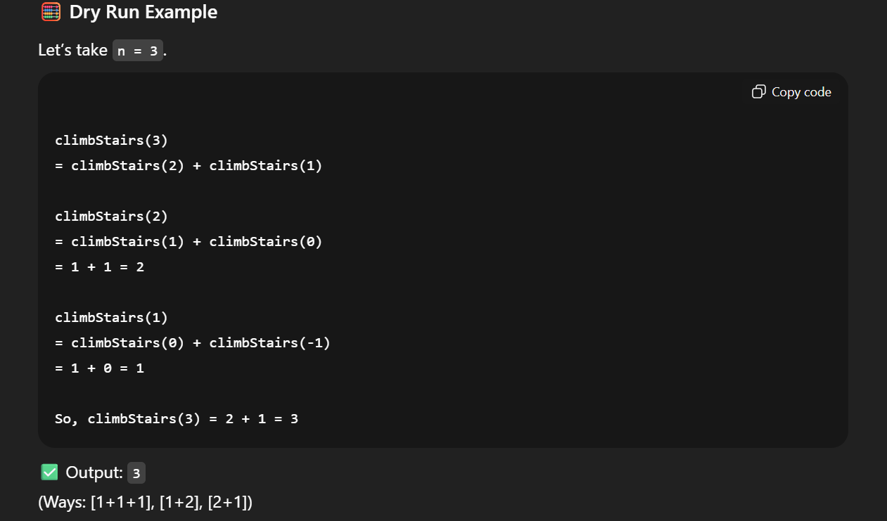

//  Count Ways To Reach The N-th Stairs
// Problem statement
// You have been given a number of stairs. Initially, you are at the 0th stair, and you need to reach the Nth stair.
// Each time, you can climb either one step or two steps.
// You are supposed to return the number of distinct ways you can climb from the 0th step to the Nth step.

// Note:

// Note: Since the number of ways can be very large, return the answer modulo 1000000007.
// Example :
// N=3

#include <bits/stdc++.h> 
int countDistinctWays(int nStairs) {
     if(nStairs <0){
         return 0;
     }
     if(nStairs==0){
         return 1;
     }

     //recursive relation

     int ans =countDistinctWays(nStairs-1)+ countDistinctWays(nStairs-2);
     return ans;
}

